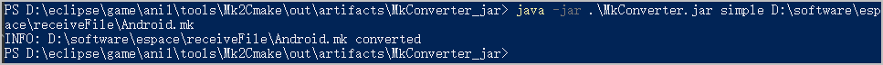
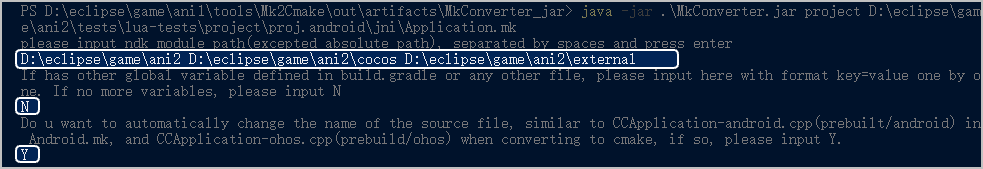
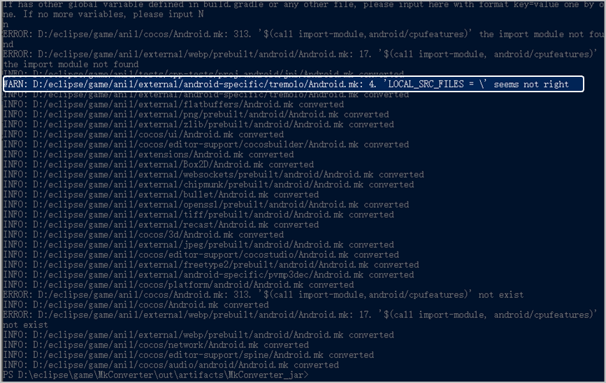
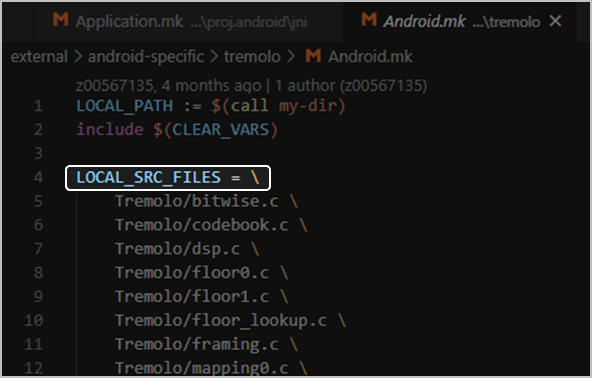
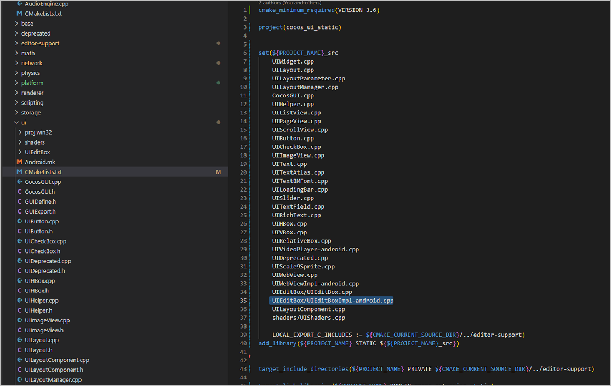

HarmonyOS 5.0及以上工程使用Deveco Studio进行开发，以Hvigor作为构建工具，其C++部分通过CMake构建。如果当前游戏工程已经使用CMake构建，可跳过本章节。

如果游戏当前的Android工程使用Android.mk构建，在进行HarmonyOS 5.0及以上的系统的适配时需要自行生成CMake构建文件。为了减少工作量，可以基于Android的构建逻辑生成HarmonyOS 5.0及以上的构建文件。您可以使用我们提供的CMake**转换工具**进行构建。


* 转换工具暂不支持如下场景：
  + 自定义函数。
  + 单个Android.mk文件中声明多个库。
  + include $(BUILD\_STATIC\_LIBRARY)等库构建语句包含在条件命令中。
* 除了使用工具进行转换，你还可以[通过手动方式转换](#section273015714571)。

## 使用工具转换

### 转换步骤

1. 下载[MkConverter\_jar.zip](https://alliance-communityfile-drcn.dbankcdn.com/FileServer/getFile/cmtyPub/011/111/111/0000000000011111111.20260323192544.57326339358980022099197002014526%3A20260603103755%3A2800%3A51C19FF7B89733FAC0F2BEB14B406726696984FF39A533A9EADF4824BAF607BE.zip?needInitFileName=true)转换工具，并将软件包中的**MkConverter.jar**文件解压到本地。
2. 准备工具运行所需参数。

   | 模式 | 需要准备的参数 |
   | --- | --- |
   | 单文件模式 | Android.mk文件的绝对路径。 |
   | 全工程模式 | * Application.mk文件的绝对路径。 * Module父目录（NDK\_MODULE\_PATH）的绝对路径。 * 未在Application.mk及Android.mk中定义，但编译过程中需要使用到的变量。 |
3. 在命令行窗口进入**MkConverter.jar**所在路径，执行如下命令运行工具。
   * 单文件模式。执行如下命令行：

     ```
     java -jar .\MkConverter.jar simple {Android.mk文件的绝对路径}
     ```

     
   * 全工程模式操作步骤如下：
     1. 执行如下命令行：

        ```
        java -jar .\MkConverter.jar project {Application.mk文件的绝对路径}
        ```
     2. 按照提示输入**NDK\_MODULE\_PATH**的绝对路径，多个绝对路径需以空格分割。
     3. 若需添加Application.mk和Android.mk中未定义的**全局变量**，请按“key=value”的格式添加。若无需添加，请输入“N”结束输入。
     4. 命令行窗口提示是否将路径和文件名中Android字样自动替换为HarmonyOS，若输入“Y”，将自动进行以下转换：
        + **android**/**Android**将替换为**ohos**
        + **ANDROID**将替换为**OHOS**
     5. 等待程序自动执行，并在Android.mk的同级目录生成相应的CMakeLists.txt。

        
4. 日志检查处理。

   程序对不符合预期的情况会输出WARN或ERROR信息，需要处理，可根据报错文件及行号，快速找到错误位置，修正后重新执行。

   

   如上图红框中的“WARN”提示，表示Android.mk中第4行的语法不符合预期，正确应是“LOCAL\_SRC\_FILES :=\”。

   
5. 打开新生成的CMakeLists.txt文件，根据如下步骤进行修改。若工具执行时已选择**自动将路径和文件名中Android字样替换为HarmonyOS**，请跳过本步骤。
   * 将文件中的Android源文件名修改为HarmonyOS 5.0及以上的源文件名，如“xxx-**android**.cpp”修改为“xxx-**ohos**.cpp”。

     

     修改时请确认“xxx-**ohos**.cpp”在工程目录中存在。
   * 检查所有HarmonyOS cpp源文件在CMakeLists.txt中是否都已经存在，如不存在则需要手动添加。

     

### 转换样例

转换前：

```
LOCAL_PATH := $(call my-dir)
include $(CLEAR_VARS)
LOCAL_MODULE := cpp_tests_shared
LOCAL_MODULE_FILENAME := libcpp_tests
LOCAL_ARM_MODE := arm
LOCAL_SRC_FILES := main.cpp \
../../../Classes/ActionManagerTest/ActionManagerTest.cpp \
../../../Classes/controller.cpp
LOCAL_C_INCLUDES := $(LOCAL_PATH)/../../../Classes \
                    $(LOCAL_PATH)/../../../../..
LOCAL_EXPORT_C_INCLUDES := $(LOCAL_PATH)/../../../include
LOCAL_STATIC_LIBRARIES := cc_static
include $(BUILD_SHARED_LIBRARY)
$(call import-module, cocos)
```

转换后：

```
cmake_minimum_required(VERSION 3.6)
project(cpp_tests_shared)
set(src_files main.cpp
             ../../../Classes/ActionManagerTest/ActionManagerTest.cpp
             ./../../Classes/controller.cpp
             )
add_library(${PROJECT_NAME} SHARED ${src_files})
target_include_directories(${PROJECT_NAME} PRIVATE ${CMAKE_CURRENT_SOURCE_DIR}/../../../Classes
                                           PRIVATE ${CMAKE_CURRENT_SOURCE_DIR}/../../../../..
                                           )
target_include_directories(${PROJECT_NAME} PUBLIC ${CMAKE_CURRENT_SOURCE_DIR}/../../../include)
target_link_libraries(${PROJECT_NAME} PUBLIC cc_static)
add_subdirectory(${CMAKE_CURRENT_SOURCE_DIR}/../../../../../../../cocos cocos)
```

## 手动转换

1. 创建一个新的CMakeList.txt文件。
2. 在文件起始位置声明cmake版本。

   ```
   cmake_minimum_required(VERSION 3.6)
   ```

   具体版本与使用命令有关，3.6版本基本可满足需求。
3. 将Android.mk中的语句全部复制到CMakeList.txt文件中。
4. 将原有Android.mk中的原有语法替换为CMake语法。

   

   * Application.mk中的语句，可添加在入口CMakeLists.txt中，即Android工程jni目录下的Android.mk对应的CMakeLists.txt。
   * 如有表格中未列出的语句，请自行替换为对应的CMake语法。

   | Application.mk | CMake |
   | --- | --- |
   | APP\_CFLAGS | add\_compile\_options |
   | APP\_CONLYFLAGS | set(CMAKE\_C\_FLAGS "$\&#123;CMAKE\_C\_FLAGS\&#125; xxx"&#125; |
   | APP\_CPPFLAGS | set(CMAKE\_CXX\_FLAGS "$\&#123;CMAKE\_CXX\_FLAGS\&#125; xxx"&#125; |
   | APP\_CXXFLAGS | set(CMAKE\_CXX\_FLAGS "$\&#123;CMAKE\_CXX\_FLAGS\&#125; xxx"&#125; |
   | APP\_LDFLAGS | add\_link\_options |

   | Android.mk | CMake |
   | --- | --- |
   | include $(BUILD\_EXECUTABLE) | add\_executable（与LOCAL\_MODULE结合使用） |
   | include $(BUILD\_SHARED\_LIBRARY) | add\_library（与LOCAL\_MODULE结合使用） |
   | include $(BUILD\_STATIC\_LIBRARY) | add\_library（与LOCAL\_MODULE结合使用） |
   | include $(PREBUILT\_STATIC\_LIBRARY) | add\_library(xxx STATIC IMPORTED GLOBAL) |
   | LOCAL\_MODULE | project（定义后，与add\_executable/add\_library结合使用） |
   | LOCAL\_SRC\_FILES | 普通构建：add\_executable 或 add\_library的源文件列表，可使用自定义变量承载  预构建：set\_target\_properties(xxx PROPERTIES IMPORTED\_LOCATION "$\&#123;path\&#125;/libxxx.a" ) |
   | LOCAL\_CPP\_FEATURES | target\_compile\_features |
   | LOCAL\_C\_INCLUDES | target\_include\_directories |
   | LOCAL\_EXPORT\_C\_INCLUDES | 普通构建：target\_include\_directories  预构建：set\_target\_properties(xxx PROPERTIES INTERFACE\_INCLUDE\_DIRECTORIES "$\&#123;path\&#125;/include") |
   | LOCAL\_CFLAGS | target\_compile\_options |
   | LOCAL\_CPPFLAGS | target\_compile\_options |
   | LOCAL\_STATIC\_LIBRARIES | target\_link\_libraries |
   | LOCAL\_SHARED\_LIBRARIES | target\_link\_libraries |
   | LOCAL\_WHOLE\_STATIC\_LIBRARIES | target\_link\_libraries |
   | LOCAL\_LDLIBS | target\_link\_libraries |
   | LOCAL\_LDFLAGS | target\_link\_options |
   | LOCAL\_ARM\_MODE | target\_compile\_options |
   | LOCAL\_ARM\_NEON | target\_compile\_options |
   | $(call import-module,xxx) | add\_subdirectory (需要根据ndk\_module\_path转化为相对路径） |
5. 对所有Android.mk做如上转换，CMakeLists.txt放在Android.mk同级目录即可。
