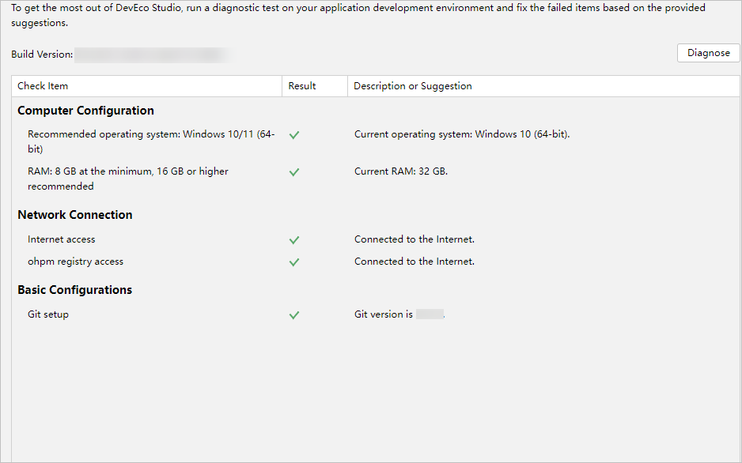
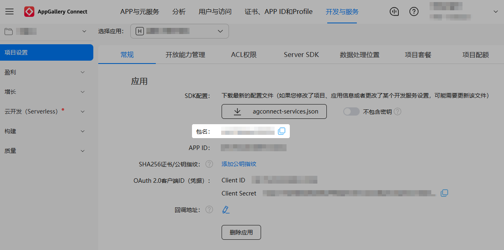

## 引擎适配准备

1. 访问Cocos2d-x的[GitHub页面](https://github.com/cocos2d/cocos2d-x/) ，选择合适的HarmonyOS 5.0及以上版本的引擎分支，可以通过git clone命令来获取。
2. 获取Cocos2d-x引擎后，如果需要获取git子模块，可以在项目的根目录下运行以下命令，这个命令会递归地初始化并更新项目中所有的git子模块。

   ```
   git submodule update --init --recursive
   ```

   如果只想更新特定的子模块，可以进入到该子模块所在的目录，然后运行以下命令：

   ```
   git submodule update –init
   ```
3. 根据external/config.json配置到GitHub页面下载源码对应三方库。
4. 依据游戏使用语言（C++/Lua/JS）运行引擎相应样例工程，验证引擎。

## 安装DevEco Studio

1. 请前往下载并安装最新的release版本[DevEco Studio](https://developer.huawei.com/consumer/cn/download/)。

   

   * HarmonyOS SDK已嵌入DevEco Studio中，无需额外下载配置。HarmonyOS SDK可以在DevEco Studio安装位置下DevEco Studio\sdk目录中查看。
   * 如需进行OpenHarmony应用开发，**Windows环境**可通过“Settings &gt; OpenHarmony SDK”页签下载OpenHarmony SDK，**macOS环境**可通过“DevEco Studio &gt; Preferences &gt; OpenHarmony SDK”页签下载OpenHarmony SDK。
2. 诊断开发环境。

   您可以在欢迎页面单击Diagnose进行诊断。如果您已经打开了工程开发界面，也可以在菜单栏单击“Help &gt; Diagnostic Tools &gt; Diagnose Development Environment”进行诊断。

   

## 知识准备

### 学习ArkTS语言

ArkTS是HarmonyOS 5.0及以上的游戏开发的官方高级语言，其中ArkUI（方舟UI框架）更为游戏UI开发提供了完整的基础设施，包括简洁的UI语法、丰富的UI功能。ArkTS语言更多介绍请参见[学习ArkTS语言](https://developer.huawei.com/consumer/cn/doc/harmonyos-guides/learning-arkts)。

### 了解Stage模型

了解Stage模型可以帮助开发者更好地理解应用程序的架构和设计，有助于开发者对不同阶段的应用程序包形态有更加清晰的认知，提升HarmonyOS 5.0及以上的开发效率和性能。Stage模型更多介绍请参见[Stage模型开发指导](/docs/dev/app-dev/application-framework/ability-kit/stage-model-development)。

## AGC控制台准备

### 注册开发者账号

若您还没有实名认证的华为开发者账号，请前往华为开发者联盟网站注册开发者账号并完成实名认证，详细操作请参见[注册认证](https://developer.huawei.com/consumer/cn/doc/start/registration-and-verification-0000001053628148)。

### 创建项目及在项目上添加游戏

前往AGC控制台创建游戏类应用，具体操作请参见[创建HarmonyOS应用](/docs/distribute/agc/agc-help-app-0000002235710234/agc-help-create-app-0000002247955506)。其中：

* “应用类型”：选择“HarmonyOS应用”。
* “应用分类”：选择“游戏”。


正式上架的游戏包名建议不要包含test、dev等信息。

### 获取游戏包名

登录[AppGallery Connect](https://developer.huawei.com/consumer/cn/service/josp/agc/index.html)，点击“开发与服务”，在项目列表中选择项目及项目下的HarmonyOS游戏，获取游戏包名。


