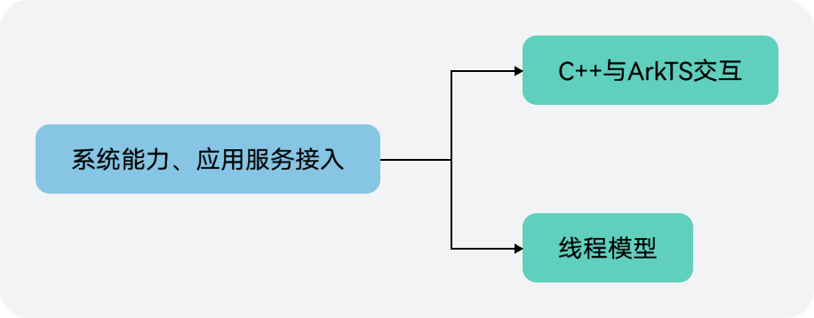
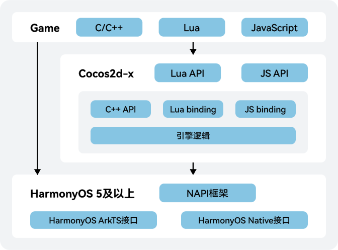
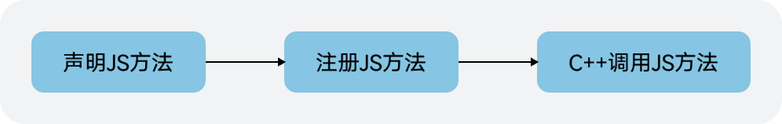
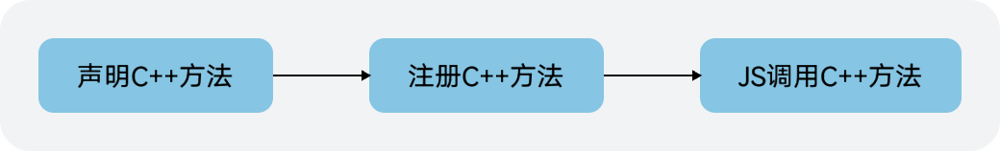

游戏点亮后，由于HarmonyOS是一个全新的系统，因此游戏原有的系统方法（电量、振动器、网络等），在HarmonyOS平台可能不支持，需要根据当前游戏实际使用情况进行替换适配，以及需集成应用服务并实现玩家登录、支付等功能。官方文档都有相应样例，本篇主要介绍接入过程中涉及的以下两点：



## C++与ArkTS交互

游戏业务逻辑调用HarmonyOS 5.0及以上系统接口的原理如下图所示。



当前HarmonyOS 5.0及以上系统提供的系统接口主要包括如下两类：

* HarmonyOS Native接口 ：游戏替换相关能力时直接使用C/C++调用HarmonyOS 5.0及以上系统接口即可。Native API参考请参见[Native API参考](https://developer.huawei.com/consumer/cn/doc/harmonyos-references/capi-native-bundle)。
* HarmonyOS ArkTS接口：游戏替换相关能力时需要通过[Node-API框架](/docs/dev/ndk-dev/napi-introduction)进行C/C++和JS的相互调用。ArkTS API参考请参见[ArkTS API参考](https://developer.huawei.com/consumer/cn/doc/harmonyos-references/js-apis-app-ability-ability)。

本文主要介绍的是使用ArkTS接口时通过NAPI框架进行C/C++和JS跨语言调用。当前NAPI框架建议直接使用开源的[AKI (Alpha Kernel Interacting)开发框架](https://gitee.com/openharmony-sig/aki)，该框架支持极简语法糖使用方式，一行代码即可完成JS与C/C++的无障碍跨语言互调。

### C++调用JS示例



此处以获取当前语言为例。

1. 声明JS方法。

   ```
   // DeviceUtils.ts:
   import i18n from '@ohos.i18n';

   export class DeviceUtils{
       static getSystemLanguage(): string {
           return i18n.System.getSystemLanguage();
       }
   }
   ```
2. 注册JS方法（该方法会在游戏拉起的时候注册到Worker线程中）。

   ```
   // CocosWorker.ts:
   ...
   NapiHelper.registerFunctions(napiContext.registerFunction);
   ...

   // NapiHelper.ts:
   import { DeviceUtils } from '/system/device/DeviceUtils'
   export class NapiHelper{
       static registerFunctions(registerFunc : Function) {
           NapiHelper.registerDeviceUtils(registerFunc);
       }
       private static registerDeviceUtils(registerFunc : Function){
           registerFunc('DeviceUtils.getSystemLanguage', DeviceUtils.getSystemLanguage);
       }
   }
   ```
3. C++调用JS方法。

   ```
   // CCApplication-ohos.cpp:
   #include "napi/helper/NapiHelper.h"

   const char * Application::getCurrentLanguageCode() {
       static char code[3]={0};
       std::string systemLanguage = JSFunction::getFunction("DeviceUtils.getSystemLanguage").invoke<std::string>();
       strncpy(code, systemLanguage.c_str(), 2);
       code[2]='\0';
       return code;
   }
   ```

### JS调用C++示例



此处以调用editbox回调函数为例。

1. 将C++方法注册到NAPI中，暴露给JS。

   ```
   // InputNapi.cpp:
   napi_value InputNapi::editBoxOnFocusCB(napi_env env, napi_callback_info info) {
       ...
   }
   ...

   // plugin_manager.cpp:
   OHOS_LOGD("NapiManager::GetContext INPUT_NAPI");
   napi_property_descriptor desc[] = {
       DECLARE_NAPI_FUNCTION("editBoxOnFocusCB", InputNapi::editBoxOnFocusCB)
       };
   NAPI_CALL(env, napi_define_properties(env, exports, sizeof(desc) / sizeof(desc[0]), desc));
   ...
   ```
2. JS调用C++方法。

   ```
   // CocosWorker.ts:
   ...
   const inputNapi: nativeRender.CPPFunctions = nativeRender.getContext(ContextType.INPUT_NAPI);
   ...
   workerPort.onmessage = function(e) : void {
       let data = e.data:
       switch(data.type) {
           case "editBoxOnFocus":
               inputNapi.editBoxOnFocusCB(data.viewTag);
               break;
           ...
   ```

## 线程模型说明

当前HarmonyOS线程模型为线程间隔离，内存不共享，导致Ark层开发的基础模块和业务需要按照单线程模式进行设计，所以会涉及到一些跨线程的接口调用、数据访问和线程切换的场景。

如下以调用应用服务登录初始化接口为例，介绍如何调用一些只能在UI线程执行的系统方法及如何将UI线程结果返回给子线程的，具体的线程原理可参考[官方文档](https://developer.huawei.com/consumer/cn/doc/harmonyos-references-V5/js-apis-worker-V5)。

### Worker线程调用UI线程方法

* 游戏启动时先将相应ts代码中Worker线程初始化。

  ```
  // CocosWorker.ts:
  ...
  workerPort.onmessage = function(e) : void {
      let data = e.data:
      switch(data.type) {
          case "onXCload":
              LoginSDK.init(workerPort);
              ...
          ...

  // SDKManager.ts:
  export class LoginSDK {
      ...
      static init(workerPort: ThreadWorkerGlobalScope) : void {
          LoginSDK.workerPort= workerPort;
      }
      ...
  }
  ```
* Worker线程发送消息给UI线程。

  ```
  // SDKManager.ts:
  ...
  static loginInit(): string {
      LoginSDK.workerPort.postMessage({
          'module': LoginSDK.MODULE_NAME, 'function': 'loginInit', 'viewTag': "1"
      });
      ...
  }
  ```
* UI线程接收消息并处理。

  ```
  // Index.ets:
  ...
  .onLoad((context) => {
      ...
      cocosWorker.onmessage = async (event: MessageEvents) => {
         let eventData: EventData = event.data;
         switch (eventData.module) {
              case 'LoginSDK':
                  let result: string;
                  try {
                      result = await sdkManagerMsg.handlePullSDK(eventData as EventData);
                  } catch(e) {
                      ...
                  }
                  ...
  // SDKManagerMsg.ts:
  ...
  async handlePullSDK(eventData: EventData): Promise<string> {
      let context: common.UIAbilityContext = GlobalContext.loadGlobalThis(GlobalContextConstants.COCOS2DX_ABILITY_CONTEXT);
      switch (eventData.function) {
        case "loginInit":
          return await this.handleLoginInit(context);
        ...
       }
  }
  ```

### 将UI线程结果返回给子线程

* 登录初始化结果返回，需要通知Worker线程执行native层的回调函数。

  ```
  // Index.ets:
  ...
  .onLoad((context) => {
      ...
      cocosWorker.onmessage = async (event: MessageEvents) => {
          let eventData: EventData = event.data;
         switch (eventData.module) {
              case 'LoginSDK':
                  ...
              if (result != null || result != undefined) {
                    try{
                      cocosWorker.postMessage({type:"syncLoginSDKResult", data: result});
                    }catch (e){
                      ...
                    }
              }
              ...
  ```
* Worker线程接收消息并做出处理。

  ```
  // CocosWorker.ts:
  ...
  workerPort.onmessage = function(e) : void {
      let data = e.data;
      switch(data.typd) {
          case "syncLoginSDKResult":
              loginSDKNapi.syncLoginSDKResult(data.data);
              break;
          ...
  ```
