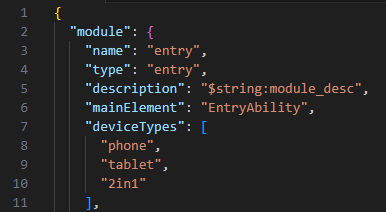
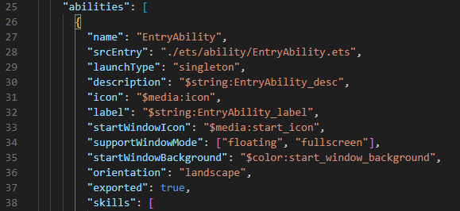
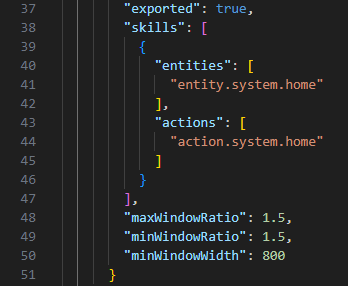
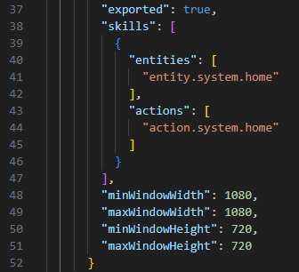

为了扩大游戏的使用范围，增加游戏的用户群体，提升游戏的市场竞争力，建议游戏适配PC设备。

## 追加设备类型

在module.json5文件中将deviceTypes追加“2in1”设备。

```
"deviceTypes": [
      "phone",
      "tablet",
      "2in1"
],
```



## 适配窗口模式

### 支持窗口模式

在module.json5文件中通过supportWindowMode设置游戏运行时支持的窗口模式。

```
// fullscreen表示全屏模式；floating表示自由多窗模式。
"supportWindowMode": ["floating", "fullscreen"]
```



### 设置窗口大小

自由多窗模式下缩放游戏窗口支持如下两种方式：

* （推荐）固定窗口宽高比，同时推荐设置最小宽度。示例如下：

  ```
  "maxWindowRatio": 1.5, // 请根据实际情况设置
  "minWindowRatio": 1.5, // 请根据实际情况设置
  "minWindowWidth": 800
  ```

  
* 固定窗口的最大最小宽高。示例如下：

  ```
  "minWindowWidth": 1080,
  "maxWindowWidth": 1080,
  "minWindowHeight": 720,
  "maxWindowHeight": 720
  ```

  

### 最大化时隐藏标题栏和dock栏

找到入口（Entry）模块的Ability类，在onWindowStageCreate生命周期函数中监听windowStatusChange事件，当最大化窗口时，可以调用maximize接口隐藏标题栏和dock栏。

当supportWindowMode设置同时支持全屏模式和自由多窗模式时，游戏将以自由多窗模式启动。可以通过调用maximize接口，让游戏以全屏模式启动。

```
onWindowStageCreate(windowStage: window.WindowStage): void {
  super.setPageUri('pages/Index');
  super.onWindowStageCreate(windowStage);

  // 支持沉浸式，修改如下
  windowStage.getMainWindow((err, win) => {
    if (err?.code) {
      console.error('Failed to obtain the main window. Cause: ' + err.message);
      return;
    }
    win.setWindowDecorVisible(false);
    win.maximize(window.MaximizePresentation.ENTER_IMMERSIVE); // 以全屏模式启动游戏。
    win.on("windowStatusChange", (status) => {
      if (status == window.WindowStatusType.MAXIMIZE) {
        win.maximize(window.MaximizePresentation.ENTER_IMMERSIVE); // 当最大化时隐藏标题栏和dock栏。
      }
    });
  });
}
```

### 隐藏标题栏

找到入口（Entry）模块的Ability类，在onWindowStageCreate生命周期函数中监听windowStatusChange事件，调用setWindowDecorVisible接口隐藏标题栏。

```
onWindowStageCreate(windowStage: window.WindowStage): void {
  super.setPageUri('pages/Index');
  super.onWindowStageCreate(windowStage);

  windowStage.getMainWindow((err, win) => {
    if (err?.code) {
      console.error('Failed to obtain the main window. Cause: ' + err.message);
      return;
    }
    win.setWindowDecorVisible(false); // 隐藏标题栏
    win.on("windowStatusChange", (status) => {
      if (status == window.WindowStatusType.MAXIMIZE) {
        win.maximize(window.MaximizePresentation.ENTER_IMMERSIVE); // 当最大化时隐藏标题栏和dock栏。
      }
    });
  });
}
```

## 适配键鼠设备

游戏还可以适配键盘、鼠标这两类主要输入设备。

### Cocos Creator 3.8.5/3.8.6

建议升级到最新版本。

Cocos Creator 3.8.7版本开始，引擎已实现适配键鼠设备。

### Cocos Creator 2.4.14/2.4.15

Cocos Creator将在2.4.16版本支持键鼠适配，详情请参见[#4397](https://github.com/cocos/engine-native/pull/4397/files)和[#18689](https://github.com/cocos/cocos-engine/pull/18689/files)。

若您评估适配键鼠功能的工作量低，也可以直接监听HarmonyOS键鼠事件，具体开发步骤如下：

1. 在Cocos Creator引擎中构建发布HarmonyOS Next工程。
2. 在src/main/ets/pages/index.ets文件中找到XComponent自定义渲染组件，并在其父组件监听按键和鼠标事件，通过postMessage方法将消息从UI主线程发送给Worker线程。示例如下：

   ```
   build() {
       Flex({
         direction: FlexDirection.Column,
         alignItems: ItemAlign.Center,
         justifyContent: FlexAlign.Center
       } as FlexOptions) {
         XComponent({ id: 'xcomponentId', type: 'surface', libraryname: 'cocos' })
           .onLoad((context) => {
             // Set the cache directory in the ts layer.
             this.workPort.postMessage("onXCLoad", "XComponent");
           })
           .onDestroy(() => {
             console.log('cocos onDestroy')
           })

         ForEach(this.webViewArray, (item: WebViewInfo) => {
           CocosWebView({ viewInfo: item, workPort: this.workPort })
         }, (item: WebViewInfo): string => item.viewTag.toString())

         ForEach(this.videoArray, (item: VideoInfo) => {
           CocosVideoPlayer({ videoInfo: item, workPort: this.workPort })
         }, (item: VideoInfo): string => item.viewTag.toString())
       }
       // 监听按键事件
       .onKeyEvent((event: KeyEvent) => {
         let keyCode = event.keyCode;
         let action = event.type;
         this.workPort.postMessage("onKeyEvent", { keyCode, action });
       })
       // 监听鼠标事件
       .onMouse((event: MouseEvent) => {
         let mouseButton = event.button;
         let action = event.action;
         this.workPort.postMessage("onMouseEvent", { mouseButton, action });
       })
       .width('100%')
       .height('100%')
     }
   ```
3. 在src/main/ets/workers/cocos\_worker.ts中找到消息处理函数uiPort.\_messageHandle，当接收到上一步发送的onKeyEvent和onMouseEvent消息时，应继续回调Cocos，步骤如下：
   1. 在Cocos中定义消息处理方法并绑定到全局，示例如下：

      ```
      onLoad: function () {
          globalThis.onKeyEvent = this.onKeyEvent.bind(this);
          globalThis.onMouseEvent = this.onMouseEvent.bind(this);
      },

      onKeyEvent(code, action) {
          console.log("onKeyEvent", code, action);
      },

      onMouseEvent(button, action) {
          console.log("onMouseEvent", button, action);
      },
      ```
   2. 根据Cocos使用的JavaScript引擎分两种情况：
      * 情况一：Cocos使用Ark引擎

        Worker线程和Cocos可以直接通过globalThis相互通信。uiPort.\_messageHandle修改如下：

        ```
        uiPort._messageHandle = function (e) {
          var data = e.data;
          var msg = data.data;

          switch (msg.name) {
            case "onXCLoad":
              const renderContext = cocos.getContext(ContextType.NATIVE_RENDER_API);
              renderContext.nativeEngineInit();

                launchEngine().then(() => {
                  console.info('launch CC engine finished');
                }).catch(e => {
                  console.error('launch CC engine failed');
                });

              // @ts-ignore
              globalThis.oh.postMessage = nativeContext.postMessage;
              // @ts-ignore
              globalThis.oh.postSyncMessage = nativeContext.postSyncMessage;
              renderContext.nativeEngineStart();
              break;
            case "onTextInput":
              nativeEditBox.onTextChange(msg.param);
              break;
            case "onComplete":
              nativeEditBox.onComplete(msg.param);
              break;
            case "onPageBegin":
              nativeWebView.shouldStartLoading(msg.param.viewTag, msg.param.url);
              break;
            case "onPageEnd":
              nativeWebView.finishLoading(msg.param.viewTag, msg.param.url);
              break;
            case "onErrorReceive":
              nativeWebView.failLoading(msg.param.viewTag, msg.param.url);
              break;
            case "onVideoEvent":
              nativeVideo.onVideoEvent(JSON.stringify(msg.param));
              break;
            case "backPress":
              appLifecycle.onBackPress();
              break;
            // 处理按键消息
            case "onKeyEvent":
              if (typeof globalThis.onKeyEvent === 'function') {
                globalThis.onKeyEvent(msg.param.keyCode, msg.param.action);
              }
              break;
            // 处理鼠标消息
            case "onMouseEvent":
              if (typeof globalThis.onMouseEvent === 'function') {
                globalThis.onMouseEvent(msg.param.mouseButton, msg.param.action);
              }
              break;
            default:
              hilog.info(0x0000, 'testTag', 'cocos worker: message type unknown:%{public}s', msg.name);
              console.error("cocos worker: message type unknown");
              break;
          }
        }
        ```
      * 情况二：Cocos使用V8/JSVM引擎

        可以通过引擎Native层提供的evalString方法，实现从Worker线程回调Cocos。uiPort.\_messageHandle修改如下：

        ```
        uiPort._messageHandle = function (e) {
          var data = e.data;
          var msg = data.data;

          switch (msg.name) {
            case "onXCLoad":
              const renderContext = cocos.getContext(ContextType.NATIVE_RENDER_API);
              renderContext.nativeEngineInit();

                launchEngine().then(() => {
                  console.info('launch CC engine finished');
                }).catch(e => {
                  console.error('launch CC engine failed');
                });

              // @ts-ignore
              globalThis.oh.postMessage = nativeContext.postMessage;
              // @ts-ignore
              globalThis.oh.postSyncMessage = nativeContext.postSyncMessage;
              renderContext.nativeEngineStart();
              break;
            case "onTextInput":
              nativeEditBox.onTextChange(msg.param);
              break;
            case "onComplete":
              nativeEditBox.onComplete(msg.param);
              break;
            case "onPageBegin":
              nativeWebView.shouldStartLoading(msg.param.viewTag, msg.param.url);
              break;
            case "onPageEnd":
              nativeWebView.finishLoading(msg.param.viewTag, msg.param.url);
              break;
            case "onErrorReceive":
              nativeWebView.failLoading(msg.param.viewTag, msg.param.url);
              break;
            case "onVideoEvent":
              nativeVideo.onVideoEvent(JSON.stringify(msg.param));
              break;
            case "backPress":
              appLifecycle.onBackPress();
              break;
            // 处理按键消息
            case "onKeyEvent":
              cocos.evalString(`onKeyEvent(${msg.param.keyCode}, ${msg.param.action})`);
              break;
            // 处理鼠标消息
            case "onMouseEvent":
              cocos.evalString(`onMouseEvent(${msg.param.mouseButton}, ${msg.param.action})`);
              break;
            default:
              hilog.info(0x0000, 'testTag', 'cocos worker: message type unknown:%{public}s', msg.name);
              console.error("cocos worker: message type unknown");
              break;
          }
        }
        ```

### LayaAir 1.X

建议LayaAir引擎升级到最新版本，LayaAir APP构建Native版本升级到[LayaAir Native SDK 1.0.14](https://ldc.layabox.com/layadownload/?type=layaairnative-LayaAir Native SDK 1.0.14)及以上版本。

### LayaAir 2.X

建议LayaAir引擎升级到最新版本，LayaAir APP构建Native版本升级到[LayaNative-Release-2.13.9.1](https://ldc2.layabox.com/layadownload/?language=zh&type=layaairnative-LayaNative-Release-2.13.9.1)及以上版本。

### LayaAir 3.X

建议LayaAir引擎升级到[LayaAir 3.3.3](https://www.layaair.com/#/engineDownload/LayaAir 3.3.3)及以上版本。

## 术语解释

| 概述 | 说明 |
| --- | --- |
| 全屏模式 | 游戏内容在电脑屏幕上以最大化形式展示，此时通常会隐藏任务栏、菜单栏等界面元素，使游戏内容占据整个屏幕，让用户获得沉浸式的游戏体验。 |
| 自由多窗模式 | 非全屏模式下的窗口。 |
