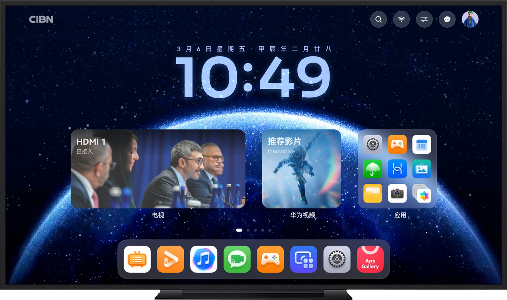

新一代华为智慧屏TV实现了与手机/平板共平台、共系统能力，成为了一款超大尺寸的手机/平板，进一步增强了智慧屏“巨幕手机”生态差异化的竞争力。

|  |  |
| --- | --- |
|  |  |

## 追加设备类型

在module.json5文件中将deviceTypes追加“tv”设备。

```
"deviceTypes": [
      "phone",
      "tablet",
      "2in1",
      "tv"
],
```

## 差异性

智慧屏与手机/平板设备相比，存在如下差异性：

### 广告服务

若游戏接入[Ads Kit（广告服务）](/docs/dev/app-dev/application-services/ads-kit-guide)，智慧屏不支持在游戏App中通过广告内容获得广告收益。

### 三方登录

若游戏接入三方账号，智慧屏暂不支持微信/QQ客户端授权登录，建议通过实现扫码登录替代。

### 深色模式

仅支持“深色模式”，且智慧屏下ArkUI组件默认样式存在差异。

若TextInput不显式指定fontColor，在手机/平板默认为#E5000000，在智慧屏默认为#E6FFFFFF。

### UI界面

智慧屏宽高比为16:9，开发者应确保适配游戏的UI界面。

### 链接打开方式

不支持跳转浏览器打开链接。

## FAQ

### 手机上的发布证书可以通用吗？

可以。

同款游戏的不同支持设备要求使用相同的发布证书。发布证书的具体操作请参见[申请发布证书](/docs/distribute/agc/agc-help-cert-0000002270829389/agc-help-release-cert-0000002283336729)。

### 智慧屏是否作为新包提审，还是和已上架的鸿蒙游戏在同一个包提审上架？

都可以。

可以单独为智慧屏导出一个游戏软件包用于提审上架，也可以把已支持的设备放在一个游戏软件包中进行提审上架。

正式提审上架时，要求“支持设备”与游戏软件包中的“deviceTypes”枚举值保持一致。
