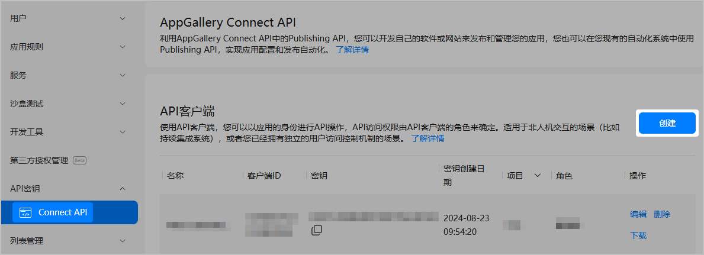
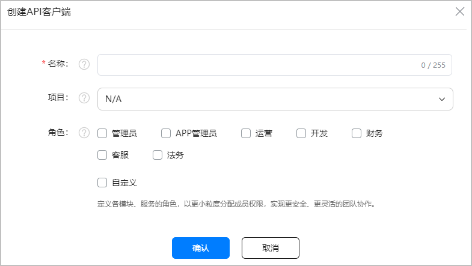
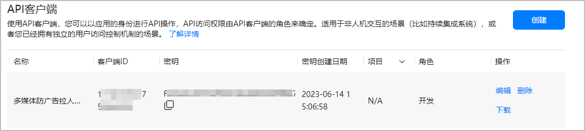

API客户端是AppGallery Connect用于管理用户访问AppGallery Connect API的身份凭据，您可以给不同角色创建不同的API客户端，使不同角色可以访问对应权限的AppGallery Connect API。在访问某个API前，必须创建有权访问该API的API客户端。

1. 登录[AppGallery Connect网站](https://developer.huawei.com/consumer/cn/service/josp/agc/index.html)，选择“用户与访问”。
2. 在左侧导航栏选择“API密钥 &gt; Connect API”，点击右上角“创建”。

   
3. 在“名称”列输入自定义的客户端名称，“项目”保持默认值“N/A”，选择对应的“角色”（管理员/APP管理员/开发），点击“确认”。

   

   “项目”请务必保持为“N/A”，表示创建的客户端为团队级的API客户端。如果不为N/A，将会导致调用API时返回403错误。

   

4. 客户端创建成功后，记录下客户端信息列表中“客户端ID”和“密钥”的值。

   

创建API客户端后，您下一步需要根据客户端ID和密钥信息获取访问API的Token，后续使用请参见[获取Token（团队级）](https://developer.huawei.com/consumer/cn/doc/games-references/gamemme-obtaintoken-restapi-0000002358963836)。
