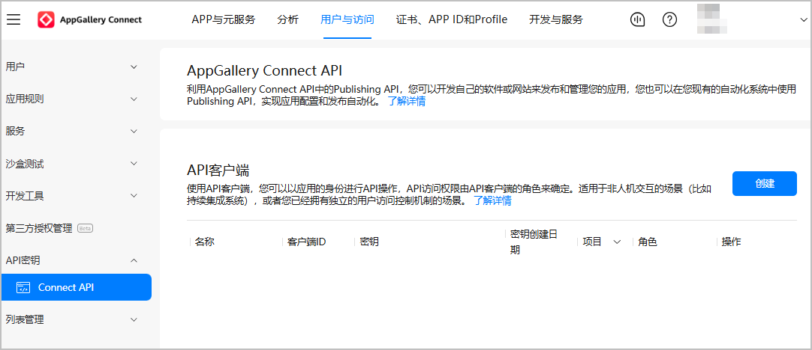
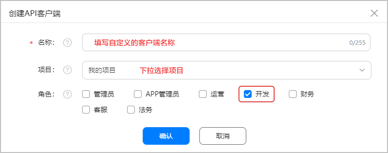
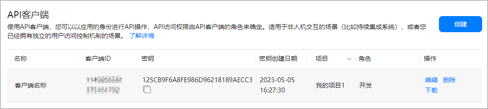

## 注册开发者账号

若您还没有实名认证的华为开发者账号，请前往华为开发者联盟网站注册开发者账号并完成实名认证，详细操作请参见[账号注册认证](https://developer.huawei.com/consumer/cn/doc/start/registration-and-verification-0000001053628148)。

## 创建项目和应用

若尚未在AppGallery Connect创建项目和应用，请参考[创建项目](/docs/distribute/agc/agc-help-project-0000002270709469/agc-help-create-project-0000002242804048)和[创建应用](/docs/distribute/agc/agc-help-app-0000002235710234/agc-help-create-app-0000002247955506)。

* “支持设备”选择“手机”。
* “应用分类”选择“游戏”。

## 创建API客户端

API客户端是AppGallery Connect用于管理用户访问AppGallery Connect API的身份凭据，您可以给不同角色创建不同的API客户端，使不同角色可以访问对应权限的AppGallery Connect API。在访问某个API前，必须创建有权访问该API的API客户端。

1. 登录[AppGallery Connect](https://developer.huawei.com/consumer/cn/service/josp/agc/index.html)，点击“用户与访问”后，在左侧导航栏选择“API密钥 &gt; Connect API”，在右侧页面点击“创建”。

   
2. 在弹出的窗口中填写信息后，点击“确认”。

   
3. API客户端成功创建后，请记录下客户端ID和密钥，作为[获取Token](https://developer.huawei.com/consumer/cn/doc/games-references/games-api-binary-optimization-obtain-token-0000002408001421)的请求参数。

   
