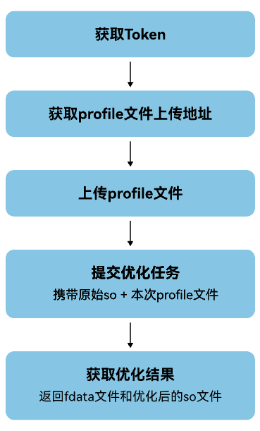
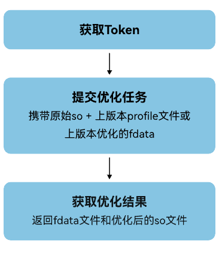

1. 调用[获取Token](https://developer.huawei.com/consumer/cn/doc/games-references/games-api-binary-optimization-obtain-token-0000002408001421)接口。
2. （可选）首次优化，或本次游戏版本较上次版本的改动较大时，调用[获取文件上传地址](https://developer.huawei.com/consumer/cn/doc/games-references/games-api-binary-optimization-obtain-url-0000002407881309)接口获取profile文件的上传地址，并根据上传地址调用[上传单个文件](https://developer.huawei.com/consumer/cn/doc/games-references/games-api-binary-optimization-upload-files-0000002374401756)接口上传profile文件。
3. 调用[提交优化任务](https://developer.huawei.com/consumer/cn/doc/games-references/games-api-binary-optimization-submit-opt-task-0000002374401760)接口。
   * 首次优化，或本次游戏版本较上次版本的改动较大

     调用接口携带[提交插桩任务](https://developer.huawei.com/consumer/cn/doc/games-references/games-api-binary-optimization-submit-pile-task-0000002374241876)接口传入的原始so文件，同时上传本次游戏版本重新采集的profile文件。
   * 本次游戏版本较上次版本的改动较小，本次优化将使用最近大版本优化的profile文件，您需要携带如下文件调用接口：
     + 携带原始so文件的objectId。
     + 携带最近大版本优化profile文件的objectId或最近大版本优化调用[获取优化结果](https://developer.huawei.com/consumer/cn/doc/games-references/games-api-binary-optimization-get-opt-result-0000002374241884)接口返回的fdata文件的objectId。
4. 调用[获取优化结果](https://developer.huawei.com/consumer/cn/doc/games-references/games-api-binary-optimization-get-opt-result-0000002374241884)接口返回本次优化过程中产生的fdata文件和优化后的so文件。
5. 将优化后的so文件替换原始包中的原始so文件，并重新打包和签名，再使用优化后的安装包进行[测试及验证收益](/docs/dev/game-dev/games-binary-optimization-test-verification-0000002342950456)。

release so经过二进制优化后，部分函数的位置可能发生变化，如果现网出现问题需要定位，您需要进行堆栈恢复，可以对release so对应的debug so进行二进制优化后，再继续问题定位。详情请参见[FAQ](/docs/dev/game-dev/games-binary-optimization-faq-0000002377194865)。

|  |  |
| --- | --- |
| 首次优化，或本次游戏版本较上次版本的改动较大 | 本次游戏版本较上次版本的改动较小 |
|  |  |
