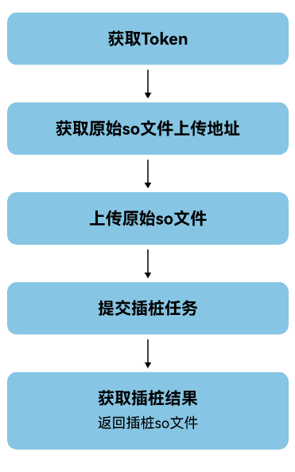

若本次游戏版本较上次版本的改动较小，可跳过二进制插桩及采集profile数据操作 。

## 前提条件

已[准备原始so文件](https://developer.huawei.com/consumer/cn/doc/games-guides/gams-binary-optimization-files-0000002377028341#section10129192418372)。

## 开发步骤

1. 调用[获取Token](https://developer.huawei.com/consumer/cn/doc/games-references/games-api-binary-optimization-obtain-token-0000002408001421)接口。
2. 调用[获取文件上传地址](https://developer.huawei.com/consumer/cn/doc/games-references/games-api-binary-optimization-obtain-url-0000002407881309)接口获取原始so文件的上传地址，并根据上传地址调用[上传单个文件](https://developer.huawei.com/consumer/cn/doc/games-references/games-api-binary-optimization-upload-files-0000002374401756)接口上传原始so文件。
3. 调用[提交插桩任务](https://developer.huawei.com/consumer/cn/doc/games-references/games-api-binary-optimization-submit-pile-task-0000002374241876)接口执行二进制插桩操作。
4. 调用[获取插桩结果](https://developer.huawei.com/consumer/cn/doc/games-references/games-api-binary-optimization-get-pile-result-0000002408001433)接口返回插桩so文件。
5. 将插桩so文件替换手机上安装后的原始so文件，替换后还需要重新打包和签名。

