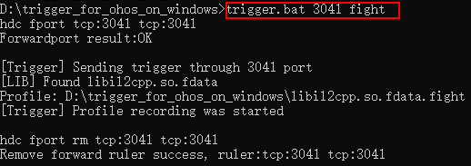
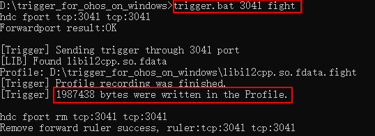
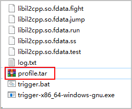

## 前提条件

* 已[配置hdc工具](https://developer.huawei.com/consumer/cn/doc/games-guides/games-binary-optimization-tool-config-0000002343110256)。
* 已[下载工具包](https://developer.huawei.com/consumer/cn/doc/games-guides/games-binary-optimization-download-tool-0000002377028329)。

## 清理无关profile文件

第一次采集前，在Windows的trigger工具目录，打开cmd窗口，执行如下命令清理上次采集遗留的Profile文件：

```
del *.fdata.*
```

## 采集profile数据

1. 确保手机与Windows PC正常连接，hdc list targets能够查询到设备号。
2. 启动so经过插桩后的游戏，运行到待采集Profile的场景。
3. 在trigger\_for\_ohos\_on\_windows工具目录下打开cmd窗口，执行trigger启动Profile采集的命令（trigger-x86\_64-windows-gnu.exe集成到trigger.bat脚本中执行），命令格式如下：

   ```
   trigger.bat trigger_port scenario_name
   ```

   参数说明如下：

   |  |  |  |  |
   | --- | --- | --- | --- |
   | **参数** | 必选(M)/可选(O) | **默认值** | **描述** |
   | *trigger\_port* | M | - | 端口号，用于跟手机设备进行通信，与调用[提交插桩任务](https://developer.huawei.com/consumer/cn/doc/games-references/games-api-binary-optimization-submit-pile-task-0000002374241876)接口的入参portStart保持一致，如3040，3041，3042等。  说明：  不同的so应配置不同的端口号，否则会导致冲突，影响profile采集**。** |
   | *scenario\_name* | M | - | 场景名称，自定义，如：fight |

   执行命令后，触发采集，会在工具所在目录生成以场景名为后缀的profile文件，不过此时文件大小是0：

   
4. 待完成采集后，执行与触发开始采集时同样的命令，触发结束采集，并生成此次采集到的profile文件：

   

   

   如果需要采集多个so的profile，可以针对不同so，分别配置不同端口号，多次执行trigger工具命令，支持同时触发多个so采集。
5. 您可以采集多个游戏场景的profile数据。单个场景的profile数据完成采集后，将生成*so\_name*.fdata.*scene\_name*的profile文件：
   * so\_name为so名称，例如libunity.so。
   * scene\_name为场景名称，例如fight。

## 打包profile文件

待所有场景都采集完成后，在Windows上trigger工具的当前路径，打开cmd窗口，执行如下命令，将多个场景的profile文件，打成tar包（文件名可自定义），作为二进制优化的输入。

```
tar -a -c -f profile.tar *.fdata.*
```


