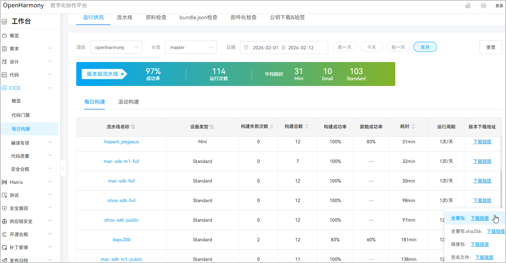
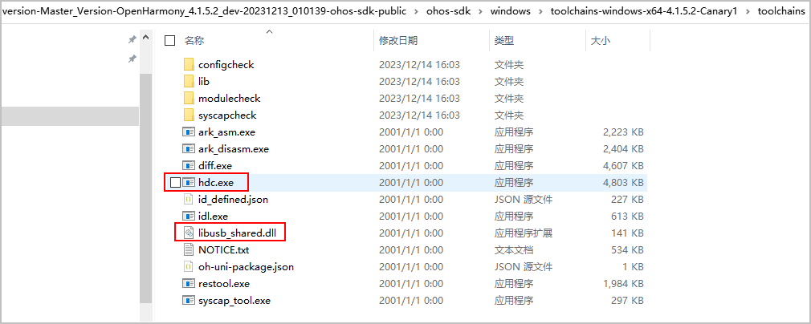
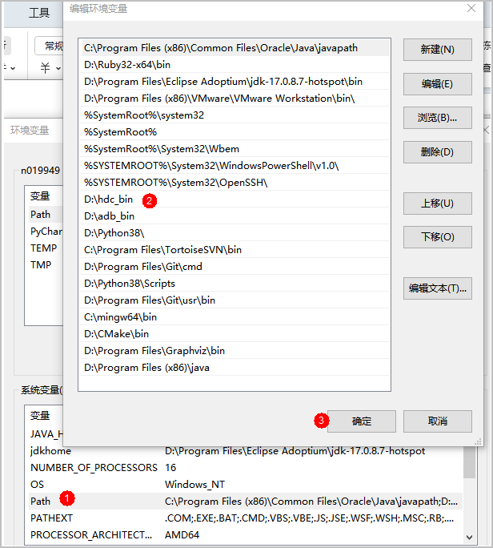
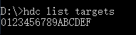

## hdc工具配置（Windows）

优化HarmonyOS 5.0及以上系统游戏时，在PC端（Windows系统）安装hdc工具可按如下步骤操作，可参考[命令行工具hdc安装应用指南](https://developer.huawei.com/consumer/cn/blog/topic/03137966529669104)。

1. 下载工具包

   点击打开[工具包下载](https://dcp.openharmony.cn/workbench/cicd/dailybuild/dailyList)页面，查找“流水线名称”名称为ohos-sdk-full或者ohos-sdk-public，点击“下载链接”，选择“全量包”。

   
2. 解压，选择红框中的文件，拷贝到自定义目录，如“D:\hdc\_bin\”。

   
3. 配置环境变量，将hdc path配置到环境变量的PATH中。

   
4. 在HarmonyOS 5.0及以上系统测试手机上，进入开发人员选项，“设置 &gt; 通用 &gt; 开发人员模式 &gt; 勾选USB调试”，打开“USB调试”。
5. 执行hdc list targets命令，查看设备号。

   
