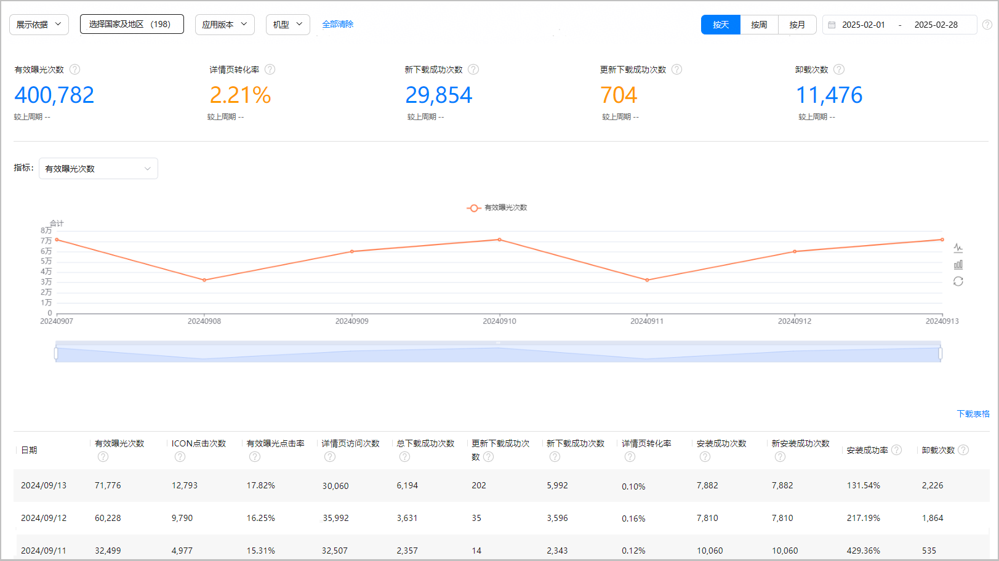
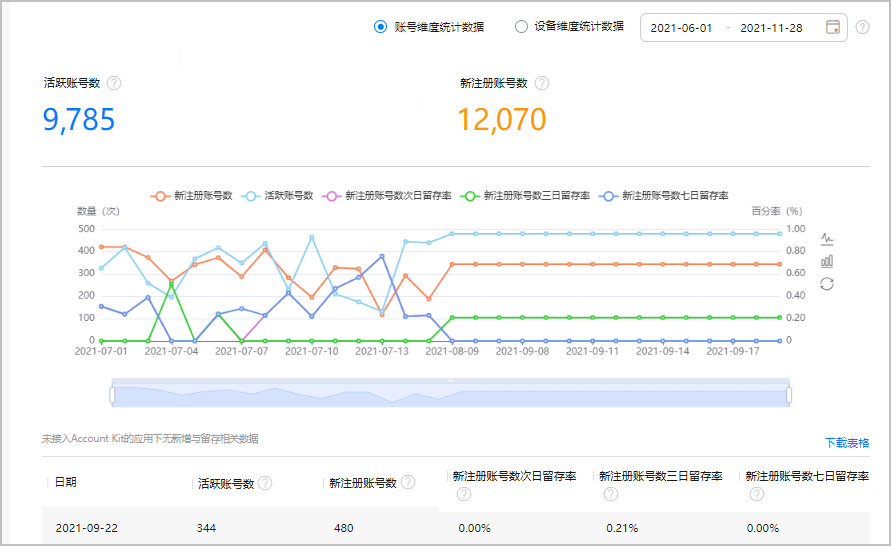
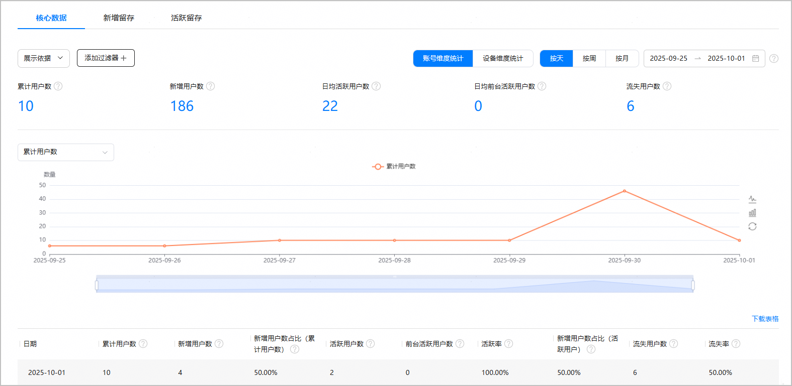
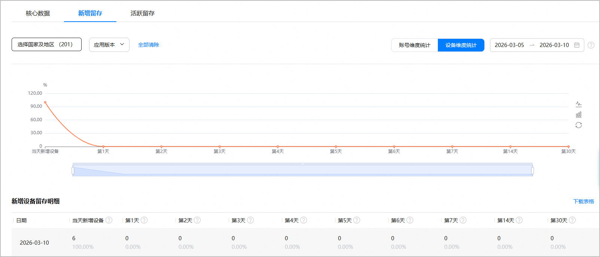
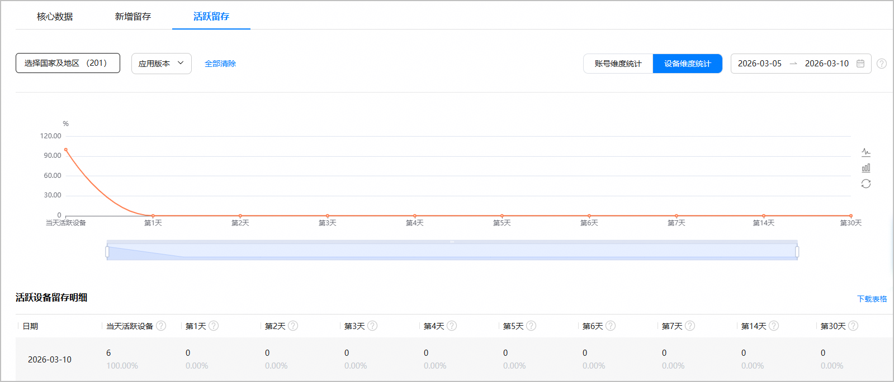

您可以在“分发分析”页签下查看HarmonyOS应用的使用情况数据：

通过“[下载安装](#section14231122115416)”、“[游戏新增与留存](#section53361428183912)”、“[用户分析](#section3905133110302)”衡量用户安装及持续使用HarmonyOS应用的情况。

## 下载安装

### 报表概览

* 下载安装数据包括应用市场、游戏中心等华为应用客户端下载的数据。
* 下载安装报表仅支持查看2024年8月30号以后的数据。

1. 在[AppGallery Connect](https://developer.huawei.com/consumer/cn/service/josp/agc/index.html)首页，点击“分析”。
2. 从列表中选择您的应用，点击“分发分析 &gt; 下载安装”。

   “下载安装”报表默认展示当前应用的“有效曝光次数”、“详情页转化率”、“新下载成功次数”、“更新下载成功次数”、“卸载次数 ”等重点指标概览数据和环比值、图表及详细报表数据，并提供表格下载功能。

   

   * 点击“展示依据”，选择“应用版本”、“机型”、“国家/地区”、“省份”、“城市”，下方列表将展示对应维度的详细报表数据。
   * 在“添加过滤器”中：
     + 点击“国家/地区”，可选择不同国家或地区查看对应的数据。

       

       当您在“选择国家及地区”中勾选“中国”时，支持选择不同省市查看对应的数据。
     + 点击“应用版本”，可选择不同应用版本查看对应的数据。
     + 点击“机型”，可选择不同的设备类型及设备型号查看对应的数据。
   * 点击“指标”下拉框，选择一项指标，如“有效曝光次数”、“有效曝光点击率”、“安装成功率”等，可查看该指标的折线图或柱状图。
   * 点击“按天”、“按周”或“按月”，界面数据将按照天、周或月展示。
   * 在右上角选择日期范围。您可以选择预定时间段（例如，过去7天）或输入自定义范围，时间跨度不得超过180天。
   * 点击表格上方的“下载表格”按钮，可以将数据下载到本地。

### 指标说明

| 指标 | 说明 | 数据统计规则 |
| --- | --- | --- |
| 有效曝光次数 | 应用在华为应用市场推荐、排行榜、搜索等资源位被展示次数，图片露出50%以上且曝光时间大于1s才算有效曝光。 | 在HarmonyOS 3.1/4.0升HarmonyOS 5后，HarmonyOS 5**不会上报HarmonyOS 3.1/4.0数据** |
| ICON点击次数 | 应用在华为应用市场内曝光的ICON被点击的次数。 |
| 有效曝光点击率 | ICON点击次数/有效曝光。 |
| 详情页访问次数 | 在华为应用市场内统计的应用详情页被浏览的次数。 |
| 更新下载成功次数 | 用户通过华为应用市场更新应用版本产生的下载成功次数。 |
| 详情页转化率 | 详情页新下载次数（仅包括详情页带来的新下载次数）/详情页访问次数 |
| 卸载次数 | 从所有渠道安装或更新的应用被卸载的次数。 |
| 总下载成功次数 | 更新下载成功次数 + 新下载成功次数。 | 在HarmonyOS 3.1/4.0升HarmonyOS 5后，HarmonyOS 5**会上报HarmonyOS 3.1/4.0****数据** |
| 新下载成功次数 | 用户通过华为应用市场新下载成功次数。  计算方式：第一次下载成功算一次，卸载后重新下载也算一次。 |
| 安装成功次数 | 应用在应用市场安装成功的次数。（包含更新安装成功次数+新安装成功次数）。 |
| 新安装成功次数 | 用户通过华为应用市场新下载并安装成功的次数。 |
| 安装成功率 | 新下载应用安装成功的比例，即新安装成功次数/新下载成功次数。 |

## 游戏新增与留存

### 报表概览

“游戏新增与留存”报表只支持游戏类的HarmonyOS应用。

1. 在[AppGallery Connect](https://developer.huawei.com/consumer/cn/service/josp/agc/index.html)首页，点击“分析”。
2. 从列表中选择您的应用，点击“分发分析 &gt; 游戏新增与留存”。

   “游戏新增与留存”报表支持按账号或设备维度展示统计数据，下文以选择“账号维度统计数据”为例进行说明。

   

   * 选择“账号维度统计数据”，报表展示“活跃账号数”、“新注册账号数”等指标概览、图表及详细数据。
   * 选择“设备维度统计数据”，报表展示“活跃账号设备数”、“新注册账号设备数”等指标概览、图表及详细数据。
   * 在右上角选择日期范围。您可以选择预定时间段（例如，过去7天）或输入自定义范围，时间跨度不得超过180天。
   * 点击表格上方的“下载表格”按钮，可以将数据下载到本地。

### 指标说明

| 指标 | 说明 |
| --- | --- |
| 活跃账号数 | 时间间隔范围内登录过的账号数。 |
| 新注册账号数 | 时间间隔范围内新注册账号数。 |
| 新注册账号次日留存率 | 统计日新注册账号次日保持活跃的比率。 |
| 新注册账号三日留存率 | 统计日新注册账号三日保持活跃的比率。 |
| 新注册账号七日留存率 | 统计日新注册账号七日保持活跃的比率。 |
| 活跃账号设备数 | 时间间隔范围内至少打开一次应用的设备数，因2019年8月29号隐私策略调整，需要在账号登录时才能上报准确的设备ID。 |
| 新注册账号设备数 | 首次打开应用的设备数，因2019年8月29号隐私策略调整，需要在账号登录时才能上报准确的设备ID。 |
| 新注册账号设备数次日留存率 | 统计日新注册账号设备数次日保持活跃的比率。 |
| 新注册账号设备数三日留存率 | 统计日新注册账号设备数三日保持活跃的比率。 |
| 新注册账号设备数七日留存率 | 统计日新注册账号设备数七日保持活跃的比率。 |

## 用户分析

1. 在[AppGallery Connect](https://developer.huawei.com/consumer/cn/service/josp/agc/index.html)首页，点击“分析”。
2. 从列表中选择您的应用，点击“分发分析 &gt; 用户分析”。

   “用户分析”报表默认展示用户分析模块的重点指标概览、图表及详细数据。您可以点击左上角的“[核心数据](#section468102418239)”、“[新增留存](#section105551824142310)”、“[活跃留存](#section47242512312)”页签，切换不同的模块查看数据。

### 核心数据

“核心数据”模块支持按账号或设备维度展示统计数据，下图以“账号维度统计”且“按天”查询为例。

* 选择“账号维度统计”，报表展示“新增用户数”、“活跃用户数”等指标概览、图表及详细数据。

  | 指标名称 | 指标说明 |
  | --- | --- |
  | 累计用户数 | 从统计起始时间到当前时间点，所有访问APP的去重用户数。 |
  | 新增用户数 | 统计日当日，访问APP的去重新增用户数。 |
  | 新增用户数占比（累计用户数） | 统计日新用户数/统计日累计用户数。 |
  | 活跃用户数 | 统计日当日，访问APP的去重用户数。  说明：  关于活跃的定义，请参见FAQ“[活跃的判定标准是什么？](https://developer.huawei.com/consumer/cn/doc/app/agc-help-anaiyze-app-faq-0000002334224101#section12621333152712)”。 |
  | 前台活跃用户数 | 统计日当日，进入APP页面的去重用户数。  说明：  前台活跃指用户进入了APP页面。 |
  | 活跃率 | 统计日活跃用户数/统计日累计用户数。 |
  | 新增用户数占比（活跃用户） | 统计日新增用户数/统计日活跃用户数。 |
  | 流失用户数 | 统计日当日，过去3个月内未使用过APP，但过去一年内使用过APP的用户。 |
  | 流失率 | 统计日流失用户数/统计日累计用户数。 |
* 选择“设备维度统计”，报表展示“新增设备数”、“活跃设备数”等指标概览、图表及详细数据。

  | 指标名称 | 指标说明 |
  | --- | --- |
  | 累计设备数 | 从统计起始时间到当前时间点，所有访问APP的去重设备数。 |
  | 新增设备数 | 统计日当日，访问APP的去重新增设备数。 |
  | 新增设备数占比（累计设备数） | 统计日新设备数/统计日累计设备数。 |
  | 活跃设备数 | 统计日当日，访问APP的去重设备数。  说明：  关于活跃的定义，请参见FAQ“[活跃的判定标准是什么？](https://developer.huawei.com/consumer/cn/doc/app/agc-help-anaiyze-app-faq-0000002334224101#section12621333152712)”。 |
  | 前台活跃设备数 | 统计日当日，进入APP页面的去重设备数。  说明：  前台活跃指用户进入了APP页面。 |
  | 活跃率 | 统计日活跃设备数/统计日累计设备数。 |
  | 新增设备数占比（活跃设备） | 统计日新增设备数/统计日活跃设备数。 |
  | 流失设备数 | 统计日当日，过去3个月内未使用过APP，但过去一年内使用过APP的设备。 |
  | 流失率 | 统计日流失设备数/统计日累计设备数。 |
* 点击“展示依据”，选择“应用版本”、“机型”、“国家/地区”、“省份”、“城市”，下方列表将展示对应维度的详细报表数据。

  

  选择“账号维度统计”时，不支持按照“机型”展示数据。
* 在“添加过滤器”中：
  + 点击“国家/地区”，可选择不同国家或地区查看对应的数据。

    

    当您在“选择国家及地区”中勾选“中国”时，支持选择不同省市查看对应的数据。
  + 点击“应用版本”，可选择不同应用版本查看对应的数据。
  + 点击“机型”，可选择不同的设备类型及设备型号查看对应的数据。

    

    选择“账号维度统计”时，不支持按照“机型”添加过滤器。
* 点击“按天”、“按周”或“按月”，界面数据将按照天、周或月度展示。
* 在右上角选择日期范围。您可以选择预定时间段（例如，过去7天）或输入自定义范围，时间跨度不得超过180天。
* 点击指标下拉框，选择一项指标，如“活跃率”、“流失率”等，可查看该指标的折线图或柱状图。
* 点击表格上方的“下载表格”按钮，可以将数据下载到本地。

### 新增留存

“新增留存”模块支持按账号或设备维度展示统计数据，下图以“设备维度统计”为例。

* 选择“设备维度统计”，报表上方展示新增设备留存率的数据统计图；报表下方按日维度展示当天新增设备以及第1、2、3、4、5、6、7、14、30天新增留存明细，包括新增设备留存数和新增设备留存率。
* 选择“账号维度统计”，报表上方展示新增用户留存率的数据统计图；报表下方按日维度展示当天新增用户以及第1、2、3、4、5、6、7、14、30天新增留存明细，包括新增用户留存数和新增用户留存率。
* 在“添加过滤器”中：
  + 点击“国家/地区”，可选择不同国家或地区查看对应的数据。

    

    - 当您在“选择国家及地区”中勾选“中国”时，支持选择不同省市查看对应的数据。
  + 点击“应用版本”，可选择不同应用版本查看对应的数据。
* 在右上角选择日期范围。您可以选择预定时间段（例如，过去7天）或输入自定义范围，时间跨度不得超过180天。
* 点击表格上方的“下载表格”按钮，可以将数据下载到本地。

### 活跃留存

“活跃留存”模块支持按账号或设备维度展示统计数据，下图以“设备维度统计”为例。

* 选择“设备维度统计”，报表上方展示活跃设备留存率的数据统计图；报表下方按日维度展示当天活跃设备以及第1、2、3、4、5、6、7、14、30天活跃留存明细，包括活跃设备留存数和活跃设备留存率。
* 选择“账号维度统计”，报表上方展示活跃用户留存率的数据统计图；报表下方按日维度展示当天活跃用户以及第1、2、3、4、5、6、7、14、30天活跃留存明细，包括活跃用户留存数和活跃用户留存率。
* 在“添加过滤器”中：
  + 点击“国家/地区”，可选择不同国家或地区查看对应的数据。

    

    当您在“选择国家及地区”中勾选“中国”时，支持选择不同省市查看对应的数据。
  + 点击“应用版本”，可选择不同应用版本查看对应的数据。
* 在右上角选择日期范围。您可以选择预定时间段（例如，过去7天）或输入自定义范围，时间跨度不得超过180天。
* 点击表格上方的“下载表格”按钮，可以将数据下载到本地。
