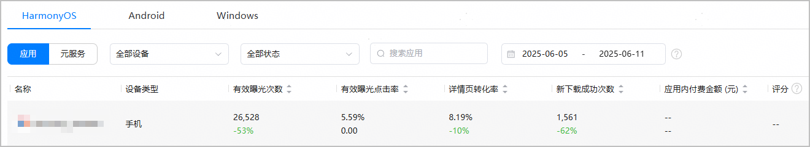
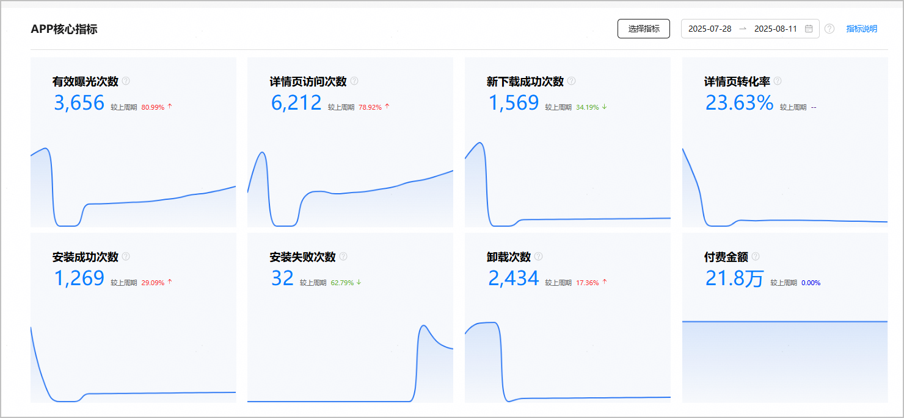
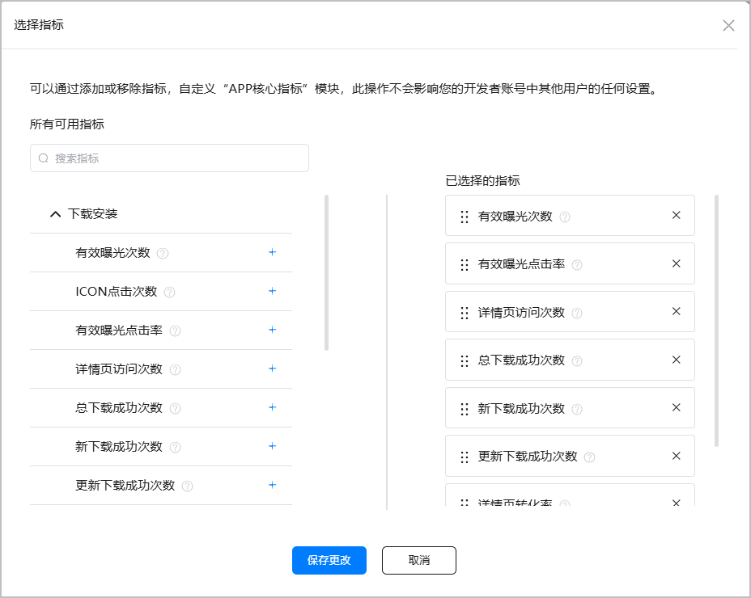
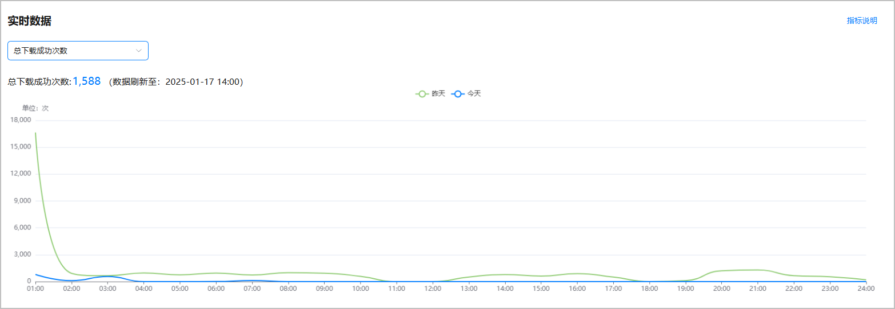
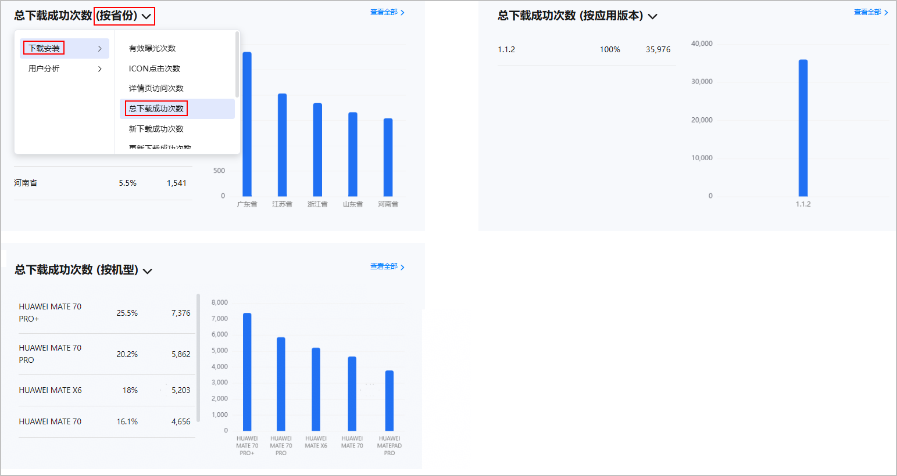
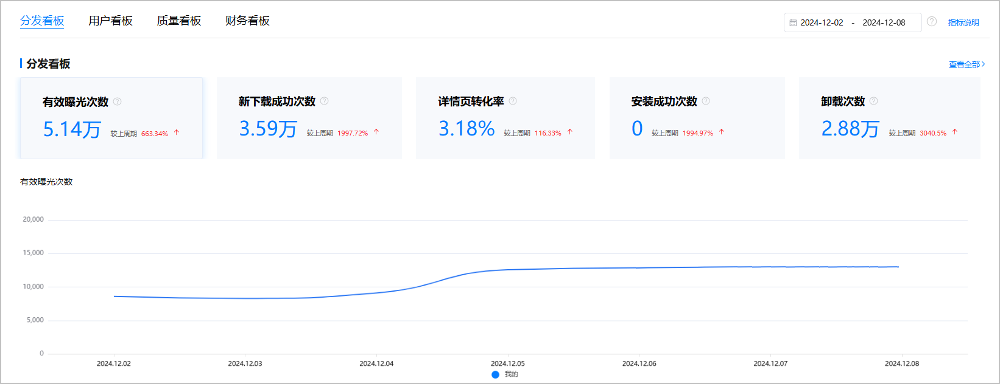
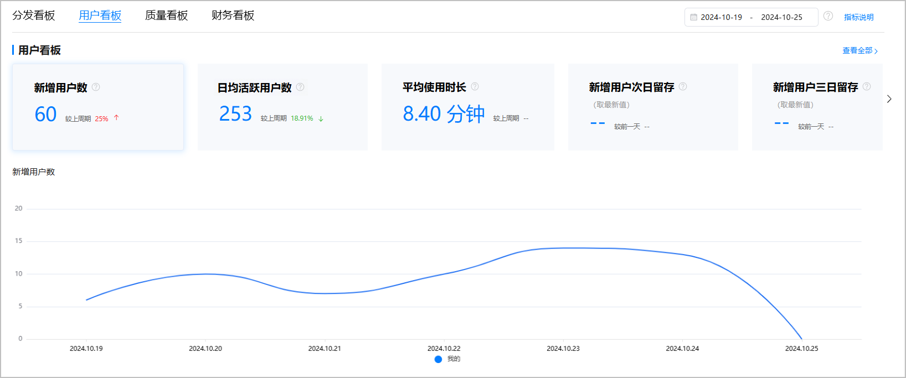
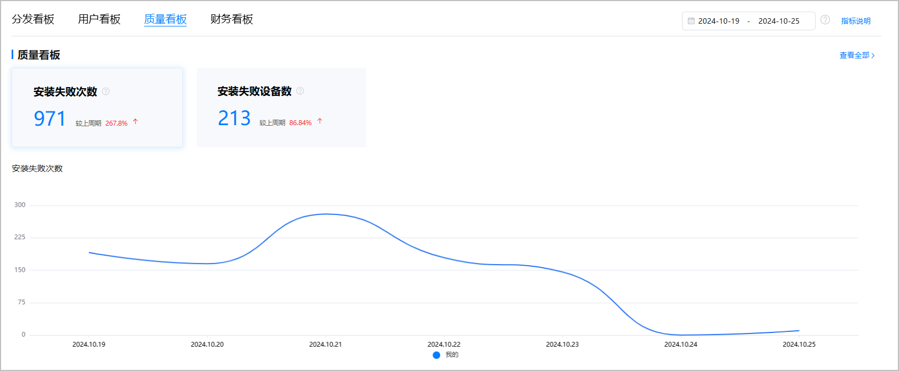
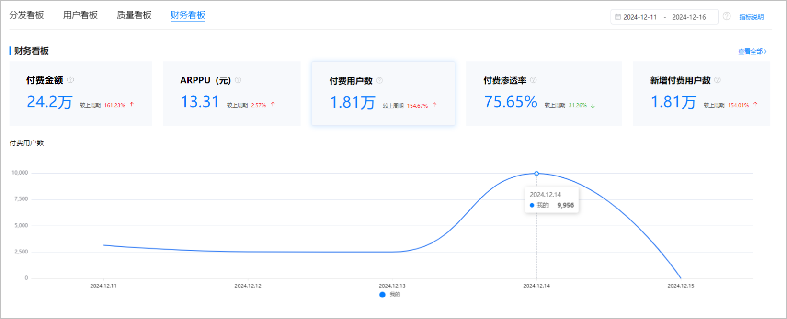

[应用分析总览](#section106851042192815)为您提供应用的分析总览数据；[应用分析概览](#section17943125854315)提供单个应用的关键KPI指标概览。

## 应用分析总览

1. 登录[AppGallery Connect](https://developer.huawei.com/consumer/cn/service/josp/agc/index.html)，点击“分析”。
2. 在分析总览页面选择“HarmonyOS”页签，页面默认展示所有HarmonyOS应用的分析总览数据。

   

   * 点击应用名称，可以查看该应用的概览页面；点击指标数据，可以查看该指标所在的报表页面。
   * 指标数据的上方显示当前时间周期的数据，下方则显示与上一个时间周期相比的数据增减百分比。

   

   “准备提交”、“正在审核”、“待修改”、“待上架”、“已撤销上架”的应用不在“分析”总览中展示，可以在“APP与元服务”中查看。

## 应用分析概览

概览界面默认展示当前应用的关键KPI表现情况，由[APP核心指标](#section85002014144412)、[实时数据](#section777862219448)、[TOP5数据](#section19526510517)和[看板模块](#section966516146443)构成。

### APP核心指标

APP核心指标默认展示“有效曝光次数”、“详情页访问次数”、“新下载成功次数”、“详情页转化率”、“安装成功次数”、“安装失败次数”、“卸载次数”、“付费金额”的汇总数据，以及各个数据的环比值。

* 点击右上角选择日期范围，时间跨度不得超过180天。您可以选择预定时间段（支持“昨天”、“过去7天”、“过去14天”、“过去30天”、“本周”、“上周”、“本月”和“上月”）或输入自定义范围，界面默认展示过去7天的时间段。日期时间为“北京时间UTC+8”。
* 点击“选择指标”按钮，可选择展示关键指标，必须选择8个。保存后，下次登录时，会展示上次保存的效果。

  
* 每个指标下方都会呈现对应的数据曲线图，曲线图上展示选中的时间内每天的数据，且支持展示环比值。
* 点击指标数据，可以跳转到该指标对应的报表页面，查看详细数据。

### 实时数据

实时数据默认展示“有效曝光次数”截至2小时前的当日数据曲线图，和昨日同时段的对比数据曲线图。

下拉列表框可选择“有效曝光次数”、“详情页访问次数”、“总下载成功次数”、“新下载成功次数”、“安装成功次数”、“卸载次数”共6个指标。点击“指标说明”可跳转详细介绍各项指标的页面。

### TOP5数据

TOP5数据支持筛选单个指标，按省份、应用版本、机型维度展示该指标TOP5名称、数据百分比（当前指标占总指标数的比例）、数据。点击“查看全部”可跳转到指标所对应的报表页面。

### 概览报表当前支持的核心指标

| 报表 | 指标名称 | 指标说明 |
| --- | --- | --- |
| 下载安装 | 有效曝光次数 | 应用在华为应用市场推荐、排行榜、搜索等资源位被展示次数，图片露出50%以上且曝光时间大于1s才算有效曝光。 |
| ICON点击次数 | 应用在华为应用市场内曝光的ICON被点击的次数。 |
| 有效曝光点击率 | ICON点击次数/有效曝光次数。 |
| 详情页访问次数 | 在华为应用市场内统计的应用详情页被浏览的次数。 |
| 总下载成功次数 | 更新下载成功次数 + 新下载成功次数。 |
| 更新下载成功次数 | 用户通过华为应用市场更新应用版本产生的下载成功次数。 |
| 新下载成功次数 | 用户通过华为应用市场新下载成功次数。  计算方式：第一次下载成功算一次，卸载后重新下载也算一次。 |
| 详情页转化率 | 详情页新下载次数（仅包括详情页带来的新下载次数）/详情页访问次数。 |
| 安装成功次数 | 应用在应用市场安装成功的次数（包含更新安装成功次数+新安装成功次数）。 |
| 新安装成功次数 | 用户通过华为应用市场新下载并安装成功的次数。 |
| 安装成功率 | 新下载应用安装成功的比例，即新安装成功次数/新下载成功次数。 |
| 卸载次数 | 从所有渠道安装或更新的应用被卸载的次数。 |
| 用户分析 | 累计用户数 | 截止当日累计用户数。 |
| 新增用户数 | 访问APP的去重新增用户数。 |
| 日均活跃用户数 | 所选时间段内每天活跃用户的累计总和/所选时间段天数。  说明：  关于活跃的定义，请参见FAQ“[活跃的判定标准是什么？](https://developer.huawei.com/consumer/cn/doc/app/agc-help-anaiyze-app-faq-0000002334224101#section12621333152712)”。 |
| 流失用户数 | 过去3个月内未使用过APP，但过去一年内使用过APP的用户。 |
| 安装失败 | 安装失败次数 | 时间间隔范围内的安装失败次数。 |
| 安装失败设备数 | 时间间隔范围内的安装失败设备数。 |
| 应用内付费 | 付费金额 | 时间间隔范围内所有用户付费总额。 |
| ARPPU（元） | 付费金额/付费用户数。 |
| 付费用户数 | 时间间隔范围内所有付费的用户数。 |
| 付费渗透率 | 时间间隔范围内付费用户占活跃用户的比率。 |
| 新增付费用户数 | 首次付费的用户数。 |

### 看板模块

数据看板模块包含“分发看板”、“用户看板”、“质量看板”、“财务看板”。您可通过点击看板页签直接查看对应看板数据。

* **分发看板：**为您展示有效曝光次数、新下载成功次数、详情页转化率、安装成功次数、卸载次数等汇总数据和环比值。

  当您点击某个指标（如“安装成功次数”）时，下方图表中会呈现对应的数据曲线图，曲线图上的数据展示选中的时间内每天的数据。点击右侧的“查看全部”，页面跳转到“[下载安装](https://developer.huawei.com/consumer/cn/doc/games-guides/games-center-anaiyze-app-usage-0000002350464692#section14231122115416)”报表页面。

  您也可以点击右上角选择预定时间段（例如，过去7天）或输入自定义范围（时间跨度不得超过180天），界面默认展示过去7天的时间段。

  

  **指标说明**

  | 指标名称 | 指标说明 |
  | --- | --- |
  | 有效曝光次数 | 应用在华为应用市场推荐、排行榜、搜索等资源位被展示次数，图片露出50%以上且曝光时间大于1s才算有效曝光。 |
  | 新下载成功次数 | 用户通过华为应用市场新下载成功次数。  计算方式：第一次下载成功算一次，卸载后重新下载也算一次。 |
  | 详情页转化率 | 详情页新下载次数（仅包括详情页带来的新下载次数）/详情页访问次数。 |
  | 安装成功次数 | 应用在应用市场安装成功的次数（包含更新安装成功次数+新安装成功次数）。 |
  | 卸载次数 | 从所有渠道安装或更新的应用被卸载的次数。 |
* **用户看板**：为您展示新增用户数、日均活跃用户数、平均使用时长、新增用户次日留存、新增用户三日留存、新增用户七日留存的汇总数据和环比值。

  当您点击某个指标（如“新增用户数”）时，下方图表中会呈现对应的数据曲线图，您可清晰掌握应用的用户使用情况。点击右侧的“查看全部”，页面跳转到“[用户分析](https://developer.huawei.com/consumer/cn/doc/games-guides/games-center-anaiyze-app-usage-0000002350464692#section3905133110302)”报表页面。

  您也可以点击右上角选择预定时间段（例如，过去7天）或输入自定义范围（时间跨度不得超过180天），界面默认展示过去7天的时间段。

  

  **指标说明**

  | 指标名称 | 指标说明 |
  | --- | --- |
  | 新增用户数 | 访问APP的去重新增用户数。 |
  | 日均活跃用户数 | 所选时间段内每天活跃用户的累计总和/所选时间段天数。  说明：  关于活跃的定义，请参见FAQ“[活跃的判定标准是什么？](https://developer.huawei.com/consumer/cn/doc/app/agc-help-anaiyze-app-faq-0000002334224101#section12621333152712)”。 |
  | 平均使用时长 | 用户在APP每天平均使用时长。 |
  | 新增用户次日留存 | 统计日首次打开APP的用户次日保持活跃的比率。 |
  | 新增用户三日留存 | 统计日首次打开APP的用户第3天保持活跃的比率。 |
  | 新增用户七日留存 | 统计日首次打开APP的用户第7天保持活跃的比率。 |
* **质量看板：**为您展示安装失败次数、安装失败设备数的汇总数据和环比值。

  当您点击某个指标（如“安装失败次数”）时，下方图表中会呈现对应的数据曲线图，您可清晰掌握应用的安装失败情况。点击右侧的“查看全部”，页面跳转到“[安装失败](https://developer.huawei.com/consumer/cn/doc/games-guides/games-center-anaiyze-app-quality-0000002384225033#section08791825212)”报表页面。

  您也可以点击右上角选择预定时间段（例如，过去7天）或输入自定义范围（时间跨度不得超过180天），界面默认展示过去7天的时间段。

  

  **指标说明**

  | 指标名称 | 指标说明 |
  | --- | --- |
  | 安装失败次数 | 时间间隔范围内的安装失败次数。 |
  | 安装失败设备数 | 时间间隔范围内的安装失败设备数。 |
* **财务看板：**为您展示付费金额、ARPPU（元）、付费用户数、付费渗透率、新增付费用户数的汇总数据和环比值。

  当您点击某个指标（如“付费用户数”）时，下方图表中会呈现对应的数据曲线图，您可清晰掌握应用的付费情况。点击右侧的“查看全部”，页面跳转到“[应用内付费](https://developer.huawei.com/consumer/cn/doc/games-guides/games-center-anaiyze-app-sale-0000002384065345#section0292172912231)”报表页面。

  您也可以点击右上角选择预定时间段（例如，过去7天）或输入自定义范围（时间跨度不得超过180天），界面默认展示过去7天的时间段。

  

  **指标说明**

  | 指标名称 | 指标说明 |
  | --- | --- |
  | 付费金额 | 时间间隔范围内所有用户付费总额。 |
  | ARPPU（元） | 付费金额/付费用户数。 |
  | 付费用户数 | 时间间隔范围内所有付费的用户数。 |
  | 付费渗透率 | 时间间隔范围内付费用户占活跃用户的比率。 |
  | 新增付费用户数 | 首次付费的用户数。 |
