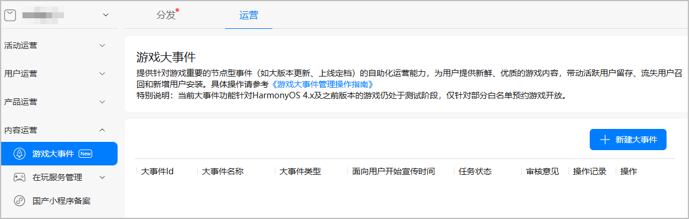
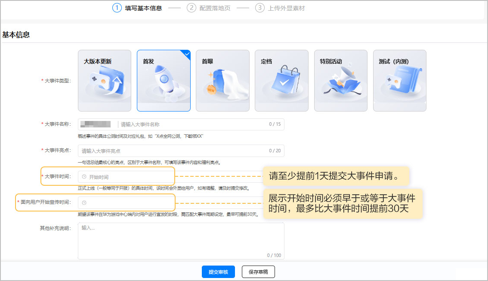
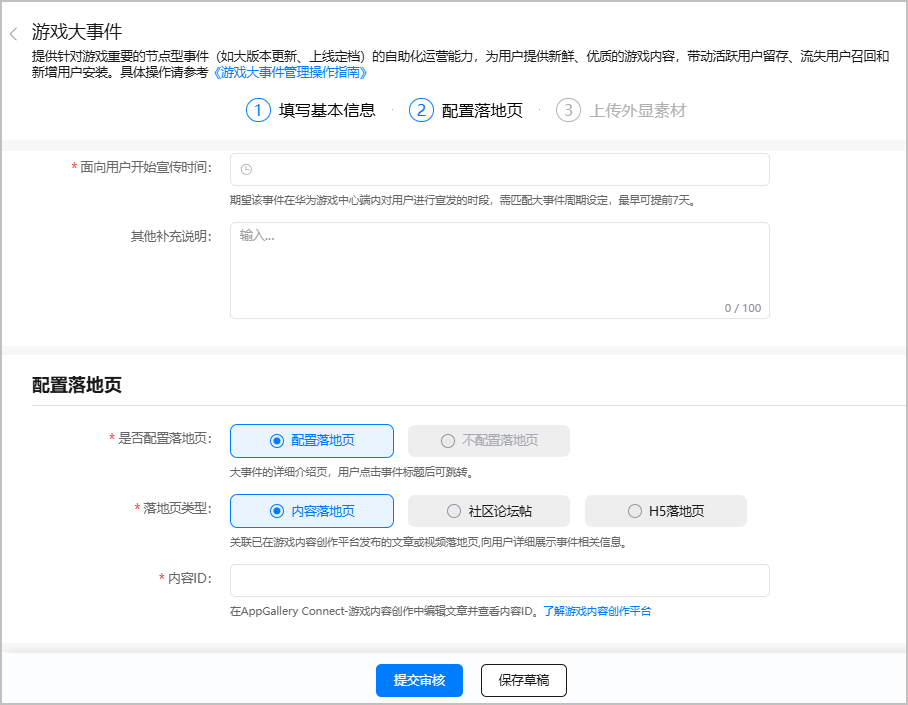
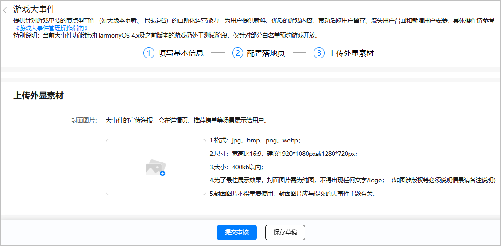
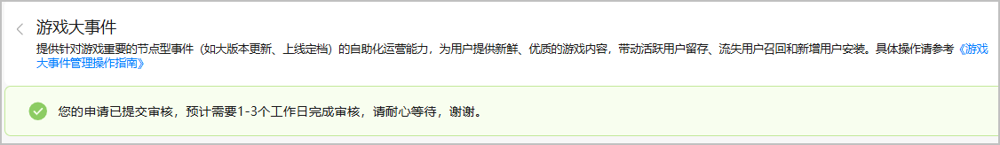

首发是指从未公开运营过的新游戏，首次面向用户公开正式运营。

## 前提条件

* 您已成功[创建游戏](https://developer.huawei.com/consumer/cn/doc/app/agc-help-create-app-0000002247955506)。
* 您已完成[配置应用基本信息](https://developer.huawei.com/consumer/cn/doc/app/agc-help-release-app-0000002271695230)。

## 操作流程

## 创建大事件

1. 登录[AppGallery Connect](https://developer.huawei.com/consumer/cn/service/josp/agc/index.html)，点击“APP与元服务”，在应用列表中选择需要创建游戏大事件的应用。
2. 选择“运营 &gt; 内容运营 &gt; 游戏大事件”，进入游戏大事件页面，点击“新建大事件”。

   
3. 填写基本信息。

   
4. 配置落地页。

   落地页是大事件的详细介绍页，用户点击事件标题后可跳转。

   

   相关参数如下表所示。

   | 参数 | 说明 |
   | --- | --- |
   | 是否配置落地页 | 大事件类型为“首发”时，可选择是否配置相应的落地页。 |
   | 落地页类型 | 可选择落地页的类型，分为内容落地页、社区论坛帖和H5落地页三种。  * 内容落地页：关联已在游戏内容创作平台发布的文章或视频落地页，向用户详细展示事件相关信息。 说明：  配置内容落地页需先创作游戏的内容作品，具体要求请参见[内容创作管理](https://developer.huawei.com/consumer/cn/doc/games-guides/games-center-column-operation-0000002320758549)。 * 社区论坛帖：关联已发布的社区论坛帖，向用户详细展示事件相关信息。 说明：  使用社区论坛帖类型需要先开通社区板块，具体操作方法请参见[社区管理](https://developer.huawei.com/consumer/cn/doc/games-guides/games-center-community-operation-0000002285999096)。 * H5落地页：关联魔方创意生成的H5活动页面，向用户详细展示事件相关信息。 |
   | 内容ID | 选择落地页类型为“内容落地页”时显示，需填写相关内容ID。  说明：  内容ID可以在“AppGallery Connect \&gt; 全部服务 \&gt; 搜索游戏内容创作 \&gt; 内容管理”中进行查看。 |
   | 社区帖ID | 选择落地页类型为“社区论坛帖”时显示，需填写相关社区帖的ID。  说明：  社区帖ID可以在“AppGallery Connect \&gt; 社区管理”中进行查看。 |
   | 自定义H5链接 | 选择落地页类型为“H5落地页”时显示，需填写H5活动页面链接。  说明：  仅支持添加由[魔方创意](https://developer.huawei.com/consumer/cn/doc/games-guides/games-center-creatives-ideas-0000002286004608)生成并审核通过的H5活动页面链接。 |
5. 上传外显素材（可选）。

   外显素材是大事件的宣传海报,会在详情页、推荐榜单等场景展示给用户。

   

   

   1. 大事件需配置相应内容的封面图片和落地页，审核通过后可获得尝鲜专区/新游专区展示位机会。
   2. 为了最佳展示效果，封面图片需为纯图，不得出现任何文字/logo。（如图涉版权等必须说明情景请备注说明）
   3. 封面图片不得重复使用，封面图片应与提交的大事件主题有关。
6. 填写完成后点击“提交审核”。提交审核后，华为工作人员审核大事件申请预计需要1~3个工作日，请耐心等待。审核结果可在游戏大事件列表内“任务状态”列查看。

   

   

   * 填写过程中可选择“保存草稿”，已填写信息会保存。可以在游戏大事件页面中查看草稿并继续编辑提交。
   * 若想修改审核中的活动，请先撤销大事件的申请，重新编辑大事件后再提交审核。
