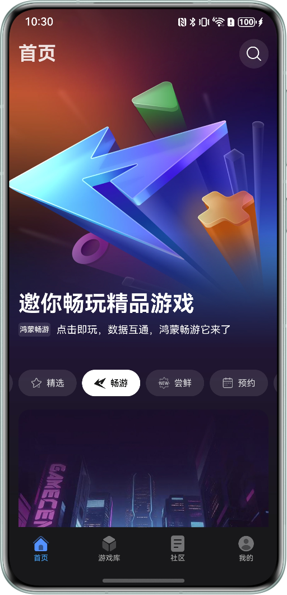
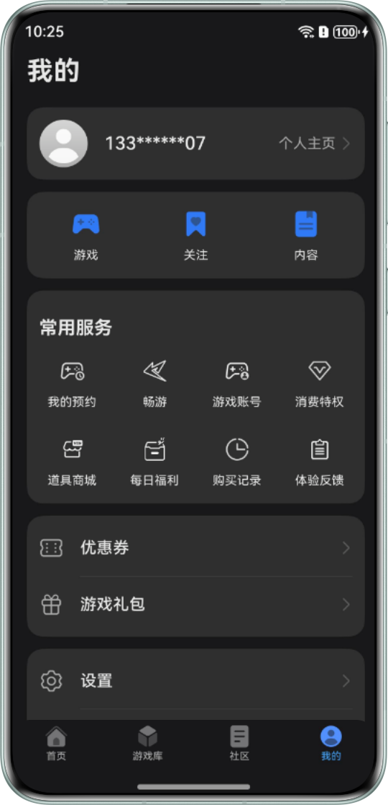
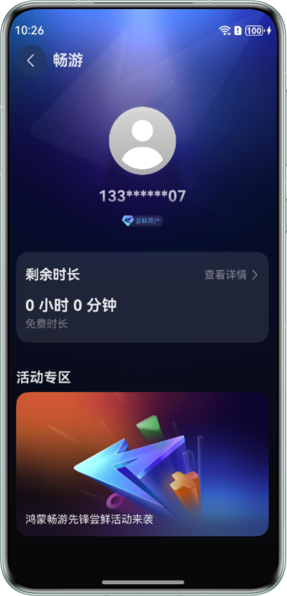

游戏中心【畅游】专区游戏基于云端技术实现云侧游戏部署，将游戏运行在服务端，玩家只需联网即可畅玩，无需高端硬件也能流畅运行大型游戏。游戏中心【畅游】专区汇聚众多精彩游戏，无需下载安装，即点即玩。

## 前提条件

当前游戏中心【畅游】专区限量尝鲜中，仅受邀玩家可获得免费游玩时长。

## 客户端展示效果

|  |  |
| --- | --- |
| **游戏中心首页** |  |
|  |  |

## 个人中心入口

畅游个人中心入口在“ 游戏中心 &gt; 我的 &gt; 常用服务 &gt; 畅游”，玩家可以在此处查看自己的剩余时长信息。

|  |  |
| --- | --- |
|  |  |

## FAQ

### 玩家的畅游游戏排队时切换后台，如何再次查看排队进度？

玩家可至游戏中心客户端内【我的】查看排队进度，客户端外如果开启了实况窗权限，则可通过实况窗实时查看排队进度。
