华为游戏中心社区是以用户为核心，内容为引导，不断聚集更多热爱游戏的玩家，实现玩家与玩家，玩家与开发者的交流互动阵地。我们诚邀各位开发者一起来加入游戏社区的运营，为玩家提供更多的内容、创建社区活动和进行互动，共同建立一个受玩家喜爱的游戏社区。

## 社区开版

### 前提条件

* 在开通社区版块前，您必须先[创建游戏](/docs/distribute/agc/agc-help-app-0000002235710234/agc-help-create-app-0000002247955506)。
* 社区版块的名称和图标影响审核结果，请在开通社区版块前修改，图标要求为216\*216px的png图片。
* 目前开通社区版块仅支持在架版本或预约审核通过的游戏。

### 开通版块

1. 登录[AppGallery Connect 网站](https://developer.huawei.com/consumer/cn/service/josp/agc/index.html#/)，在全部服务搜索“社区管理”服务，进入“社区管理”页面。

   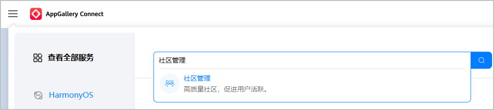
2. 选择“社区详情 &gt; 版块管理”，点击“开通版块”。

   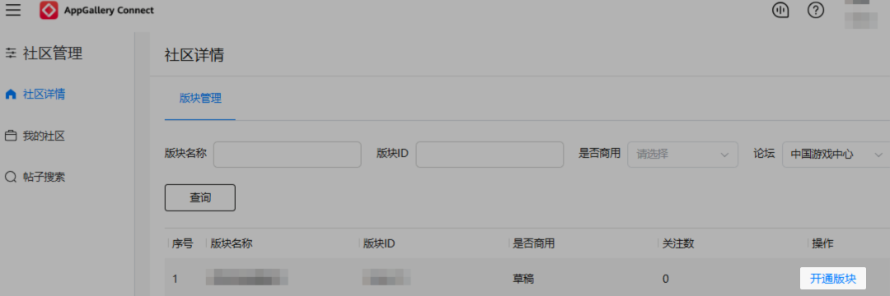
3. 在“开通版块”详情页按照提示填写信息。

   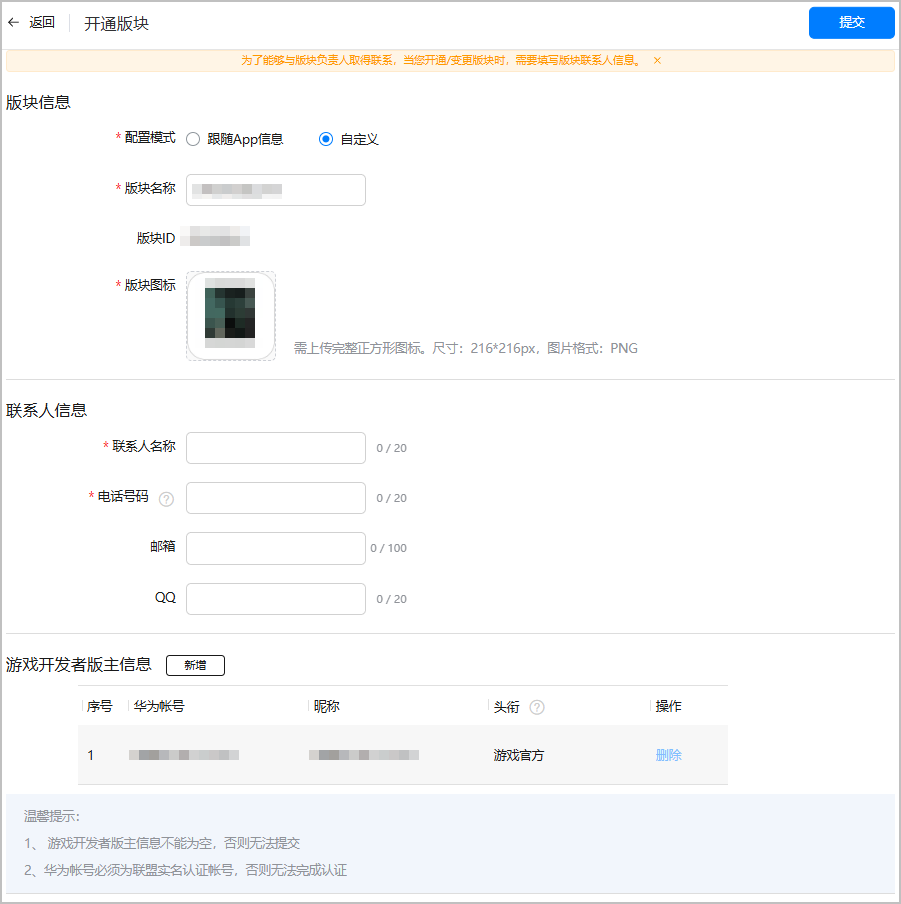

   | 参数 | | 说明 |
   | --- | --- | --- |
   | 版块信息 | | 自动获取关联信息，也可以自定义名称和图标。 |
   | 联系人信息 | 联系人名称 | 必填项。方便华为工作人员与版块负责人取得联系。 |
   | 电话号码 | 必填项。电话号码格式有如下2种：  * 3~4位区号-7~8位座机号码，例如025-12345678。 * 13~19开头的手机号，例如13645167527。 |
   | 邮箱 | 选填项。 |
   | QQ | 选填项。 |
   | 游戏开发者版主信息 | | 至少一个实名认证的账号，可新增多个账号。账号包括：  * 华为账号 * 版主头衔必须符合如下要求之一：   + 游戏公司官方，认证内容为公司名称（以游戏公司为单位），一个公司仅能认证一个账号。   + 游戏官方，认证内容为游戏名称+官方（以单款游戏为单位），一个游戏仅能认证一个账号。   + 游戏相关人员，认证内容为游戏名称+职能（以从业者为单位），一个游戏可认证多个账号。 |
4. 完成信息的配置后，点击“提交”。若在工作日的17:00前提交申请，华为工作人员将在当天审核完毕，如遇节假日则延迟。在审核完成前，您都可以撤回申请。

### 变更版块

1. 登录[AppGallery Connect 网站](https://developer.huawei.com/consumer/cn/service/josp/agc/index.html#/)，在全部服务搜索“社区管理”服务，进入“社区管理”页面。
2. 选择“社区详情 &gt; 版块管理”，点击“变更”。

   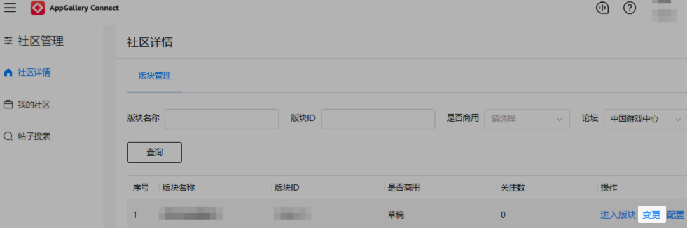
3. 在“申请变更”详情页按照提示填写信息。

   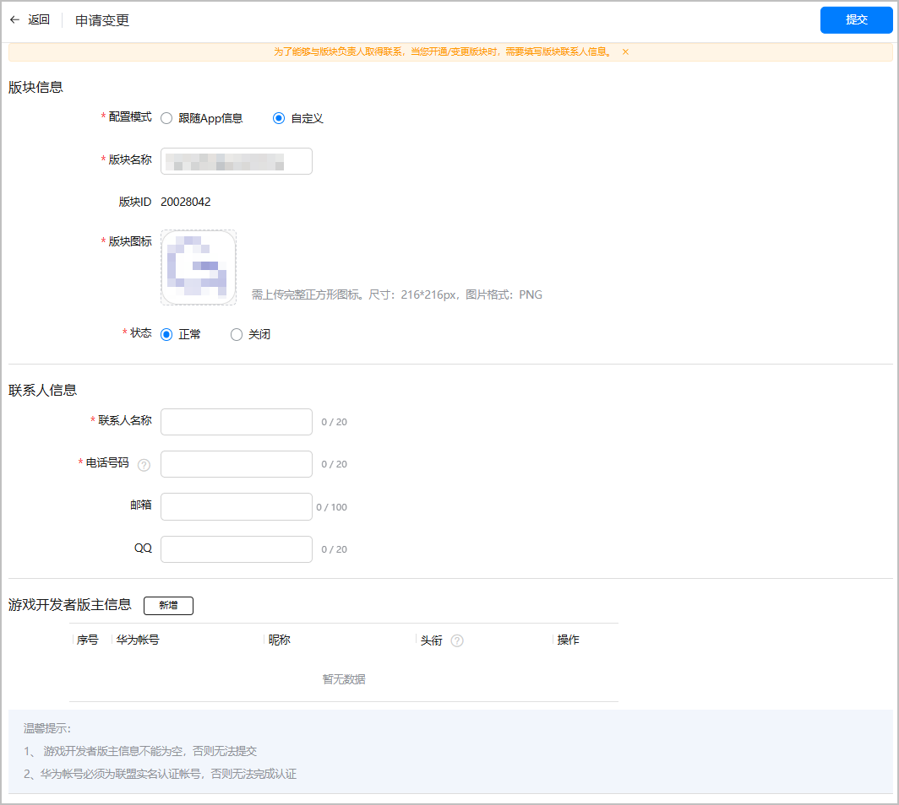

   | 参数 | 说明 |
   | --- | --- |
   | 版块信息 | * 若选择“关闭”版块，将不再支持自助开版。 * 若重新开通已关闭版块，需发送邮件至gameforum@huawei.com进行申请。 |
   | 联系人信息 | 变更联系人需要正确填写信息，方便华为工作人员与版块负责人取得联系。 |
   | 游戏开发者版主信息 | 变更头衔或新增版主信息都需要符合头衔认证标准。 |
4. 完成信息的更改后，点击“提交”。若在工作日的17:00前提交申请，华为工作人员将在当天审核完毕，如遇节假日则延迟。在审核完成前，您都可以取消变更内容。

### 配置版块

1. 登录[AppGallery Connect 网站](https://developer.huawei.com/consumer/cn/service/josp/agc/index.html#/)，在全部服务搜索“社区管理”服务，进入“社区管理”页面。
2. 选择“社区详情 &gt; 版块管理”，点击需要配置的版块操作列的“配置”。

   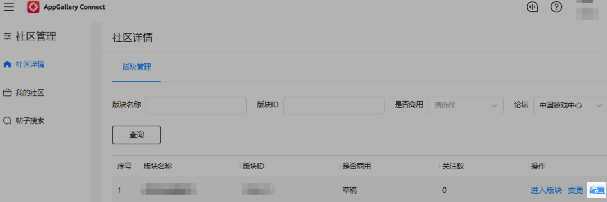
3. 在“版块配置”详情页选择“自定义标签”页签可新增标签，管理已有标签。

   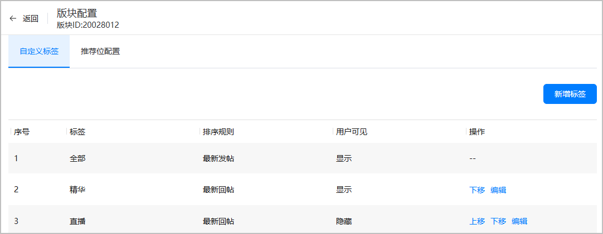
4. 在“版块配置”详情页选择“推荐位配置”页签可以配置论坛首页推荐位。

   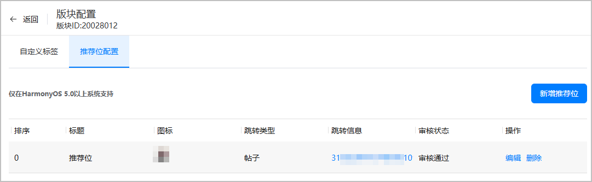

   点击“新增推荐位”，按照提示填写信息，填写完成后点击“确认”自动提交机审。

   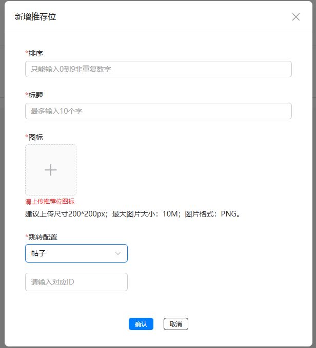

   | 参数 | 说明 |
   | --- | --- |
   | 排序 | 推荐位展示的顺序，请输入0到9非重复数字。 |
   | 标题 | 推荐位标题，最多输入10个字符。 |
   | 图标 | 推荐位图标，建议上传尺寸200\*200px；最大图片大小：10M；图片格式：PNG。 |
   | 跳转配置 | 配置点击推荐位跳转的内容，可选“帖子”和“活动”。  * 帖子：需填写对应帖子ID * 活动：需填写对应活动ID |

   审核通过后，即可在游戏中心客户端游戏论坛首页展示推荐位。

   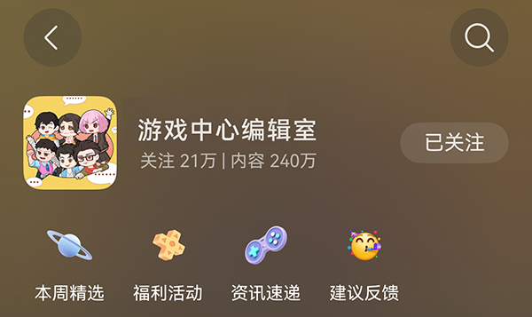

## 常用操作及功能介绍

### 后台操作

华为开发者联盟社区管理后台主要分为“社区详情”、“我的社区”、“维护管理”、“消息管理”四个模块：

|  |  |  |
| --- | --- | --- |
| 社区管理 | 社区详情 | 查询有权限的版块、帖子查询管理、进行发帖、帖子加精置顶、帖子热点申请、帖子屏蔽、帖子评论回复、活动设置 |
| 我的社区 | 互动提醒、我的发帖回帖历史、关注版块 |
| 维护管理 | 发帖回帖审核、举报审核、违规用户禁言、审核历史 |
| 消息管理 | 新建推送消息、消息状态查询、消息效果查询 |

1. 后台进入流程：[AppGallery Connect](https://developer.huawei.com/consumer/cn/service/josp/agc/index.html) &gt; 社区管理。
2. 社区详情页操作简介：
   * 论坛：请选择“中国游戏中心”。
   * 进入版块：进入版块管理页面，详情见下文。

   

   点击进入版块——

   * 精华：设置为精华帖子的汇总
   * 视频：视频帖子的汇总
   * 反馈：移入反馈区的帖子的汇总
   * 去游戏内容创作发内容

   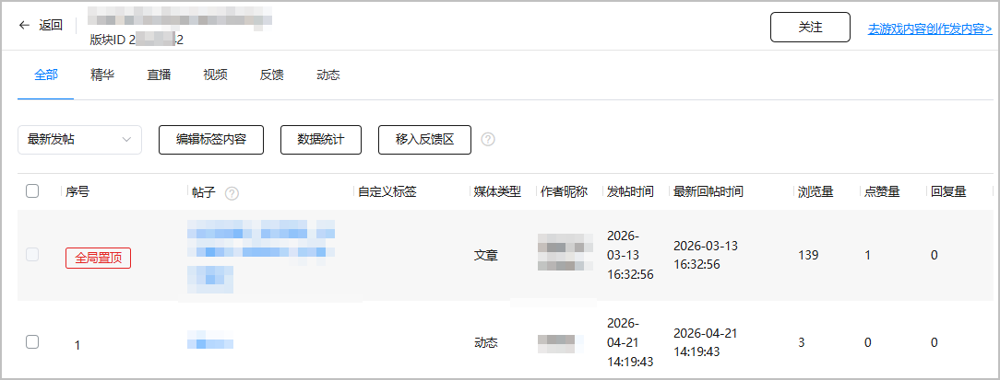

   点击“社区统计”，页面展示如下两类社区数据：

   * 版块数据： 根据您选择的时间范围，展示每天/周/月的数据值，例如新增关注账号、取消关注账号等。
   * 热门帖子列表：根据您选择的时间范围，展示回帖和回复总数排名前十的帖子。

   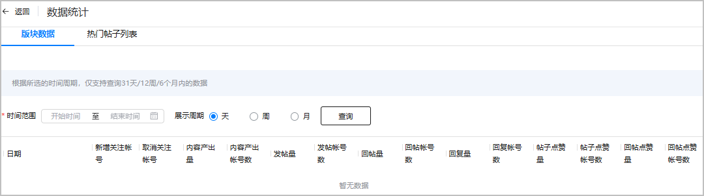

   点击进入帖子——

   * 展示帖子点赞数、评论数。
   * 支持用户禁言、评论屏蔽。

   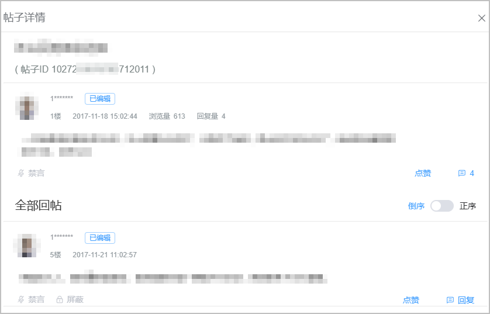
3. 我的社区页操作简介：
   * 我的提醒：回复内容、点赞情况、系统通知
   * 我的帖子：自身发帖和评论记录
   * 我的关注：自身关注的版块总览

   

## 社区维护要求

社区活跃度的提高，缺不了开发者的配合与努力。所以我们要求开发者对版块内容、活动、用户和版面维护负责，并且按照以下规则和建议进行论坛维护。具体内容请参见[社区维护要求](/docs/distribute/app-dist/game-center/game-center-operation-0000001239502315/game-center-user-operation-0000001239342339/game-center-community-operation-0000001194305462#section4451941112616)。

## 结语

在游戏外为玩家创造一个愉快、轻松的聚集地是我们华为游戏中心社区的目标。

要实现这个目标，我们需要和开发者们一同努力为玩家服务，如仍有疑问，请通过[在线提单](https://developer.huawei.com/consumer/cn/support/feedback/#/add/101704353566310877?level2=101704353626565886&level3=101704354579010004&keyWord=Game Service Kit)方式联系华为工作人员。

关于指南中所提及的资料：

[《华为游戏中心开版申请》](https://communityfile-drcn.op.hicloud.com/FileServer/getFile/cmtyManage/011/111/111/0000000000011111111.20191015160808.93749614659460508984639867885044%3A50511216084150%3A2800%3A6789526C411EEF08D413712BFB8563A56FEEB5475D78C6B1E73734F35EA616C4.xlsx?needInitFileName=true)

[《华为游戏中心社区活动模板》](https://communityfile-drcn.op.hicloud.com/FileServer/getFile/cmtyManage/011/111/111/0000000000011111111.20191015160920.12876529510443291341318681997612%3A50511216084150%3A2800%3A06E5445E7235EF0D7FB9755C19C3A050199DB74AC96C052F7661D5A0C61426BA.pdf?needInitFileName=true)
