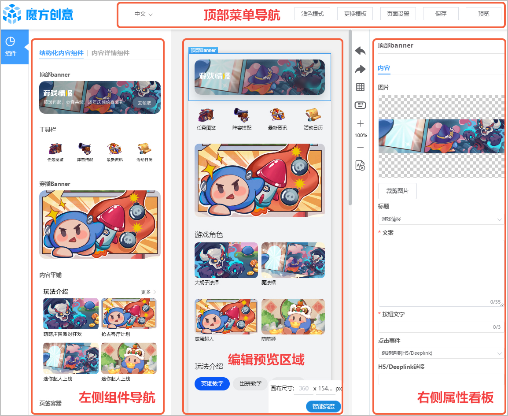
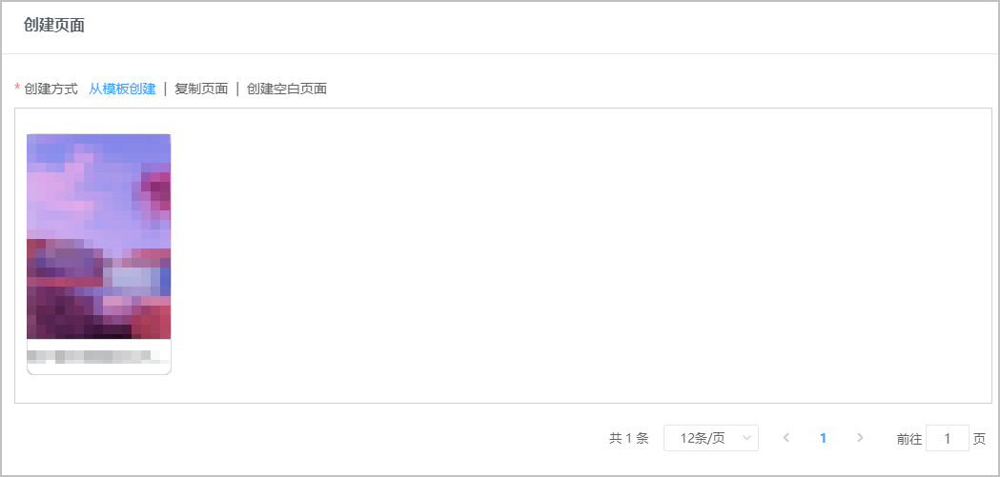
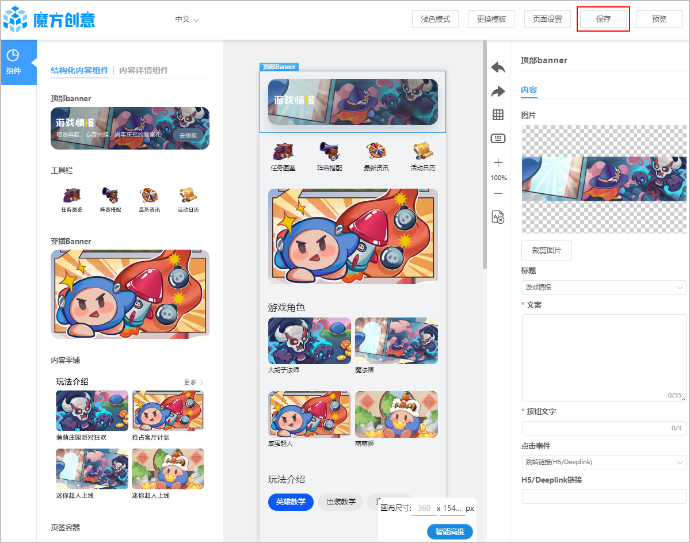
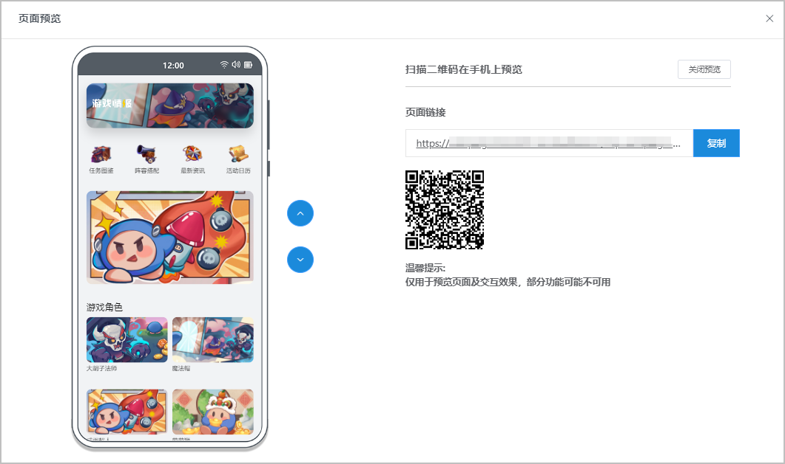
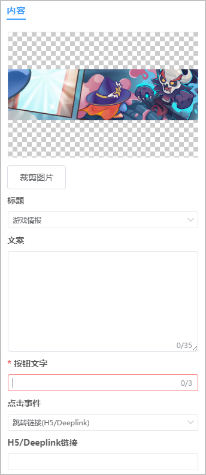
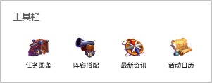
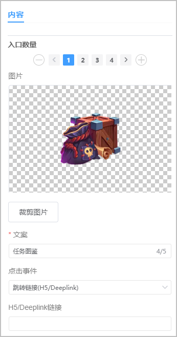
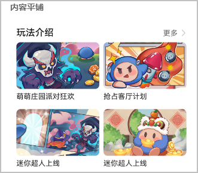
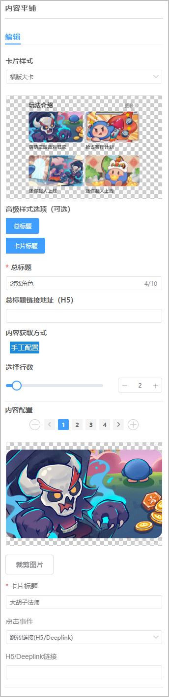
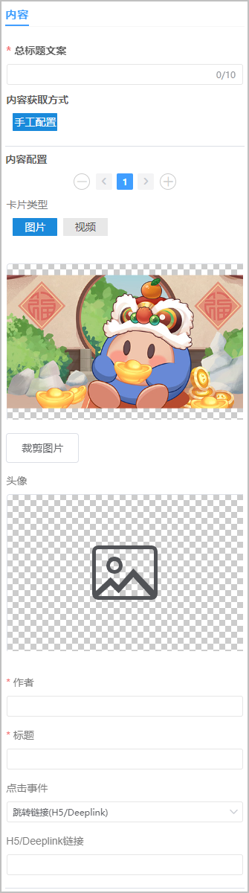

在玩魔方创意是为[在玩服务](https://developer.huawei.com/consumer/cn/doc/games-guides/games-center-playing-operation-0000002285953818)提供的在线制作、轻松上手、简单轻量的设计网站。该网站支持一键预览，支持复杂的交互或跳转，您可以自由搭配组件，一键复用优质内容，轻松设计在玩的可视化H5落地页。

## 编辑器界面

### 左侧组件导航

“魔方创意”网站的左侧组件导航展示您可以使用到在玩页面的不同组件。按住并拖动组件到页面编辑区即可将组件添加至页面当中，组件的具体样式及配置方法，请参见[结构化内容组件](#section154521023163716)。

| 组件 | 说明 |
| --- | --- |
| [顶部banner](#section11716103363711) | 当版本更新时可以使用，展示最新资讯。 |
| [工具栏](#section18850185417375) | 可配置多个图标，默认4个，只能在3~5个之间。 |
| [穿插Banner](#section257017197383) | 穿插banner组件是一种支持配置单个宽型banner的组件。穿插banner位置较为灵活，可以穿插在组件之间丰富页面样式。 |
| [内容平铺](#section67981564276) | 平铺展示多个内容。 |
| [页签容器](#section869975916276) | 可配置多个页签图标。  说明：  必须与内容平铺搭配使用。 |
| [瀑布流卡片](#section52663903818) | 瀑布流是由多个单卡片组成的竖滑组件，每个卡片承载一个内容，放置在页面底部。 |

### 顶部菜单导航

| 组件 | 说明 |
| --- | --- |
| 语言切换 | 您仅能切换成“中文”或“English”。 |
| 浅色模式 | 可切换“深色模式”或“浅色模式”。 |
| 更换模板 | 您可以重新选择页面模板，请参见[创建H5页面](#section7182346111813)。 |
| 页面设置 | 您需要设置全局样式，例如页面名称、页面使用组件版本等。 |
| 保存 | 您可以随时保存页面内容。 |
| 预览 | 您可以随时[预览页面内容](#section31105420225)。 |

### 编辑预览区域

您可以设置页面高度，调整组件位置等。拖动组件进入该区域，点击组件可对其属性进行设置，右键可删除或复制组件。

* 智能高度

  配置完页面后，点击“智能高度”，页面高度会自动调整，去除底部留白。

### 右侧属性面板

您可以设置不同组件的不同属性，例如样式、事件等。

## 创建H5页面

1. 跳转至“魔方创意”网站后，请在自动弹出的“创建页面”窗口中选择页面：
   * 您可以使用网站提供的主题模板。
   * 您可以复制历史页面。
   * 您可以使用空白页面。

   
2. 根据需求使用网站组件并设置对应的组件属性，点击“保存”随时保存已完成的页面设计。

   

## 预览H5页面

页面编辑过程中可点击顶部菜单导航“预览”对页面效果进行预览，魔方创意提供多种方式预览：

* 您可以点击  或  直接查看手机模拟器中的展示效果。
* 您可以复制一键生成的链接，前往移动端查看展示效果。
* 您可以直接扫描二维码查看展示效果。

  

## 提交审核

完成页面所有编辑或修改操作，对页面样式满意后，保存内容，然后需返回原来的[AGC在玩配置](https://developer.huawei.com/consumer/cn/doc/games-guides/games-center-playing-operation-0000002285953818#section135935152518)页面，对在玩头图和H5页面进行提交，最终客户端呈现的tab页样式会是头图+H5页面拼接的效果。

## 结构化内容组件

### 顶部banner

* 组件介绍

  

  当版本更新时可以使用，展示最新资讯。

* 组件配置

  

  | 参数 | 说明 |
  | --- | --- |
  | 图片 | 上传自定义图片，支持裁剪。建议使用无文案图片。  要求如下：  + 格式：JPG、PNG、JPEG、WEBP； + 尺寸：建议1080\*290px； + 大小：200~500KB。 |
  | 标题 | 当前仅可选“游戏情报”。 |
  | 文案 | 介绍文案，支持0~35个字符。 |
  | 按钮文字 | 必填，最多3个字符。 |
  | 点击事件 | + 跳转链接(H5/Deeplink)：需填写H5/Deeplink链接 + 跳转至帖子详情(帖子ID)：需填写帖子ID |

### 工具栏

* 组件介绍

  

  可配置多个图标，默认4个，只能在3~5个之间。

* 组件配置

  

  | 参数 | 说明 |
  | --- | --- |
  | 入口数量 | 指定工具入口数量，支持3/4/5个。 |
  | 图片 | 上传自定义图片，支持裁剪。  要求如下：  + 格式：JPG、PNG、JPEG、WEBP； + 尺寸：宽高比1:1，建议256\*256px； + 大小：500KB以内。 |
  | 文案 | 必填，最多5个字符。 |
  | 点击事件 | + 跳转链接(H5/Deeplink)：需填写H5/Deeplink链接 + 跳转至帖子详情(帖子ID)：需填写帖子ID |

### 穿插Banner

* 组件介绍

  

  穿插 banner 组件是一种支持配置单个宽型 banner 的组件。穿插 banner 位置较为灵活，可以穿插在组件之间丰富页面样式。

* 组件配置

  

  | 参数 | 说明 |
  | --- | --- |
  | 素材类型 | 支持“图片”和“视频”。  图片要求如下：  + 格式：JPG、PNG、JPEG、WEBP； + 尺寸：宽高比16:9； + 大小：500KB以内。 视频要求如下：  + 格式：MP4； + 大小：50MB以内。 |
  | 点击事件 | + 跳转链接(H5/Deeplink)：需填写H5/Deeplink链接 + 跳转至帖子详情(帖子ID)：需填写帖子ID |

### 内容平铺

* 组件介绍

  

  该组件可平铺展示多个内容。

* 组件配置

  

  | 参数 | | 说明 |
  | --- | --- | --- |
  | 卡片样式 | | 可选“横版大卡”（16：9）和“方形小卡”（1：1）。 |
  | 内容配置 | | 设定内容数量，最多10行。 |
  | 高级样式选项 | | 包括“总标题”和“卡片标题”，默认均需配置，如不需要可点击取消该项。 |
  | 总标题 | 总标题 | 必填，1~10个字符。 |
  | 总标题链接地址 | 暂不可用。 |
  | 卡片标题 | 卡片标题 | 请填写卡片标题。 |
  | 内容获取方式 | | 选择“手工配置”。 |
  | 手工配置 | 选择行数 | 可选1~10。 |
  | 内容配置 | 设定内容数量，总数与配置的行数匹配。  分别上传各内容的图片，支持裁剪。  要求如下：  + 格式：JPG、PNG、JPEG、WEBP； + 尺寸（方形小卡）：宽高比1：1，建议1080\*1080px； 尺寸（横版大卡）：宽高比16：9； + 大小：500KB以内。 |
  | 点击事件 | + 跳转链接(H5/Deeplink)：需填写H5/Deeplink链接 + 跳转至帖子详情(帖子ID)：需填写帖子ID |

### 页签容器

* 组件介绍

  

  页签容器可配置多个页签图标。必须与内容平铺搭配使用。

* 组件配置

  

  | 参数 | 说明 |
  | --- | --- |
  | 展示总标题 | 选择是否展示总标题。 |
  | 总标题文案 | 必填，1~10个字符。 |
  | 总标题链接地址 | 暂不可用。 |
  | 页签设置 | 可配置多个页签，但不支持超过一行。 |
  | 页签名称 | 要求1~4个字符。 |

  编辑预览区域已放置页签容器和内容平铺组件后，选中内容平铺组件，可拖拽入页签容器，页签容器边框高亮时可放开鼠标，弹框提示“是否拖入当前容器？”，点击“确定”即可将该组件放入该页签。

  

  多个页签需点击对应页签分别配置关联内容平铺组件。

  

  

  不同页签下的内容平铺组件的行数要保持一致，不然页面底部会出现留白。

### 瀑布流卡片

* 组件介绍

  

  瀑布流是由多个单卡片组成的竖滑组件，每个卡片承载一个内容，放置在页面底部。

* 组件配置

  

  | 参数 | | 说明 |
  | --- | --- | --- |
  | 总标题文案 | | 必填，最多10个字符。 |
  | 内容获取方式 | | 选择“手工配置”。 |
  | 手工配置 | 内容配置 | 设定内容数量，可添加多个，不受限制。  分别上传各内容的图片，支持裁剪。  要求如下：  + 格式：JPG、PNG、JPEG、WEBP； + 尺寸：宽高比16:9，建议1280\*720px； + 大小：500KB以内。 |
  | 卡片类型 | 可选“图片”和“视频”。 |
  | 头像 | 请上传头像图片。 |
  | 作者 | 请填写作者信息。 |
  | 标题 | 请填写标题信息。 |
  | 点击事件 | + 跳转链接(H5/Deeplink)：需填写H5/Deeplink链接 + 跳转至帖子详情(帖子ID)：需填写帖子ID |
