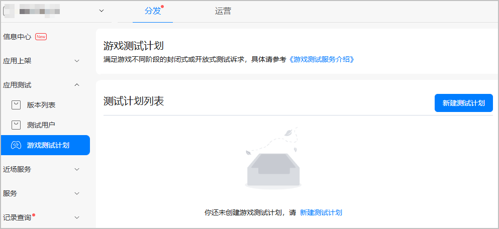
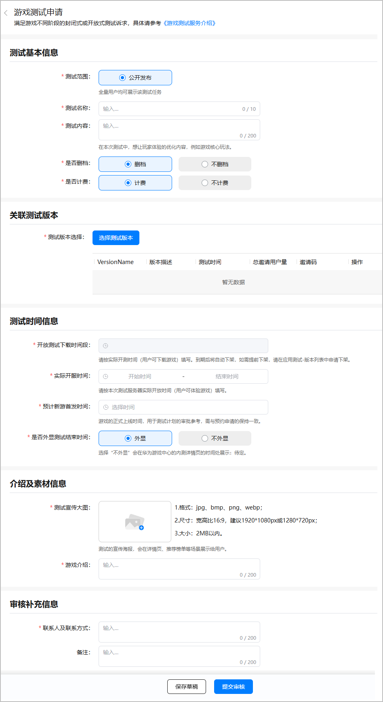
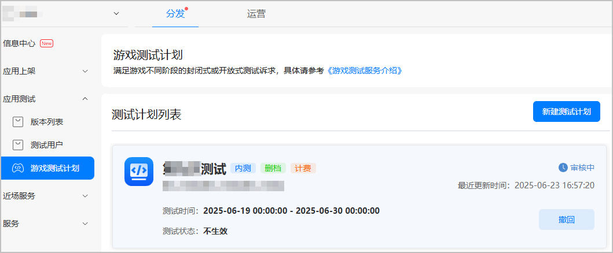
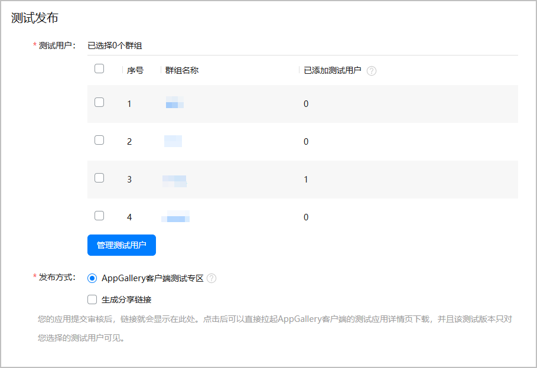

游戏内测是您验证游戏对华为手机适配情况，获取游戏数据情况来改进游戏的关键环节，同时内测数据也是用来确定游戏评分评级与首发推广资源的重要参考依据。因此强烈建议您对游戏进行内测。

## 前提条件

* 您已成功[创建游戏](/docs/distribute/agc/agc-help-app-0000002235710234/agc-help-create-app-0000002247955506)，且软件包类型为“APP（HarmonyOS应用）”，支持设备为“手机”。
* 您已[配置应用基本信息](https://developer.huawei.com/consumer/cn/doc/app/agc-help-release-game-0000002364930906)，且游戏分类不包括“斗地主”、“捕鱼”、“纸牌 ”和“麻将”。
* 为了提升内测包的通过率，您需要提前自检游戏接入参数、游戏登录体验、游戏支付体验等。
* （可选）您可以[开通社区论坛](/docs/distribute/app-dist/game-center/game-center-operation-0000001239502315/game-center-user-operation-0000001239342339/game-center-community-operation-0000001194305462)，用于宣传游戏内容，聚集核心用户。

## 提交内测版本

提交内测申请前，您需先提交内测版本审核。

1. 登录[AppGallery Connect](https://developer.huawei.com/consumer/cn/service/josp/agc/index.html)，点击“APP与元服务”，在应用列表页面选择需要申请内测的游戏。
2. 在“分发 &gt; 应用测试 &gt; 版本列表”页面提交内测包，添加测试用户以及创建测试版本的接入要求、流程请参见[邀请测试](https://developer.huawei.com/consumer/cn/doc/app/agc-help-apptest-invite-test-0000002258071220)。

   

   * 添加测试用户时，“添加方式”选择“邀请码添加”。
   * 邀请码可设置的邀请用户数量上限为10000人。当所有测试用户群组的数量相加去重，累计达到10000时，邀请码会自动失效，且待邀请用户数量会自动变为0。
   * 创建测试版本时，需配置测试时间（即允许用户下载测试包的时间）。

   
3. 内测包的审核预计需要3~5个工作日，请耐心等待。审核结果可在“版本信息”页面查看。

## 提交内测申请

提交内测版本并审核通过后，您可以提交内测申请。

1. 登录[AppGallery Connect](https://developer.huawei.com/consumer/cn/service/josp/agc/index.html)，点击“APP与元服务”，在应用列表页面选择需要申请内测的游戏。
2. 选择“分发 &gt; 应用测试 &gt; 游戏测试计划”，在页面右侧点击“新建测试计划”。

   
3. 在弹窗页面选择“游戏内测”，进入游戏测试申请编辑页面，按照提示填写信息，并点击提交审核。

   

   | 类型 | 参数 | 说明 |
   | --- | --- | --- |
   | 测试基本信息 | 测试范围 | 选择“公开发布”。 |
   | 测试名称 | 请填写本次测试的名称，要求1~10个字符。 |
   | 测试内容 | 在本次测试中，想让玩家体验的优化内容，例如游戏核心玩法，要求0~200个字符。 |
   | 是否删档 | 内测结束后，是否清空当前内测的玩家数据。  说明：  同一个游戏不删档情况最多内测2次。 |
   | 是否计费 | 游戏内是否包含付费功能。  说明：  同一个游戏不计费情况最多内测2次。 |
   | 关联测试版本 | 测试版本选择 | 点击“选择测试版本”关联本次内测的测试版本。 |
   | 测试时间信息 | 开放测试下载时间 | 实际开测时间，即用户允许下载游戏的时间。自动同步测试版本填写的时间。到期后自动下架，如需提前下架，请在应用测试-版本列表中申请下架。 |
   | 实际开服时间 | 请按本次测试服务器实际开放时间（用户可体验游戏）填写。 |
   | 预计新游首发时间 | 游戏的正式上线时间，用于测试计划的审批参考，需与预约申请的保持一致。 |
   | 是否外显测试结束时间 | 是否在游戏内测详情页展示。 |
   | 介绍及素材信息 | 测试宣传大图 | 测试的宣传海报，会在详情页、推荐榜单等场景展示给用户。 |
   | 游戏介绍 | 请填写游戏的内容介绍，用于游戏中心内测详情页展示，最多可输入200个字符。 |
   | 审核补充信息 | 联系方式 | 华为工作人员联系您的方式。请填写姓名、QQ、手机、邮箱等信息。要求1~200个字符。 |
   | 备注（可选） | 您可以补充额外说明信息。 |
4. 内测申请的审核预计需要1~3个工作日，请耐心等待。审核结果可在状态栏或您预留的邮箱查看。

   

   内测游戏提交之后需审核通过即可上架，请您关注测试计划状态。

   任务状态共包含以下几种：

   * 待提交：测试版本未提交的状态。您可以点击进入测试计划编辑页面新增或修改信息。
   * 审核中：测试版本提交成功之后的状态。您可以撤销审核，撤销审核后，任务回到“准备提交”状态，测试状态“不生效”。
   * 审核通过：审核通过后，还没到测试时间，任务状态为“审核通过”，测试状态为“待开启”。审核通过后，并到达测试时间，测试状态为“已生效”。您可以手动停止测试，停止测试后，测试状态变为“已结束”。
   * 审核不通过：测试版本审核驳回后，状态为“审核不通过”，点击“审核意见”会展示审核不通过的原因。
   * 已取消：测试计划取消的任务状态，此时测试状态为“已结束”。
   * 已结束：到达测试截止时间，状态会变为“已失效”。

## FAQ

### 提前结束测试怎么办？

如果您想提前结束测试，在测试计划列表点击“取消”按钮申请取消测试，等待运营审核通过之后即可。

### 需要补充用户数量怎么办？

1. 登录[AppGallery Connect](https://developer.huawei.com/consumer/cn/service/josp/agc/index.html)中选择申请内测的应用，在“分发 &gt; 应用测试 &gt; 测试用户”页面[创建测试群组](/docs/distribute/agc/agc-help-privacy-appgallery-invite-test-0000002292624409/agc-help-appgallery-create-testgroup-0000002258071216)，并添加测试用户。
2. 在“分发 &gt; 应用测试 &gt; 版本列表”页面版本列表中选择需要补充用户数量的测试版本，配置测试发布中的测试用户，添加新增的用户群组。

   
