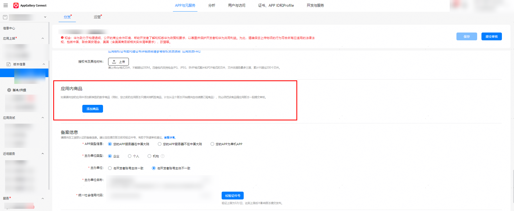
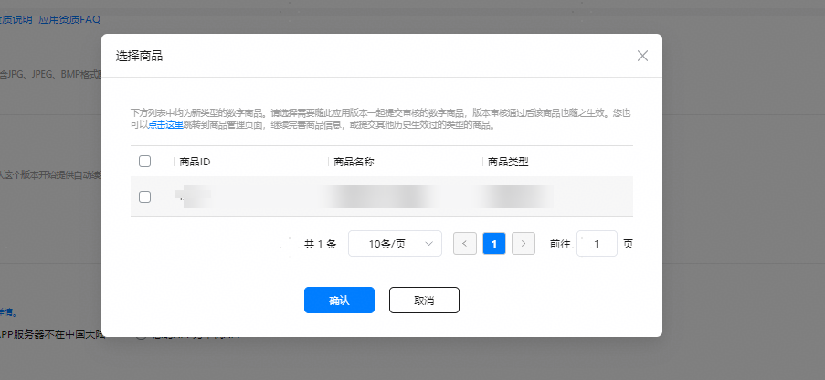
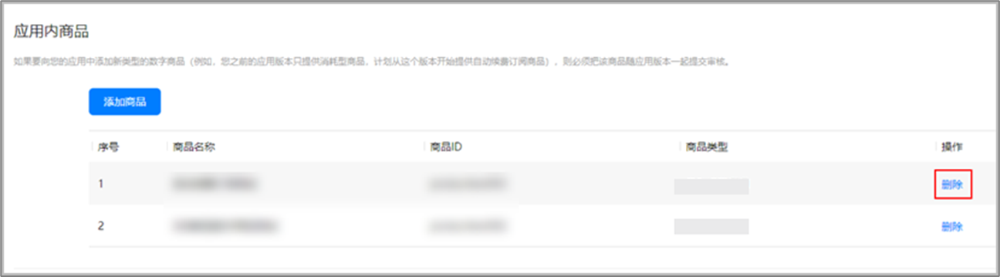

1. 点击[AppGallery Connect](https://developer.huawei.com/consumer/cn/service/josp/agc/index.html)，选择“APP与元服务”。
2. 在应用列表中点击需要提交商品的应用。
3. 在“分发”页签下的左侧导航栏中，选择“应用上架 &gt; 版本信息”。
4. 下滑至“应用内商品”部分，点击“添加商品”，选择要提交的数字商品并确认。

   

   

   如果一个应用版本关联了新类型的多个数字商品时，所有关联的数字商品应一起提交。如果应用已有某类型的一个或多个数字商品通过审核，后续该类型的数字商品可以直接提交，无需随新的应用版本一同提交。
5. 在应用版本提交前，您可以删除需要随版本提交的数字商品。找到商品列表中需要操作的数字商品，点按 “删除”，即可取消数字商品与应用版本的关联。

