## 批量添加数字商品

1. 登录[AppGallery Connect](https://developer.huawei.com/consumer/cn/service/josp/agc/index.html)，选择“APP与元服务”。
2. 在应用列表中点击需要导入商品的应用。
3. 在“运营”页签下的左侧导航栏中，选择“产品运营 &gt; 商品管理”。
4. 在“商品列表”页签中，点击页面右上角下载商品模板，在下载的模板中按要求填写商品信息。

   

   “商品模板”中支持填写的国家/地区、语言、币种等商品信息，具体可参见[国家/地区、语言、币种列表](https://developer.huawei.com/consumer/cn/doc/games-guides/games-center-countries-overview-0000002320771745#ZH-CN_TOPIC_0000002382173741)。

   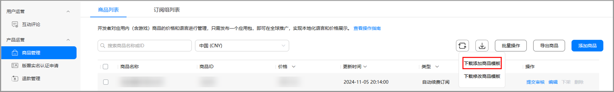
5. 在下载的模板中，resource ID 必须输入上传应用内截图后生成的素材ID，您可以点击“批量操作”下拉选项中的“查看素材”，点击“批量上传”，批量上传应用内截图，并点击“确认上传”。

   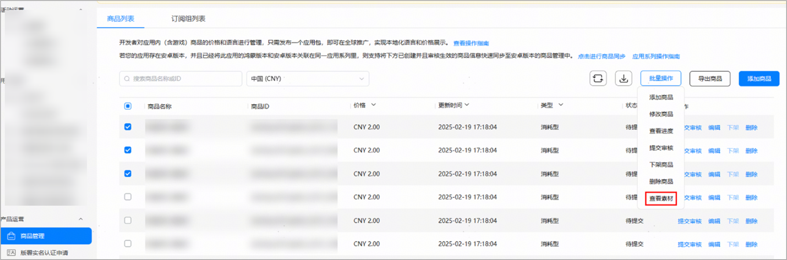

   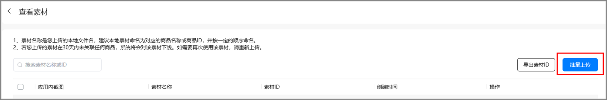

   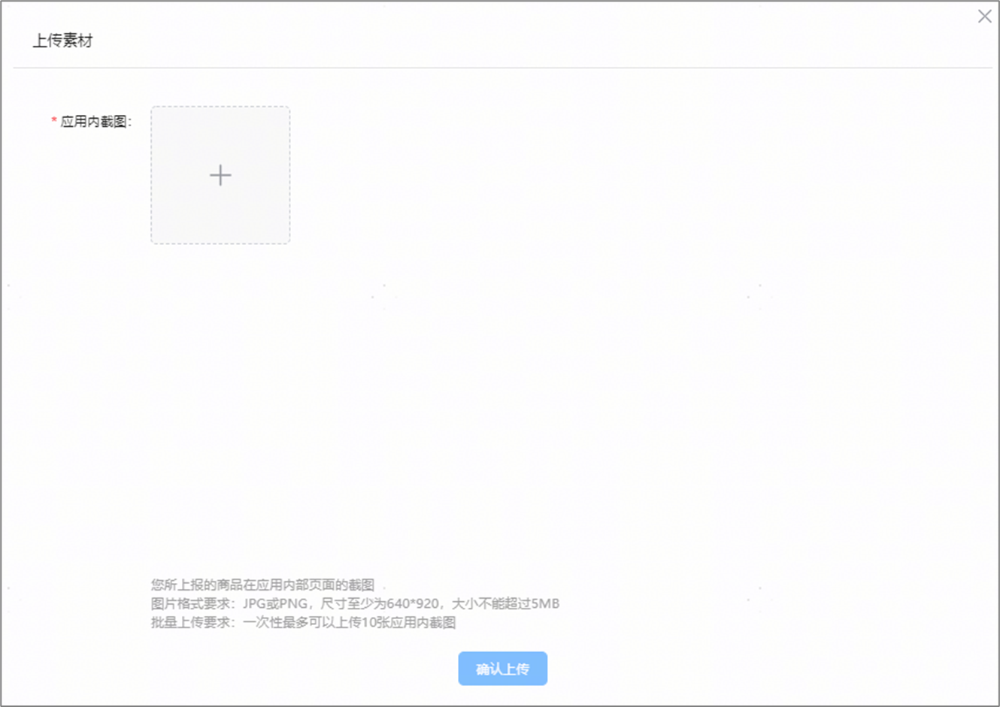

   

   * 素材名称是您上传的本地文件名，建议本地素材命名为对应的商品名称或商品ID，并按一定的顺序命名，以便您后续更便捷地填写下载模板中的 resource ID。
   * 若您上传的素材在30天内未关联任何商品，系统将会对该素材下线。如需要再次使用该素材，请重新上传。
   * 图片格式要求：JPG或PNG，尺寸至少为640\*920，大小不能超过5MB。
   * 批量上传要求：一次性最多可以上传10张应用内截图。

   完成所有截图上传后，选择素材，点击“导出素材ID”可生成素材ID，将素材ID按要求填入下载的模板中resource ID 列。

   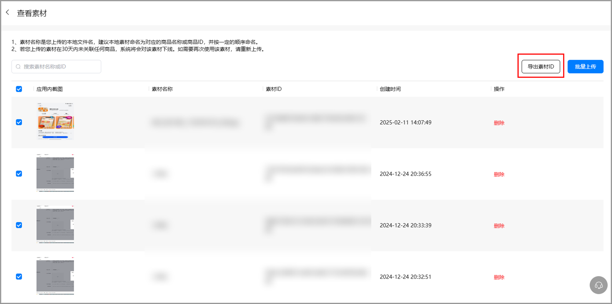

   

   素材ID为系统自动生成，在素材列表页点击素材ID右侧的复制按钮，可以复制单个素材ID。

   您也可以勾选部分应用内截图，点击“导出素材ID”将只会导出对应素材ID，单次最多可导出200条。

   如果您不做任何选择，直接点击“导出素材ID”，将会导出该素材列表下的前200条素材ID。
6. 在下载的模板中按要求完成全部商品信息填写后，点击“批量操作”下拉选项中的 “添加商品”，并在弹出的添加框中点击选择上传已填写的商品模板。

   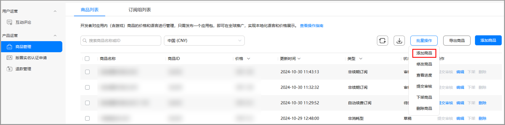
7. 在弹框中点击“确定”，完成商品添加。

   

   单个应用创建商品的上限是50000个。

## 生效商品信息快速同步至安卓版本

1. 若您的应用存在安卓版本，并且已经将此应用的鸿蒙版本和安卓版本关联在同一应用系列里，则支持将已创建并且审核生效的商品信息快速同步至安卓版本的商品管理中，点击“点击进行商品同步”。

   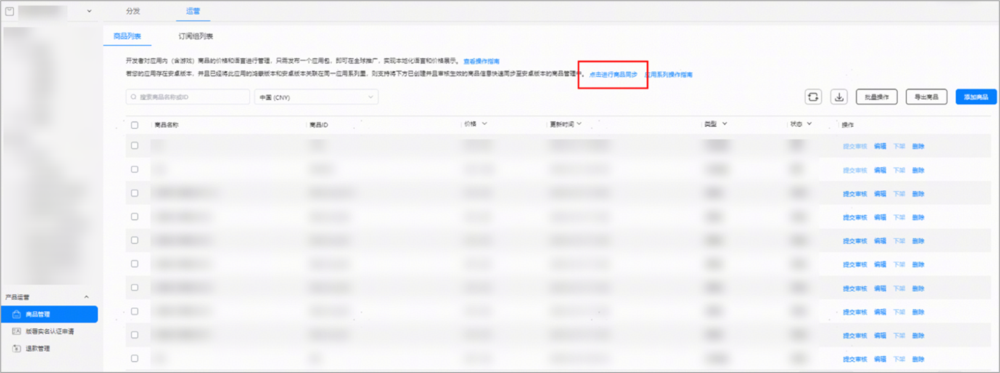

   

   您需满足以下条件才能进行商品同步：

   * 已将此应用的鸿蒙版本和安卓版本关联在同一应用系列里，应用系列操作详见[应用系列操作指南](https://developer.huawei.com/consumer/cn/doc/app/agc-help-manage-app-series-0000001773503840)。
   * 已创建商品审核通过并生效，提交商品审核操作详见[提交数字商品审核](https://developer.huawei.com/consumer/cn/doc/games-guides/games-center-submit-digital-products-for-review-0000002320572925#ZH-CN_TOPIC_0000002348293880)。
2. 选择关联应用并点击确定。

   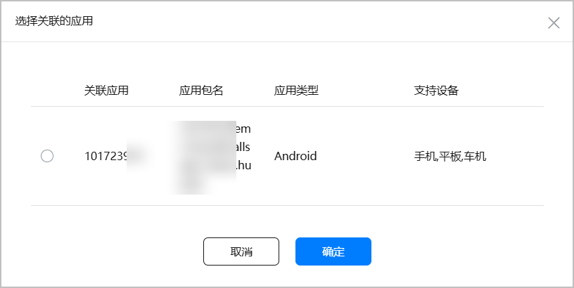
3. 选择需要同步的商品，并点击确定。

   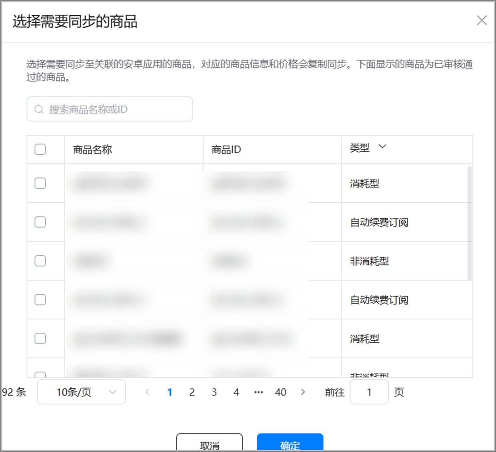
4. 确认同步请点击“确认”，否则请点击“取消”。

   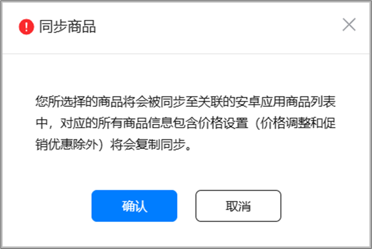
5. 若选择同步的商品中存在商品ID与安卓中已有商品ID一致的情况，您需再次点击“确认”以确认同步，否则请点击“取消”。

   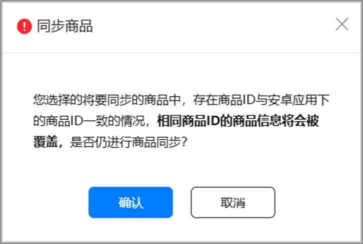
6. 确认同步后，点击“查看进度”，可查看商品同步进度，或前往对应安卓应用“运营”商品管理中进行查看和下一步操作。

   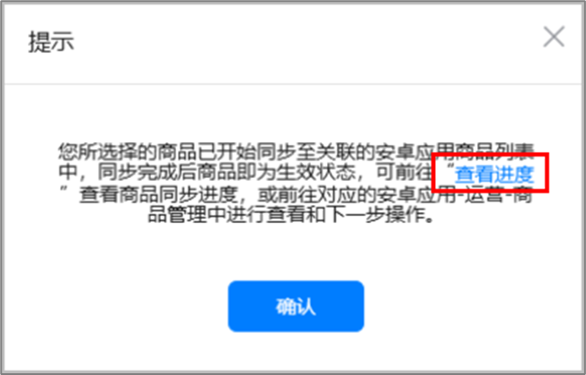

   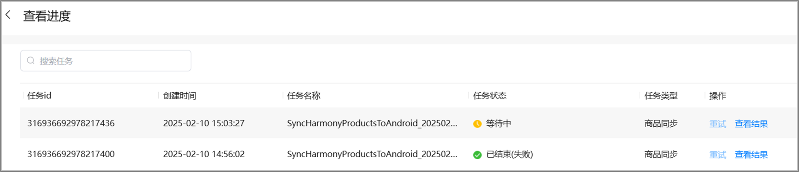
