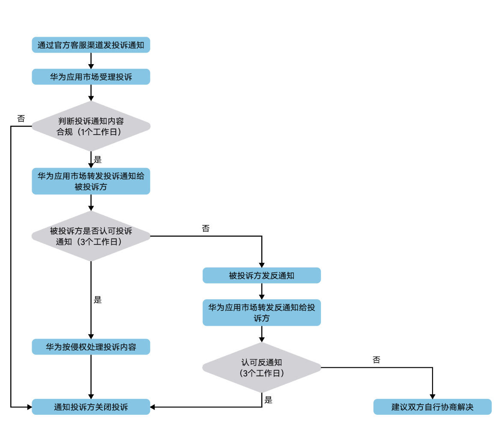

在华为应用市场/游戏中心上架的游戏均是由个人开发者或企业开发者提供的，为了保护您的版权、隐私、商标、专利等合法权益，华为应用市场制定侵权投诉通知和反通知方案，具体流程如下：

* 若认为华为应用市场/游戏中心的某项应用或游戏侵犯了您的知识产权，您可以按[投诉通知](https://developer.huawei.com/consumer/cn/doc/distribution/app/50120#h2-2-2-)流程进行处理。
* 若被投诉方认为未侵犯知识产权，应在3个工作日内按[投诉反通知](https://developer.huawei.com/consumer/cn/doc/distribution/app/50120#h2-2-4-)流程进行处理。
