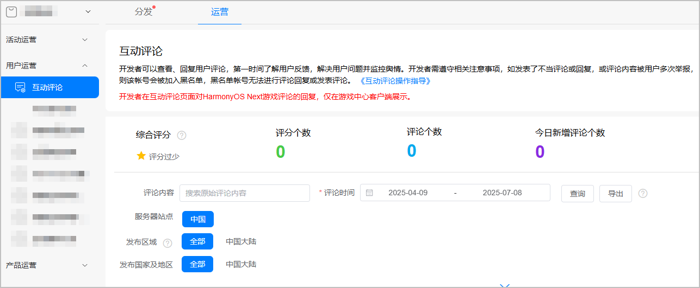
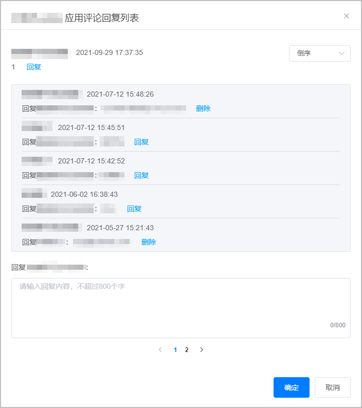
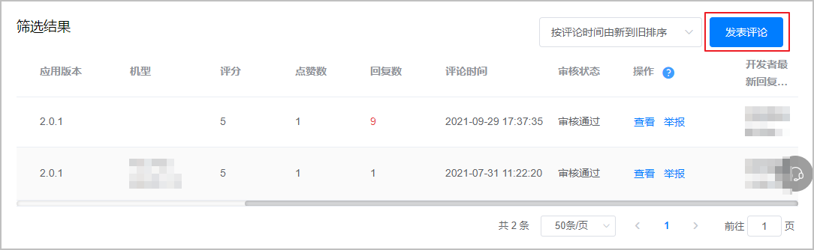
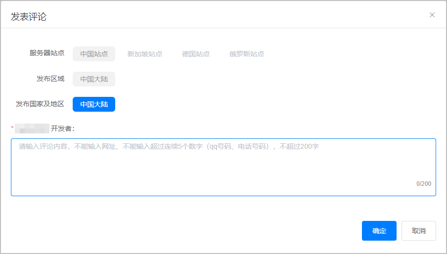
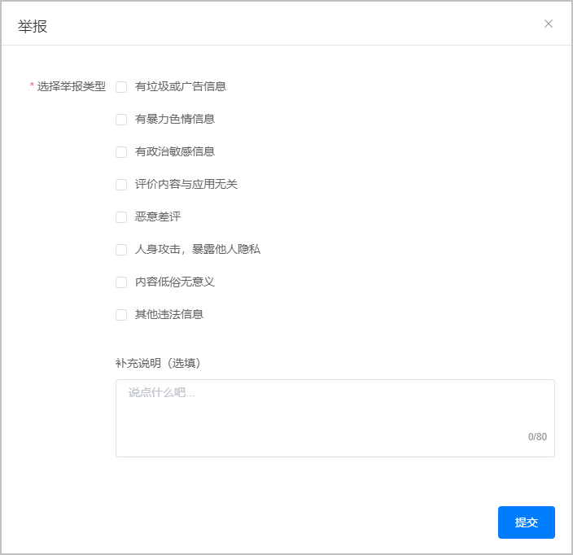
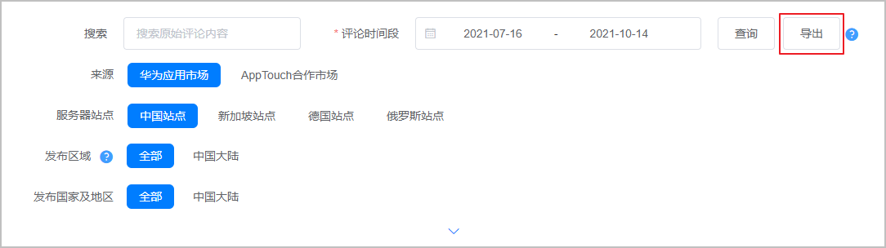

为了提供更加便利、优质的服务，进一步优化用户体验，互动评论已经迁移到应用市场统一开放平台AppGallery Connect，进入AppGallery Connect，选择您需要查看的应用即可进入互动评论界面。

## 前提条件

该服务仅支持在华为应用市场上架的应用。

## 进入互动评论

1. 登录[AppGallery Connect网站](https://developer.huawei.com/consumer/cn/service/josp/agc/index.html)，点击“APP与元服务”。
2. 选择“运营 &gt; 用户运营 &gt; 互动评论”，进入互动评论页面。

   

## 常用功能

### 更新回复

您可在查看弹框对评论进行回复，可针对一条用户评论进行多次回复。

### 发表/更新评论

您可以主动发表评论，同一应用的每个版本只能发表1条评论。发布成功后，再次点击发表评论，可修改原评论并重新发布。

### 评论举报

您可针对审核通过的评论进行举报，由华为运营人员进行审核。

### 评论导出

您可对用户的评论进行导出分析，可选择一个月内最多10万条评论进行导出，导出内容与筛选结果页面展示内容一致。

## 评论显示

您可以使用华为开发者账号答复，昵称自动取应用名称，并有开发者标识。对于已审核通过的用户评论，您的回复内容会直接显示在华为应用市场/游戏中心客户端且所有用户可见 。

## 评论原则

* 评论及回复禁止引导用户到非华为渠道。
* 应用类评论内容，不能输入网址、QQ号码、电话号码，不超过800字，回复内容支持 QQ、邮箱。
* 游戏类评论和回复内容，均不能输入网址、QQ号码、电话号码，不超过800字。
* 因评论数据较多，评论管理页面默认保留1年的评论数据。

## 注意事项

若您发表了不当评论或回复，或评论内容被用户多次举报，则该账号会被加入禁用清单，禁用清单的账号无法进行评论回复或发表评论。加入禁用清单后，开发者进入评论管理页面，可以查看评论，但点击“发表评论”或“评论回复”时会弹框报错（“您已被加入禁用清单，不能发表或回复评论，如需开通，请联系运营专员”），普通应用需联系developer@huawei.com，游戏类应用需联系game.business@huawei.com申请解除禁用清单限制。

## FAQ

### 请问用户的评论多久会出现在应用的评论区内？

用户对应用的评论内容会在华为运营人员审核通过后展示。

### 请问可以在哪里看评论和回复评论？

为了提供更加便利、优质的服务，进一步优化用户体验，互动评论已经迁移到应用市场统一开放平台[AppGallery Connect](https://developer.huawei.com/consumer/cn/service/josp/agc/index.html#/)，进入AppGallery Connect，选择您需要查看的应用即可进入互动评论界面。

功能入口：[AppGallery Connect](https://developer.huawei.com/consumer/cn/service/josp/agc/index.html#/) &gt; APP与元服务 &gt; 运营 &gt; 用户运营 &gt; 互动评论。

使用开发者账号在后台进行评论回复，回复内容可直接外显。

### 如何对应用评论进行回复？

您好，请登录管理中心—应用市场—进入AGC后台—应用名称—运营—互动评论，可查看和回复评论。

### 对评论展示有异议

应用市场评论展示本着客观公正的原则，不违规评论都会一一显示。应用市场新版本页面热门、精彩等排序方式，根据系统后台计算规则实时更新，导致用户查看的内容侧重点不同。后期会进一步优化更新。

### 用户发表的评论被删除。（评论没有显示）

您好，评论需要审核通过才会展示，如评论存在违规（如广告、涉赌、涉黄等）以及判定为恶意刷评论等行为，将不予通过。

### 应用市场人工审核/复审评论的判定标准是什么？

若评论内容为违法违规、散播广告、有不文明用语、与应用功能体验无关、主观人为的灌水/刷评等情形时，将不予审核通过。

### 恶意差评怎么办？

关于恶意评论，可通过[互动中心](https://developer.huawei.com/consumer/cn/doc/app/agc-help-interaction-center-0000002276985946)或通过developer@huawei.com(应用类)，game.business@huawei.com(游戏类)邮箱申请，如果被判定为恶意评论则可以屏蔽。

### 申请删除恶意差评

您好，如应用被恶意差评，请提供评论截图含用户昵称及时间，您的应用名称及APPID及申请删除的理由，通过[互动中心](https://developer.huawei.com/consumer/cn/doc/app/agc-help-interaction-center-0000002276985946)或邮件反馈至developer@huawei.com(应用类)，game.business@huawei.com(游戏类)。

### 如何申请评论置顶（精彩评论）？

您好，请提供APPID+需要置顶的评论截图（最多3条，且为一个月内的评论）通过[互动中心](https://developer.huawei.com/consumer/cn/doc/app/agc-help-interaction-center-0000002276985946)或发邮件到developer@huawei.com(应用类)，game.business@huawei.com(游戏类)申请。

### 评论里“热门”、“精彩”以及“最新”的排序逻辑是什么呢？

* 热门：根据评论质量多维度打分，打分较高的会排列在前，一般来说，评论言之有理能引起其他用户共鸣，点赞或回复越多的评论热门评分越高。
* 精彩：点赞越多的评论排列越靠前。
* 最新：评论时间距现在越近越靠前。

### 应用评论里“精彩”“热门”具体规格是什么？

您好，“精彩”“热门”由系统逻辑推荐（包含开发者申请的评论置顶），系统后台计算规则不同，导致用户查看的内容侧重点不同，具体以应用市场展示为准，谢谢。

### 为什么开发者回复评论时间早于用户评论时间？

因为用户可以对自己发表的评论进行更改，修改后时间显示为最新修改时间，如在用户修改前开发者有进行回复，会导致开发者回复时间早于用户评论时间。
