若您在当前版本中无法找到本文档描述的功能，可以通过[在线工单系统](https://developer.huawei.com/consumer/cn/support/feedback/#/)与我们联系，工单问题分类请选择【华为应用分发】&gt;【应用市场】&gt;【应用发布】。

**相对旧版分阶段发布，分阶段发布（7天内自动更新）具备以下全新能力：**

* 具备7天内按固定百分比覆盖用户的自动更新能力，百分比覆盖进程支持提速直至全网发布。
* 发布过程中所有用户主动下载均为新版本，旧版本用户也可以通过应用市场搜索下载新版本。
* 可实现指定用户的版本更新：先暂停分阶段发布，然后把AppGallery详情页链接通过应用内弹窗发给指定用户，引导用户更新到最新版本。
* 支持通过Publishing API进行分阶段发布的设置，详见[更新分阶段发布](https://developer.huawei.com/consumer/cn/doc/app/agc-help-publish-api-phased-release-0000002271000625)。
* 您可以选择让应用审核通过后立即上架，也可以指定一个特定时间上架（和全网发布指定时间上架一致）。

**注意**：在新分阶段发布版本上架成功后，即覆盖了全网在架包，应用内检查更新的接口需要做适配调整。

* 被百分比覆盖的用户，仍然可以使用[AppGallery Kit的检查更新接口](https://developer.huawei.com/consumer/cn/doc/harmonyos-guides/store-update)在应用内弹框引导更新，不受影响。

* 未被百分比覆盖的低版本用户，无法通过AppGallery Kit检查全网在架包的更新，但您可以在应用内弹框，引导这些用户升级到新的分阶段版本，具体操作请参见[应用市场详情页展示](https://developer.huawei.com/consumer/cn/doc/harmonyos-guides/store-productview#section729012543213)。

在当前上架版本为全网发布时，您可以采用分阶段发布（7天内自动更新）的方式进行应用升级。采用此方式发布，您可以按照1%、2%、5%、10%、20%、50%、100%的比例向已在应用市场开启自动更新应用的用户发布更新的版本。通过阶段性的版本更新，您可以快速获取用户对新版本的反馈意见，降低该版本出现问题的风险。

| 阶段性发布天数 | 使用者百分比 |
| --- | --- |
| 1 | 1% |
| 2 | 2% |
| 3 | 5% |
| 4 | 10% |
| 5 | 20% |
| 6 | 50% |
| 7 | 100% |

分阶段发布版本上架后，用户在客户端的体验如下：

* 百分比覆盖范围内、已开启自动更新应用的用户的应用会被自动更新。
* 所有用户都可以在应用市场主动搜索并下载分阶段发布版本。

  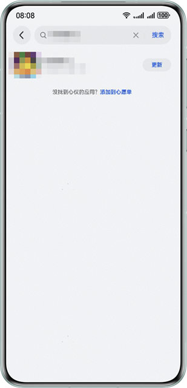

  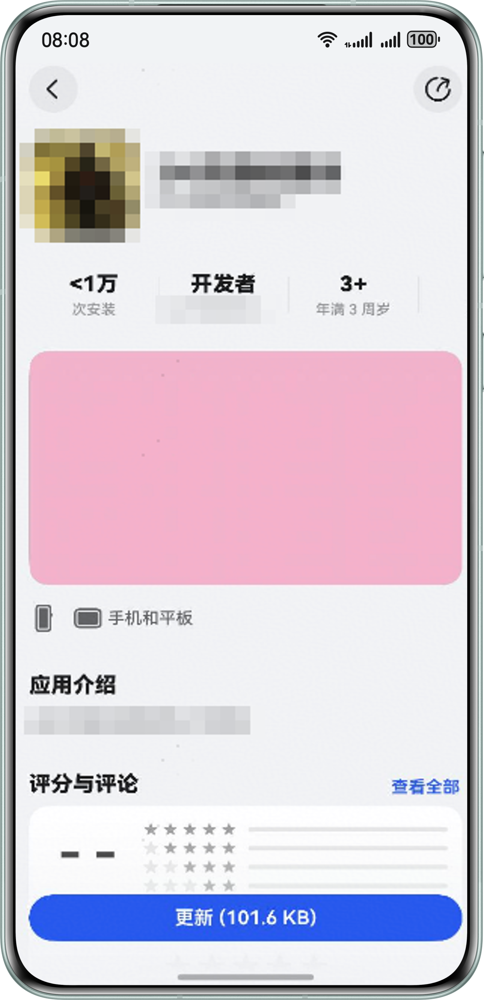

## 前提条件

* 分阶段发布的应用必须存在全网在架的版本。
* 分阶段发布（7天内自动更新）仅支持如下设备类型：
  + 手机
  + 平板
  + PC/2in1
  + 智慧屏
  + 运动手表
  + 智能手表

## 提交分阶段发布申请

1. 登录[AppGallery Connect](https://developer.huawei.com/consumer/cn/service/josp/agc/index.html)，点击“APP与元服务”。
2. 在应用列表选择待升级应用或者元服务，进入应用详情页面。
3. 选择“分发 &gt; 应用上架 &gt; 版本信息”，在页面右上角点击“升级”。

   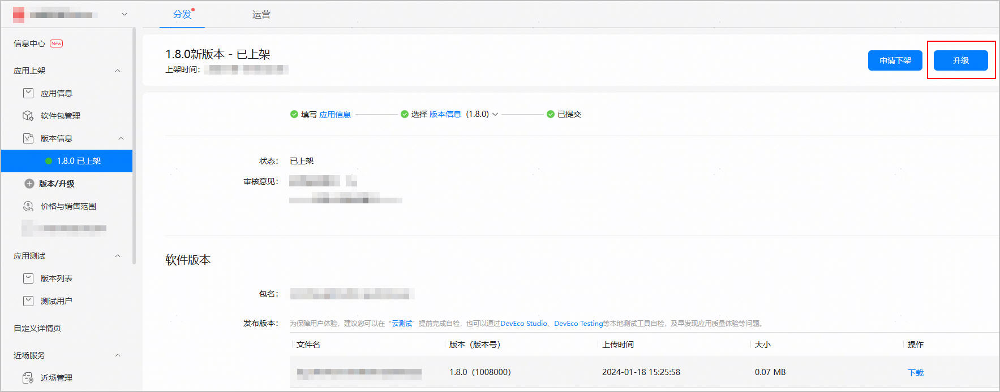
4. 左侧导航栏新增“新版本-准备提交”页面。

   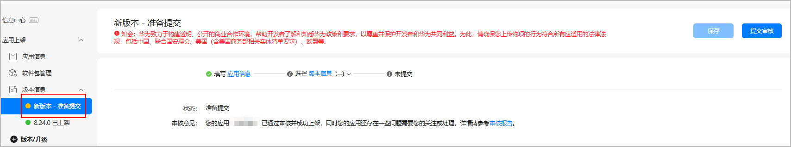
5. 如需修改应用信息，点击左侧导航栏“应用信息”或者右侧“应用信息”进行编辑，完成后点击“下一步”，将再次跳转至“新版本-准备提交”页面。

   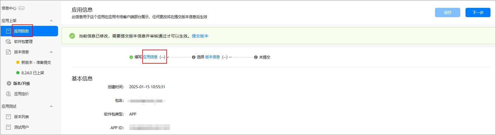
6. 在“软件版本”区域点击“版本选取”，在弹出的窗口中上传或者选取软件包。

   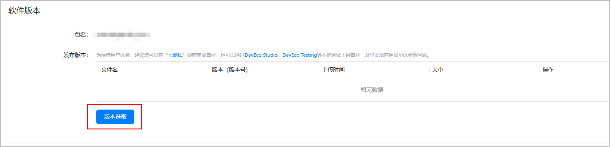

   * 如需更新软件包，您可以点击“上传”，上传本地软件包。

     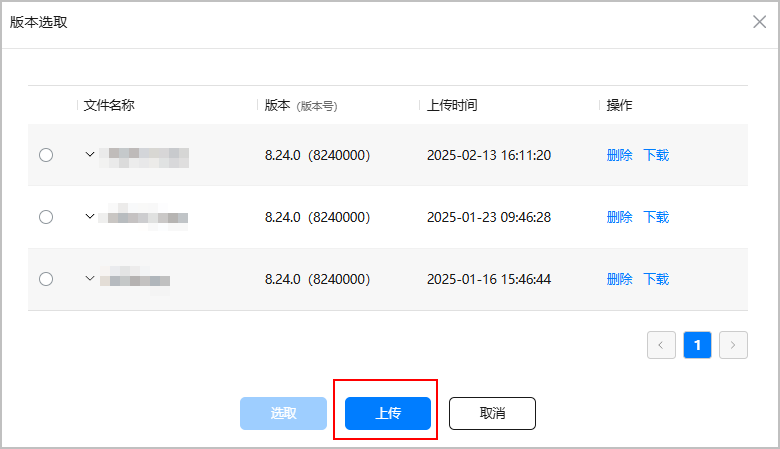
   * 若无需更新软件包，您可以直接在软件包列表中选择，点击“选取”。

     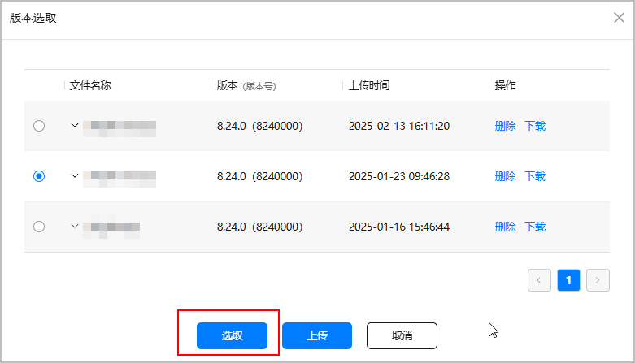
7. 在“发布类型”区域下设置相关参数。

   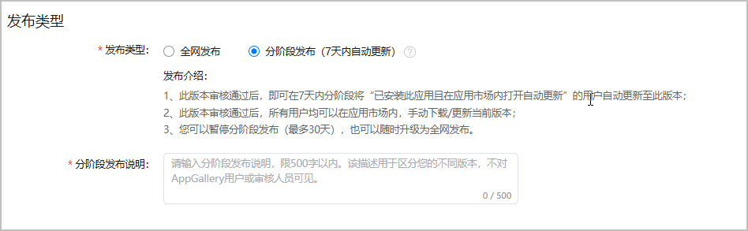

   | 参数 | 说明 |
   | --- | --- |
   | 发布类型 | 选择“分阶段发布（7天内自动更新）”。 |
   | 分阶段发布说明 | 填写您本次分阶段发布的备注信息，如发布特性等，要求1-500字符。  此说明不对用户或华为审核人员展示，仅展示在版本信息页面，供您自己参考。 |
8. 完善其他相关信息后，点击“提交审核”，确认版本号无误后点击“确认”。提交成功后，应用版本状态更新为“正在审核”。

   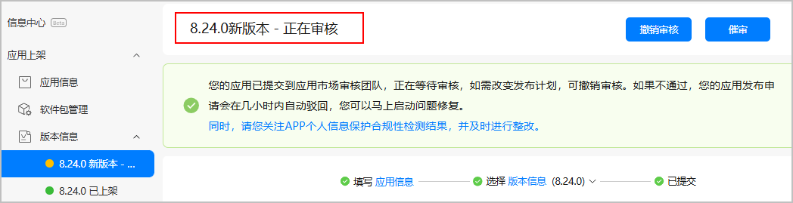

## 设置上架时间

您可以选择让应用审核通过后立即上架，也可以指定一个特定时间上架。

1. 登录[AppGallery Connect](https://developer.huawei.com/consumer/cn/service/josp/agc/index.html)，点击“APP与元服务”。
2. 选择要发布的应用。
3. 左侧导航选择“应用上架 &gt; 版本信息”下待发布的版本。
4. 进入“上架”区域，设置上架时间。

   指定时间：选择时为您的本地时间，设置完成后，系统将自动转换成UTC标准时间，并显示在时间框后。

   

   如果后续需要在指定时间前上架，可以[手动发布待上架应用](#section0726113812279)。

   

## 手动发布待上架应用

如果您之前设置指定时间上架，审核通过后，您又想在设定时间之前上架，则可以手动发布上架。

1. 登录[AppGallery Connect](https://developer.huawei.com/consumer/cn/service/josp/agc/index.html)，点击“APP与元服务”。
2. 选择要发布的应用。
3. 左侧导航选择“应用上架 &gt; 版本信息”下待发布的版本。
4. 点击右上角的“手动发布”。

   
5. 点击“确认”。

   手动发布一般在几分钟内生效。

## 分阶段发布（7天内自动更新）申请审核通过

分阶段发布（7天内自动更新）审核通过并上架生效后：

* 原有的在架版本会立即下架。
* 左侧导航栏的“版本信息”变更为“已上架”状态。
* “版本信息”页面右上角显示“[向所有用户发布](#section1599758104316)”、“[暂停分阶段发布](#section891645219919)”、“[下架分阶段发布版本](#section65201527144517)”和“[升级](#section29124512519)”按钮。
* “版本信息”页面的“发布类型”区域显示“分阶段发布中”状态。

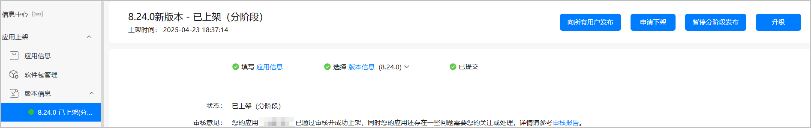

## 分阶段发布（7天内自动更新）自动更新

分阶段发布中，该应用会在7天的时间内每24小时按一定比例（1%、2%、5%、10%、20%、50%、100%）向已在应用市场开启自动更新应用的用户发布更新的版本。

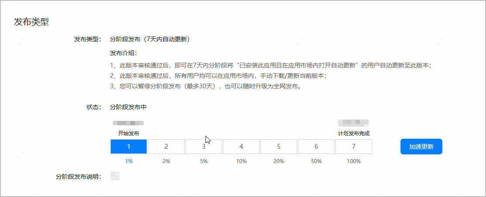

## 分阶段发布（7天内自动更新）加速更新

当您觉得分阶段发布速度较慢，您可以使用加速更新的功能。若分阶段发布为暂停状态，则不支持加速更新。

1. 分阶段发布审核通过后，在版本信息页面发布类型处可以看到“加速更新”按钮。

   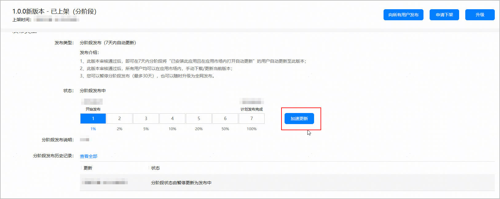
2. 点击“加速更新”，弹出确认提示框。

   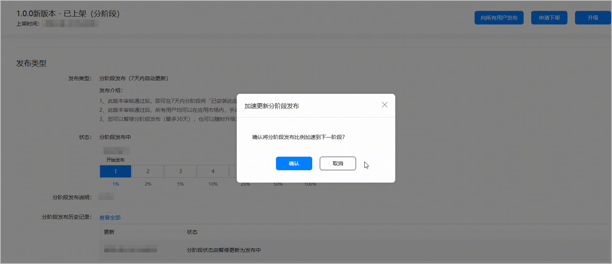
3. 点击“确认”，分阶段发布进度由1%直接跳到2%。同时，分阶段发布历史记录增加一条记录。

   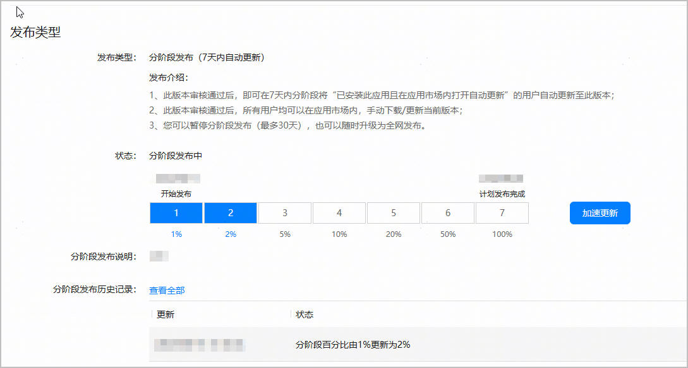
4. 若加速更新到100%，“加速更新”按钮置灰。

   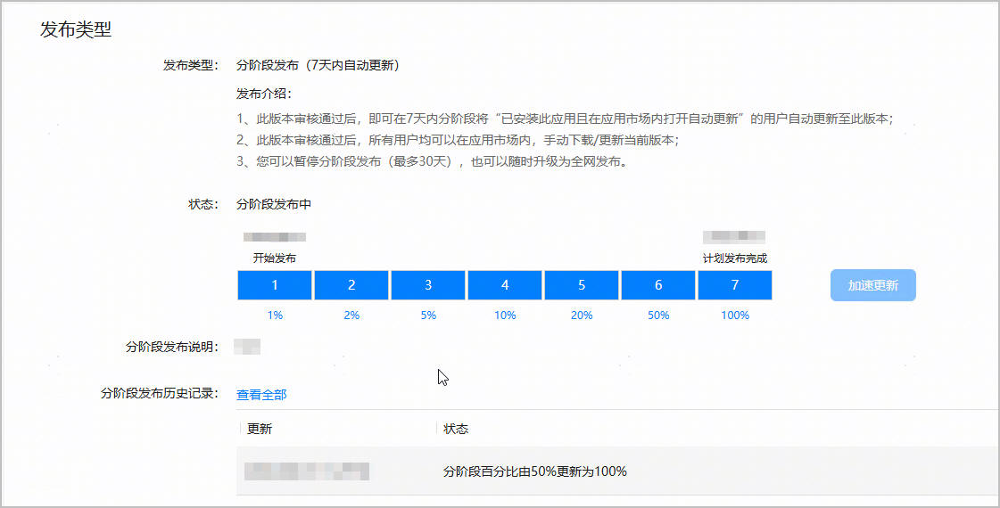

## 向所有用户发布

在分阶段发布生效期间，您可以执行如下操作向所有用户发布，即将分阶段版本转为全网版本：

1. 在“版本信息”页面右上角，点击“向所有用户发布”。
2. 认真阅读弹出的提示框内容后，点击“确认”。

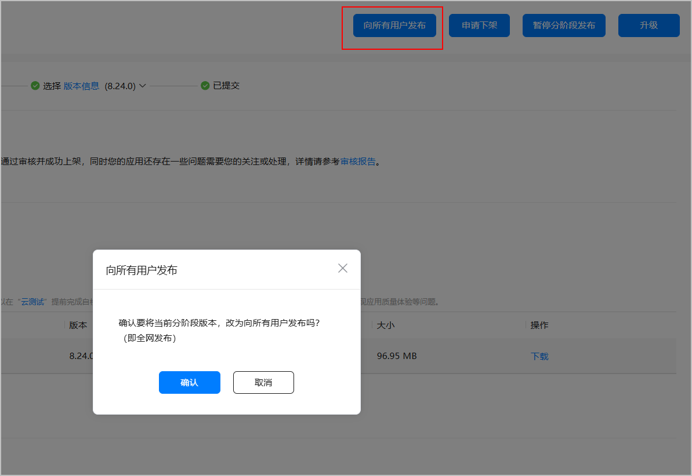

* 向所有用户发布的申请无需人工审核。
* 向所有用户发布后，应用市场会立即向所有开启自动更新应用的用户自动更新新版本。

## 暂停分阶段发布

在分阶段发布生效期间，您可以执行如下操作暂停分阶段发布：

1. 在“版本信息”页面右上角，点击“暂停分阶段发布”。
2. 认真阅读弹出的提示框内容后，点击“确认”。

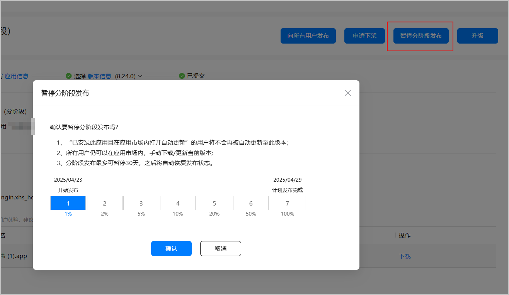

* 暂停分阶段发布的申请无需人工审核。
* 暂停分阶段发布后，即使在百分比覆盖范围内开启自动更新应用的用户也不会被自动更新。
* 最多累计暂停分阶段发布30天，第31天会自动恢复分阶段发布。

## 恢复分阶段发布

暂停分阶段发布后，您可以执行如下操作恢复分阶段发布：

1. 在“版本信息”页面右上角，点击“恢复分阶段发布”。
2. 在弹出的对话框中修改参数后，点击“确认”。

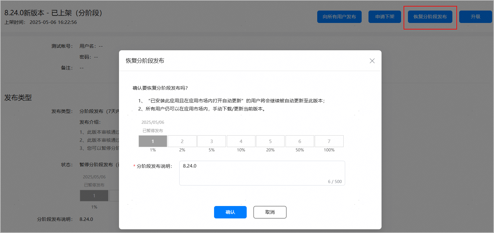

| 恢复分阶段发布参数 | 说明 |
| --- | --- |
| 分阶段发布说明 | 填写您本次分阶段发布的备注信息，如发布特性等，要求1-500字符。  此说明不对用户或华为审核人员展示，仅展示在版本信息页面，供您自己参考。 |

* 恢复分阶段发布的申请无需人工审核。
* 恢复分阶段发布后，应用市场会向百分比覆盖范围内开启自动更新应用的用户自动更新版本。

## 升级分阶段发布版本

分阶段发布中，您可以点击右上角的“升级”，发布一个新的分阶段版本或全网版本。

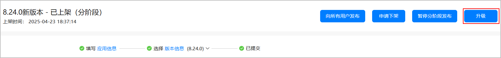

## 下架分阶段发布版本

在分阶段发布生效期间，您可以执行如下操作申请版本下架：

1. 在“版本信息”页面右上角 点击“申请下架”。

   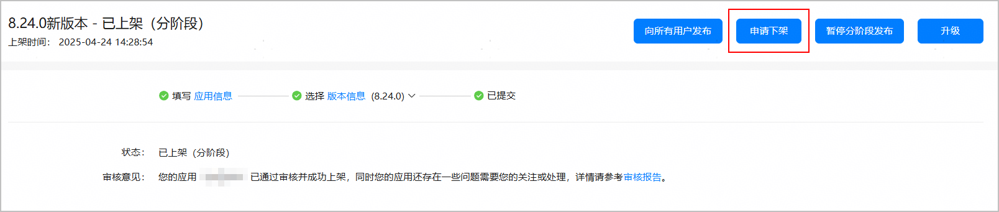
2. 认真阅读弹出的提示框内容后，填写下架原因，点击“确认”。

   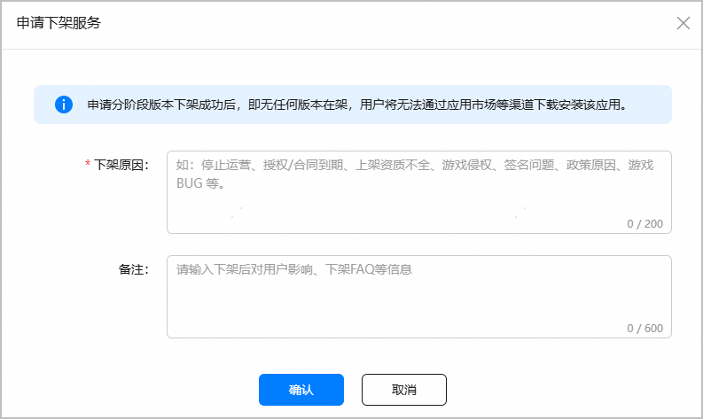

* 申请下架的申请需人工审核。
* 下架后，任何用户均无法在华为应用市场搜索到该应用。

## 查看分阶段发布历史操作记录

您可以在“发布类型”区域下查看“分阶段发布历史记录”。

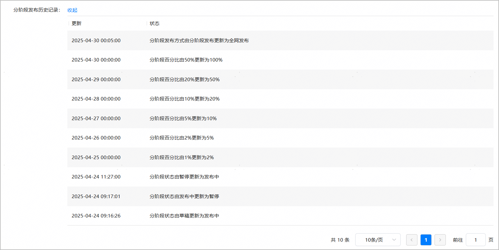

## 回退分阶段发布版本

分阶段发布版本暂不支持回退功能。

若您在发布过程中遇到版本问题，建议采取以下两种方式处理：

* 下架后重新上架：申请将当前问题版本下架，随后提交并上架一个新版本。
* 发布新分阶段版本：直接点击“升级”，发布一个新的分阶段版本。提交新版本后，您可以申请[审核加急](https://developer.huawei.com/consumer/cn/doc/games-guides/games-push-0000002348323780#section1043320011101)以加快发布流程。

从用户体验的角度出发，版本回退无法修复已受影响用户的实际问题，反而可能导致用户本地安装版本与线上版本不一致，引发舆情或误解。因此，我们建议您聚焦于发布新版本，确保所有用户能够升级至最新稳定版，从而从根本上解决问题。
