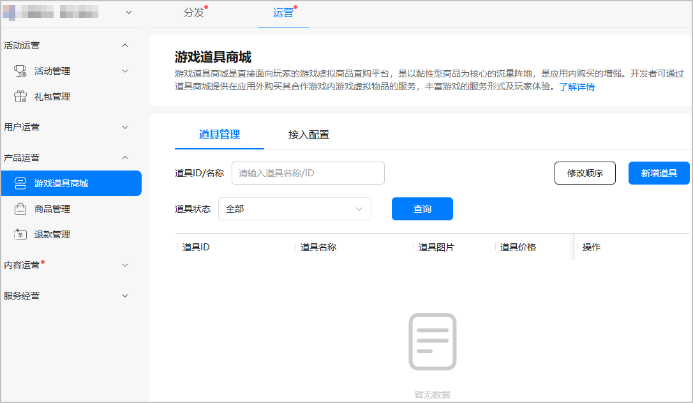
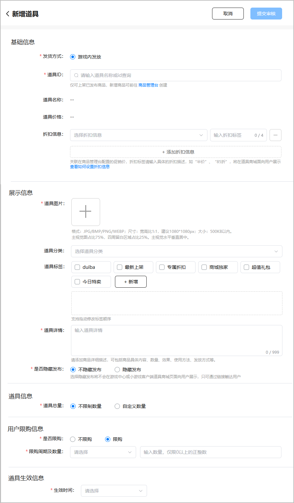
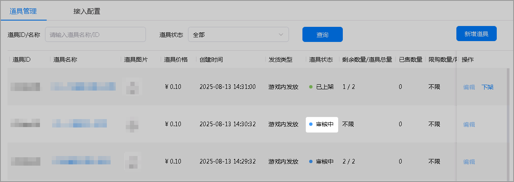
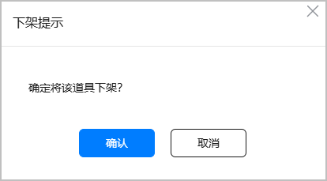
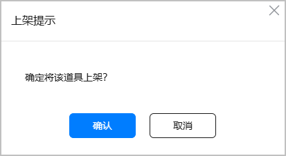
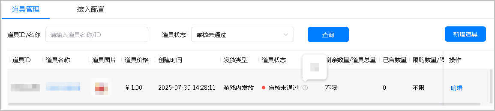
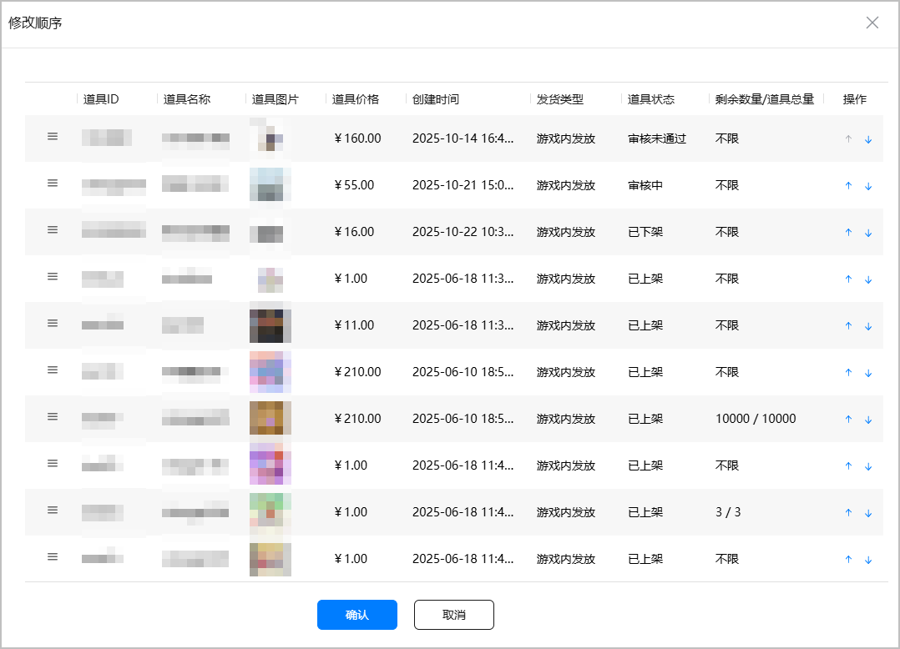
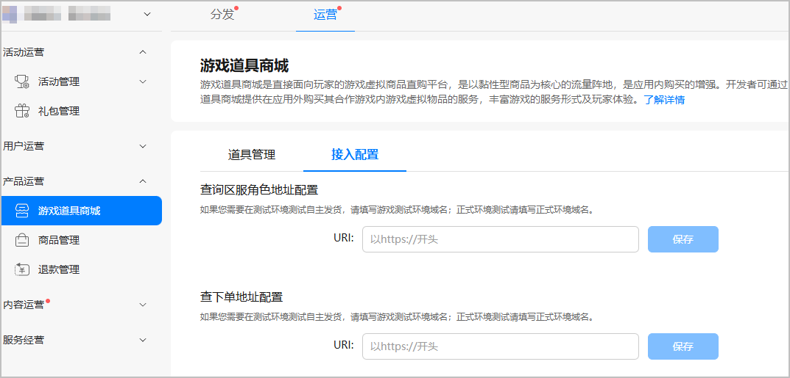

## 概述

游戏道具商城是直接面向玩家的游戏虚拟商品直购平台，是以黏性型商品为核心的流量阵地，是应用内购买的增强。开发者可通过道具商城提供在应用外购买其合作游戏内游戏虚拟物品的应用外购买产品服务，丰富游戏的服务形式及玩家体验。

## 道具商城入口

道具商城入口在“ 游戏中心 &gt; 我的 &gt; 常用服务 &gt; 道具商城”。

## 前提条件

* 已创建游戏，且软件包类型为“APP（HarmonyOS应用）”，支持设备为“手机”。
* 您已在商品管理[新增商品](/docs/dev/game-dev/games-center-create-digital-products-0000002286076724)。

## 准备道具素材

| 准备项 | 说明 |
| --- | --- |
| 道具图片 | 展示在道具详情页外显的图片。   * 格式：JPG/BMP/PNG/WEBP * 尺寸：宽高比1:1，建议1080\*1080px * 大小：500KB以内   主视觉图占比75%，四周留白区域占比25%。主视觉水平垂直居中。 |

## 道具管理

### 新增游戏道具

1. 登录[AppGallery Connect](https://developer.huawei.com/consumer/cn/service/josp/agc/index.html)，点击“APP与元服务”，在应用列表中选择需要新增道具的游戏。
2. 选择“运营 &gt; 产品运营 &gt; 游戏道具商城”，进入游戏道具商城页面，点击“道具管理”页签的“新增道具”。

   
3. 在道具商城详情页填写信息。

   

   相关参数如下表所示

   | 类型 | 参数 | 说明 |
   | --- | --- | --- |
   | 基础信息 | 发货方式 | 选择“游戏内发放”。 |
   | 道具ID | 下拉选择可上架已发布商品，新增商品前往[商品管理台](/docs/dev/game-dev/games-center-products-manage-0000002286057092)创建。 |
   | 道具名称 | 由道具ID搜索而来。 |
   | 道具价格 | 由道具ID搜索而来。 |
   | 折扣信息 | 关联在商品管理台配置的促销信息，下拉选择折扣价格。折扣标签，请输入具体的折扣描述，如“半价”、“85折”，标签将在道具商城面向用户展示，若未输入标签，则默认展示“折后”标签。 |
   | 展示信息 | 道具图片 | 上传道具在道具详情页外显展示的图片。 |
   | 道具分类（可选） | 下拉选择游戏对外展示的分类区域。 |
   | 道具标签（可选） | 添加游戏对外展示的标签。请选择默认游戏标签，或点击“新增”按钮添加自定义标签，最多支持添加3个标签。 |
   | 道具补充信息（可选） | 请填写对游戏道具的补充描述，最多不超过999个字符。 |
   | 是否隐藏发布 | 请选择是否隐藏发布道具，选择“隐藏发布”时将不会在游戏中心或小游戏客户端的道具商城页面向用户展示，只可通过链接触达用户。 |
   | 道具信息 | 道具库存 | 请设置游戏道具的库存量。选择“不限制数量”或“自定义数量”，选择“自定义数量”时，请输入有效的库存数量，请输入正整数。 |
   | 用户限购信息 | 是否限购 | 请选择是否限购。选择限购时，请填写限制周期及数量。 |
   | 限购周期及数量 | 选择限购周期：  * 全局 * 每日 * 每周 * 每月 填写限购数量时，请输入正整数。 |
   | 道具生效信息 | 生效时间 | 下拉选择生效时间指定方式，并设置道具生效时间：  * 审核通过立即生效：将在审核通过后立即展示。 * 仅指定开始时间：已审核通过的道具，将在指定时间后才展示。 * 指定开始和结束时间：已审核通过的道具，将在指定时间段内展示。 * 仅指定结束时间：已审核通过的道具，将在指定时间后不展示。 |
4. 填写完成后点击“提交审核”。提交审核后，华为工作人员审核游戏道具申请预计需要1~3个工作日，请耐心等待。审核结果可在道具管理列表内“道具状态”列查看。

   

### 管理游戏道具

您可以对已创建的游戏道具进行查看、编辑、上架、下架、调整顺序的操作。

* 查看游戏道具信息

  点击操作列“查看”，查看游戏道具的具体信息。
* 编辑游戏道具信息

  处于“已下架”或“审核未通过”的游戏道具支持编辑操作，点击操作列“编辑”，您可以重新编辑游戏道具的相关信息，完成后点击“提交审核”。
* 下架游戏道具

  处于“已上架”状态的游戏道具支持下架操作，在“操作”列点击“下架”，在下架确认弹框内，点击“确认”，道具状态变更为“已下架”。

  
* 上架游戏道具

  处于“已下架”状态的游戏道具支持上架操作，在“操作”列点击“上架”，在上架确认弹框内，点击“确认”，道具状态变更为“已上架”。

  
* 查看审核意见

  处于“审核未通过”状态的道具，点击道具状态列查看当前游戏道具的审核意见。

  
* 调整游戏道具顺序

  已创建的游戏道具支持调整顺序操作，点击右上角“修改顺序”按钮，在弹出的全量道具弹窗页面对所有道具进行顺序调整，点击或上移或下移游戏道具，点击拖动道具至列表任意位置，并点击确定，道具将在AGC道具列表页以及客户端游戏店铺页按调整的顺序展示。

  

## 接入配置

1. 登录[AppGallery Connect](https://developer.huawei.com/consumer/cn/service/josp/agc/index.html)，点击“APP与元服务”，在应用列表中选择需要新增道具的游戏。
2. 选择“运营 &gt; 产品运营 &gt; 游戏道具商城”，进入游戏道具商城页面，点击“接入配置”页签，配置查询区服角色的地址以及用户下单后用于查询用户下单信息的地址，供华为服务器调用[查询玩家区服角色接口](https://developer.huawei.com/consumer/cn/doc/AppGallery-connect-References/agcapi-propapi-getroleinfo-0000002355255377)和[下单接口](https://developer.huawei.com/consumer/cn/doc/AppGallery-connect-References/agcapi-propapi-order-0000002321296666)。

   
