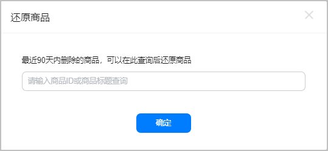
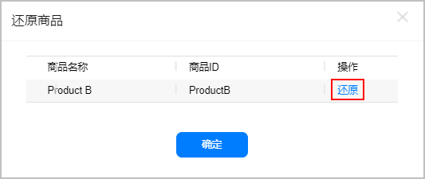

商品被删除后，您将无法通过商品列表查看该商品的相关信息。如果您需要找回已删除的商品，您可通过还原操作，将该商品恢复至商品列表中。

目前，仅支持90天（含）内已删除商品的还原操作。

1. 登录[AppGallery Connect](https://developer.huawei.com/consumer/cn/service/josp/agc/index.html)，选择“APP与元服务”。
2. 在应用列表中点击需要被还原的商品的应用。
3. 在“运营”页签下的左侧导航栏中，选择“产品运营 &gt; 商品管理”。
4. 点击页面右上角还原商品。

   
5. 在查询框中输入商品ID或商品标题，点击“确定”进行查询。

   
6. 点击待还原商品“操作”列的“还原”，即可成功还原该商品。

   
