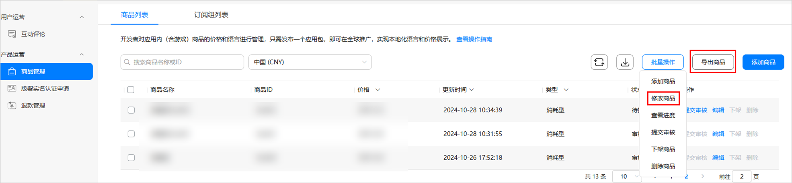
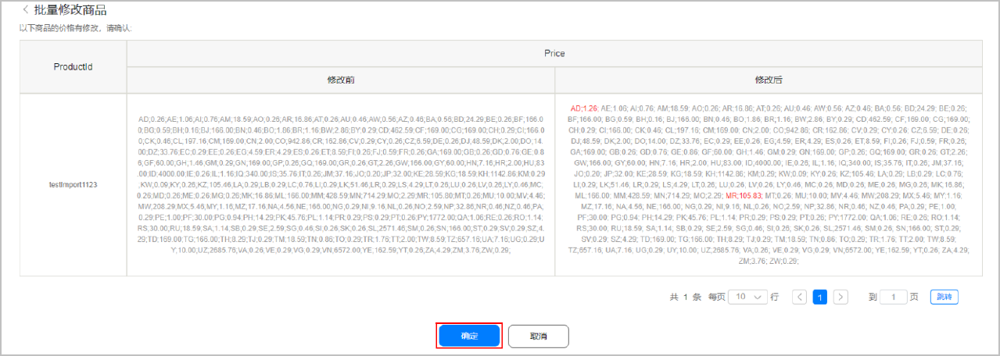

1. 登录[AppGallery Connect](https://developer.huawei.com/consumer/cn/service/josp/agc/index.html)，选择“APP与元服务”。
2. 在应用列表中点击需要批量修改商品的应用。
3. 在“运营”页签下的左侧导航栏中，选择“产品运营&gt;商品管理”。
4. 下载表格，批量修改商品信息并上传。

   

   请按照规范批量修改商品信息，否则会在上传时报错，具体错误信息可参见[常见错误说明](/docs/dev/game-dev/games-center-mistakes-0000002320646013#ZH-CN_TOPIC_0000002382054161)。

   * 方法一：

   a）点击页面右上角，下载商品模板并保存到本地。

   b）按规范修改商品信息。

   c）点击“批量操作”下拉选项中的 “修改商品”，并在弹出的添加框中点击选择上传已填写的商品模板。

   

   * 方法二：

   a）点击“导出商品”，下载商品信息表格并保存到本地。

   b）按规范修改商品信息。

   c）点击“批量操作”下拉选项中的 “修改商品”，并在弹出的添加框中点击选择上传已修改的商品信息表格。

   
5. 在确认页面可查看商品信息修改前后对比图，点击“确定”。

   

   

   已通过审核的数字商品，如果仅修改其价格和商品销售范围，则无需重新提交审核，新价格和新的商品销售范围立即生效；如果还修改了其他基本信息或审核信息，则需要再次提交审核，数字商品方可生效。
