1. 登录[AppGallery Connect](https://developer.huawei.com/consumer/cn/service/josp/agc/index.html)，选择“APP与元服务”。
2. 在应用列表中点击需要修改商品的应用。
3. 在“运营”页签下的左侧导航栏中，选择“产品运营 &gt; 商品管理”。
4. 在商品列表中，点击待编辑的非订阅类商品对应“操作”列的“编辑”。

   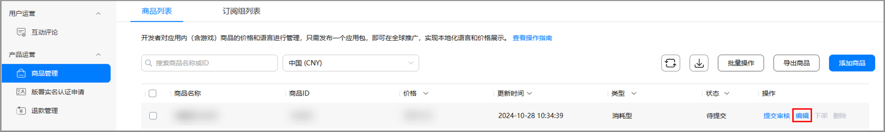
5. 可修改商品基本信息和审核信息。

   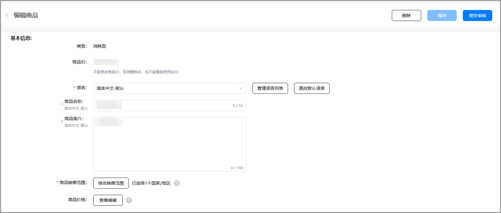

   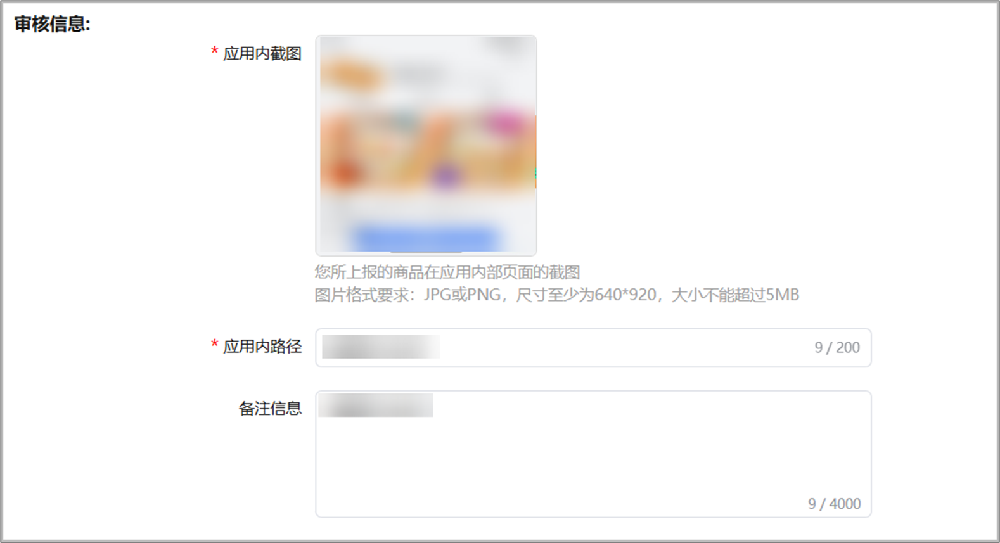
6. 如需修改商品销售范围。在商品编辑页面上点击 “修改销售范围”。
   * 商品销售范围：决定商品可供用户购买的国家/地区，修改销售范围至少选择1个销售国家/地区。
   * 新国家或地区：鸿蒙应用市场会对未来新增的国家或地区自动提供您的商品，届时以您设置的全球商品定价为准，您可以选择是否在新国家或地区销售。

   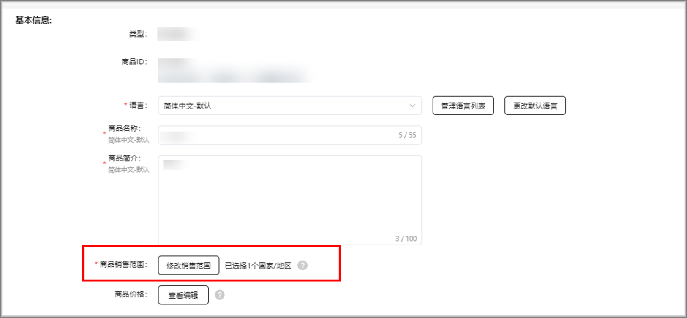

   

   * 当前鸿蒙应用数字商品服务的销售范围仅支持中国大陆，如后续新增国家或地区时，您希望商品自动支持在新国家或地区销售，请保持勾选“新国家或地区”选项。
   * 如您的订阅商品正在生效中，移除原销售国家/地区后，原销售国家/地区的用户将无法购买，生效中的现有订阅者将无法续期。
   * 如消耗型/非消耗型/非续期订阅商品正在生效中，移除原销售国家/地区后，原销售国家/地区的用户将无法购买。
7. 如需修改商品价格，点击商品编辑页面的“查看编辑”。

   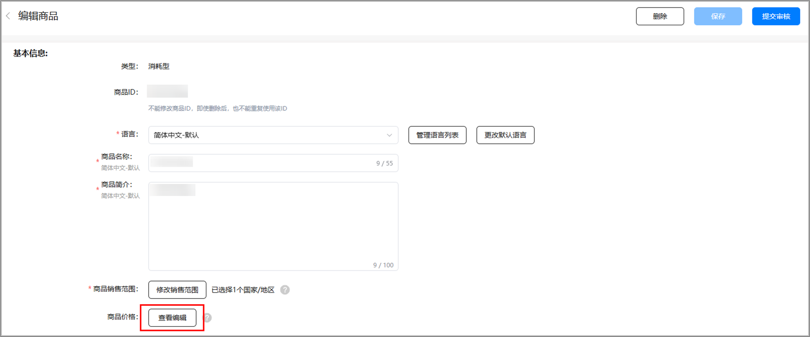
8. 修改商品价格。

   

   **全球自定价格调整：主要使用场景为针对该商品设置新的全球定价，并在未来某个时间点开始持续生效**。仅支持设置生效日期、不支持设置结束日期，不支持设置特定国家/地区，价格调整设置后，全球国家/地区对应的商品价格会在生效日期开始自动刷新为新价格。

   **临时价格调整：主要使用场景为针对商品在特定国家或地区，设置一段时间的促销价或临时涨价**。支持设置价格调整的开始和结束日期，以及生效的国家或地区。价格调整设置后，所选国家/地区对应的商品价格会在生效时间段内自动刷新为新价格；价格调整期结束后，将会恢复到原价格。

   **修改数字商品当前生效价格：**商品详情页-点击查看编辑商品价格-进入商品价格列表页-点击右上角“编辑”按钮。**编辑此处商品价格为当前立即生效、且无结束日期的“价格调整”。**

## **设置数字商品全球自定价格调整**

a）在“商品价格”页面，点击右上角“设置价格调整”。

b）选择“全球自定价格调整”，点击“下一步”。

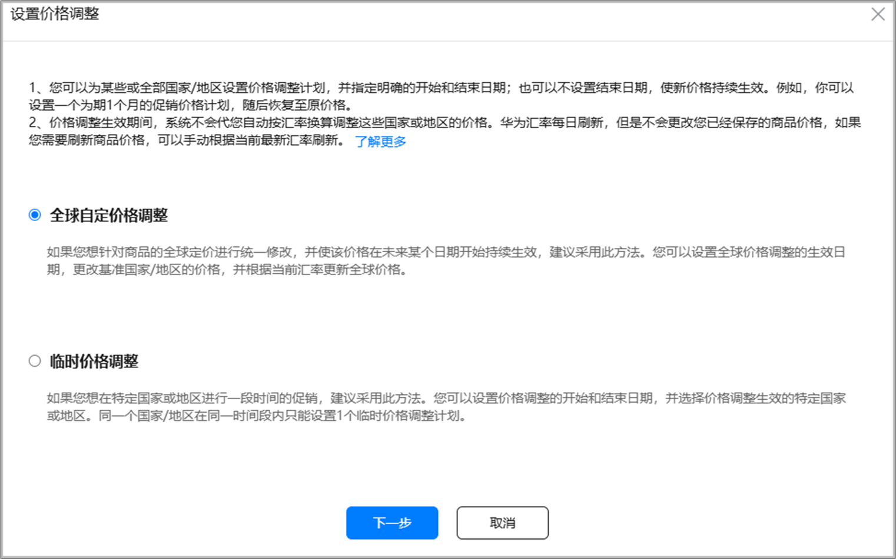

c）设置价格调整计划标识和生效起始日期，完成后，点击“下一步”。

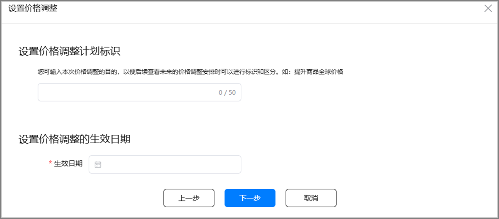

价格调整计划标识：主要用于开发者标识此次价格调整的目的，用于后续复盘查看时作区分。

价格调整的生效日期：最早可选择当日，最晚可选择下一个日历年的最后一天。

d）修改“汇率换算基准价格”，点击“刷新”同步更新商品价格。如果您需要对指定国家/地区的商品价格进行调整，还可以手动填写来修改该国家/地区对应的商品的用户支付价格（含税）。完成后，点击“下一步”。

e）查看价格调整冲突，如有问题，您可以返回上一步进行修改；如您确认价格调整冲突无影响，则点击“下一步”。

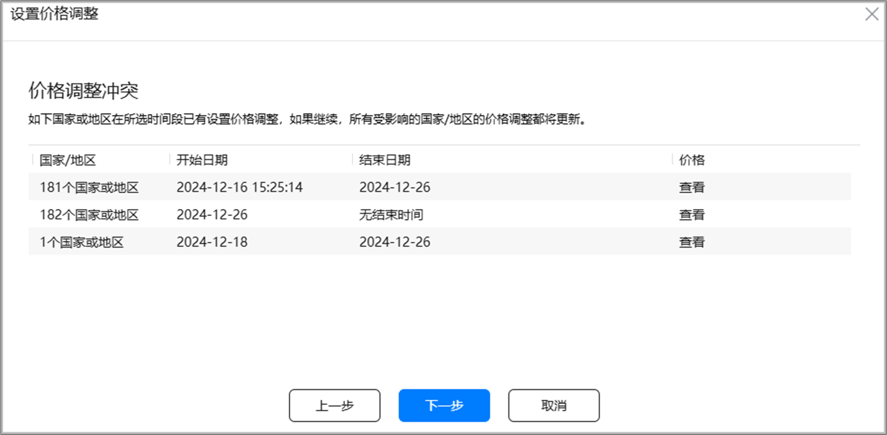

f）确认价格调整，完成全球自定价格调整设置。

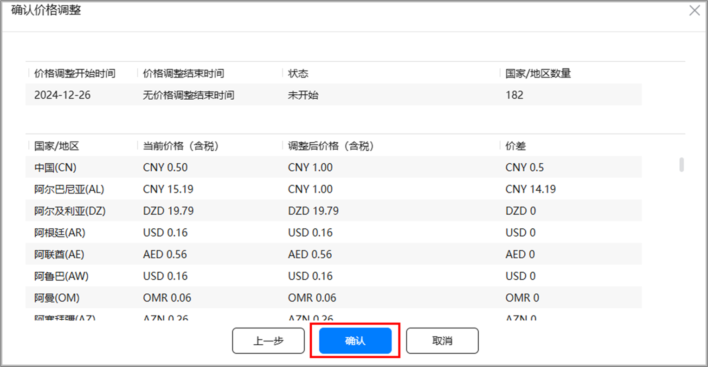

## **设置数字商品临时价格调整**

a）在“商品价格”页面，点击右上角“设置价格调整”。

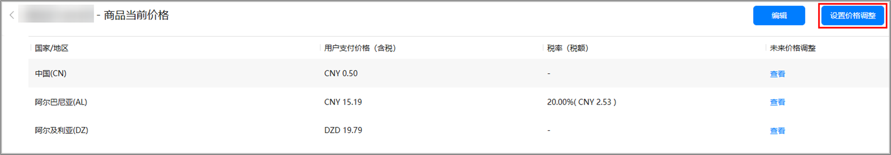

b）选择“临时价格调整”，点击“下一步”。

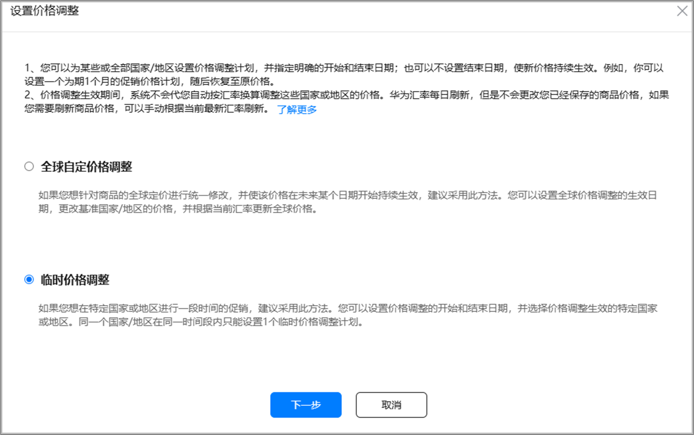

c）设置价格调整计划标识和价格调整的开始/结束日期，完成后，点击“下一步”。

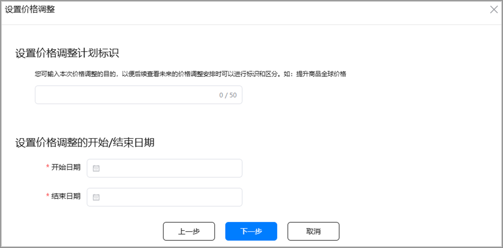

价格调整计划标识：主要用于开发者标识此次价格调整的目的，用于后续复盘查看时作区分。

价格调整的开始/结束日期：开始日期最早可选择当日，最晚可选择下一个日历年的最后一天，临时价格调整的时间跨度最长为1年。

d）选择价格调整生效的国家/地区，点击“下一步”。

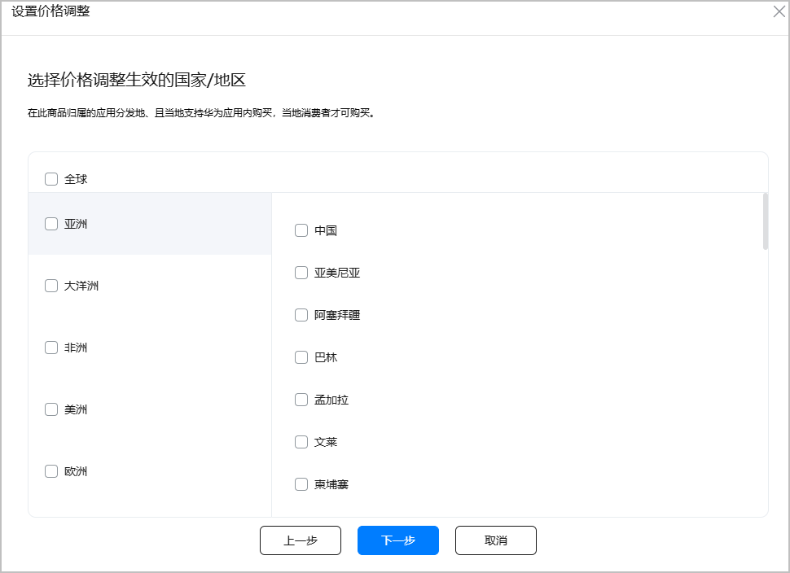

e）修改“汇率换算基准价格”，点击“刷新”同步更新商品价格。如果您需要对指定国家/地区的商品价格进行调整，还可以手动填写来修改该国家/地区对应的商品的用户支付价格（含税）。完成后，点击“下一步”。

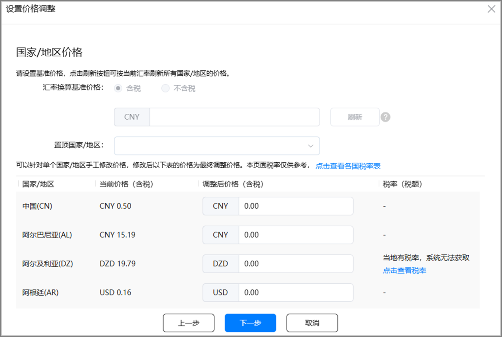

f）查看价格调整冲突，如有问题，您可以返回上一步进行修改；如您确认价格调整冲突无影响，则点击“下一步”。

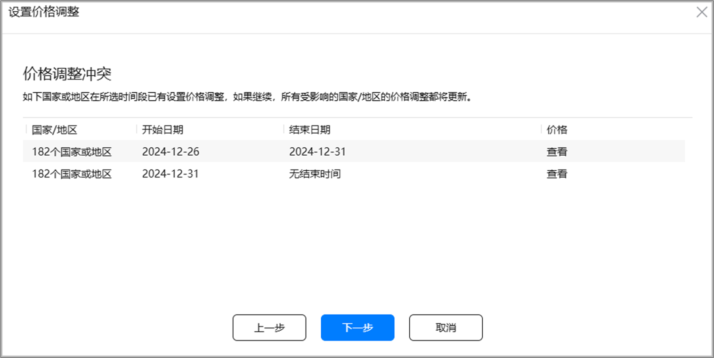

g）确认价格调整，完成临时价格调整设置。

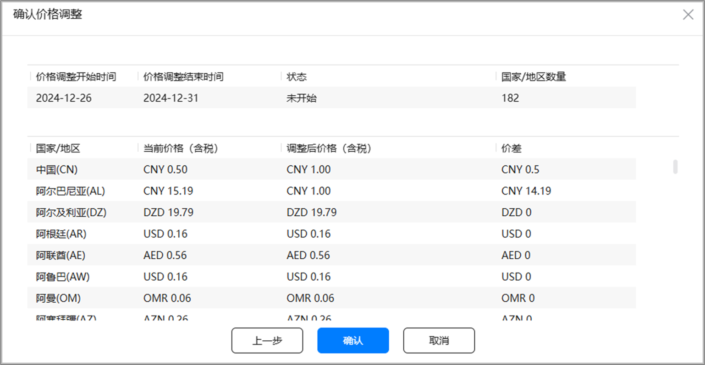

## **修改数字商品当前生效价格**

a）在“商品价格”页面，点击右上角“编辑”。

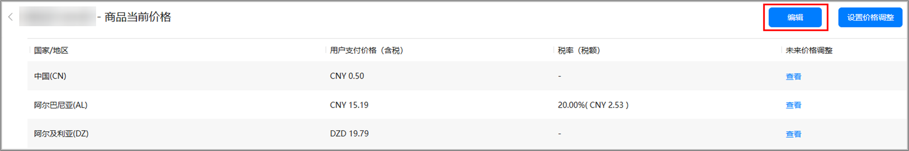

b）修改“汇率换算基准价格”，勾选排序规则，在列表中选择使用汇率刷新价格的国家/地区，点击“刷新”同步更新商品价格。如果您需要对指定国家/地区的商品价格进行调整，还可以手动填写来修改该国家/地区对应的商品的用户支付价格（含税）。

* 当进行切换“汇率换算基准价格”选项（含税或不含税）时，如果此商品存在已设置的价格调整计划，修改数字商品当前生效价格将自动清空所有未来的价格调整计划，保存后此商品定价将立即生效。
* 当华为数字商品服务新增上线国家后，如果开发者未重新确认保存商品价格，新上线国家的价格会受到汇率变动而变动（已上线国家价格不受影响）。只有当您重新确认保存商品价格后，新上线国家的价格才会固定下来，不再受汇率变动影响。

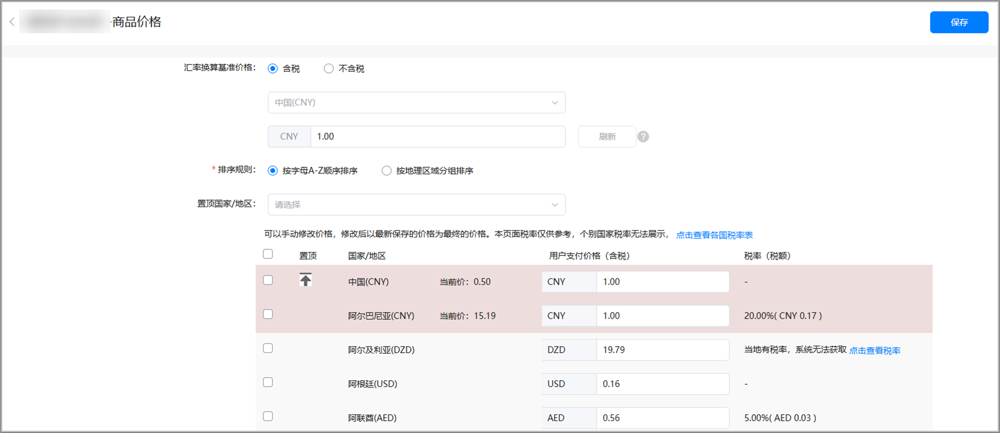

## **查看或编辑国家/地区未来价格调整**

a）商品当前价格页面，选择想要查看的国家/地区，点击“查看”。

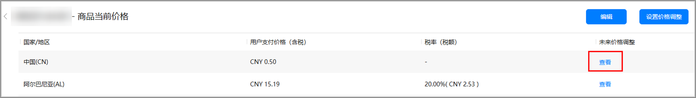

b）如需删除已设置的价格调整，可点击“删除”并确认。

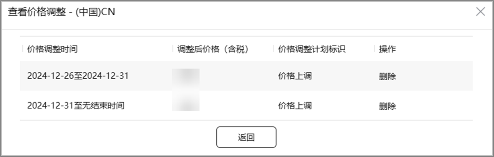

c）完成修改后，点击“保存”或“提交审核”。

已通过审核的数字商品，如果仅修改其价格和商品销售范围，则无需重新提交审核，新价格和新的商品销售范围立即生效；如果还修改了其他基本信息或审核信息，则需要再次提交审核，数字商品方可生效。
