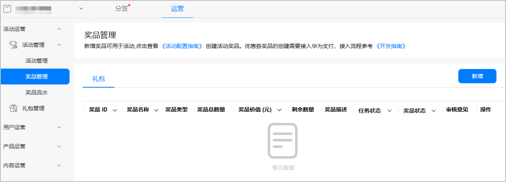
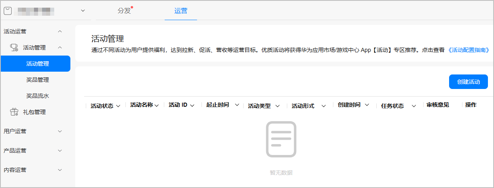
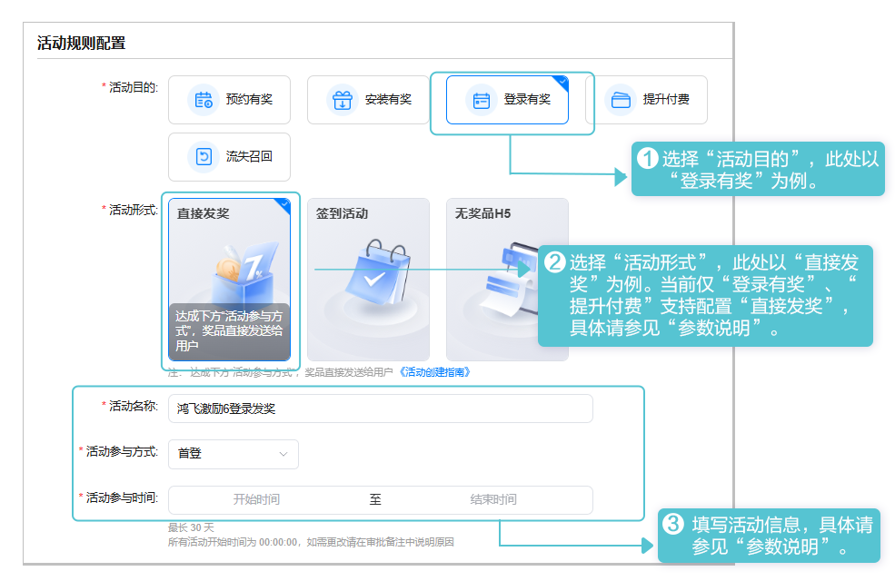
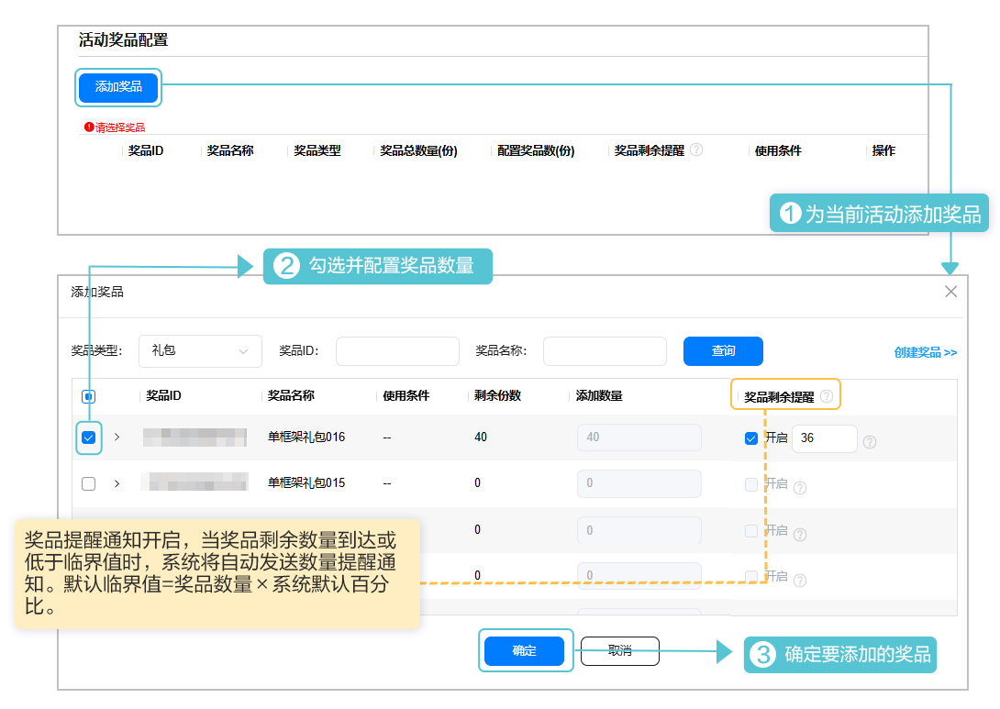
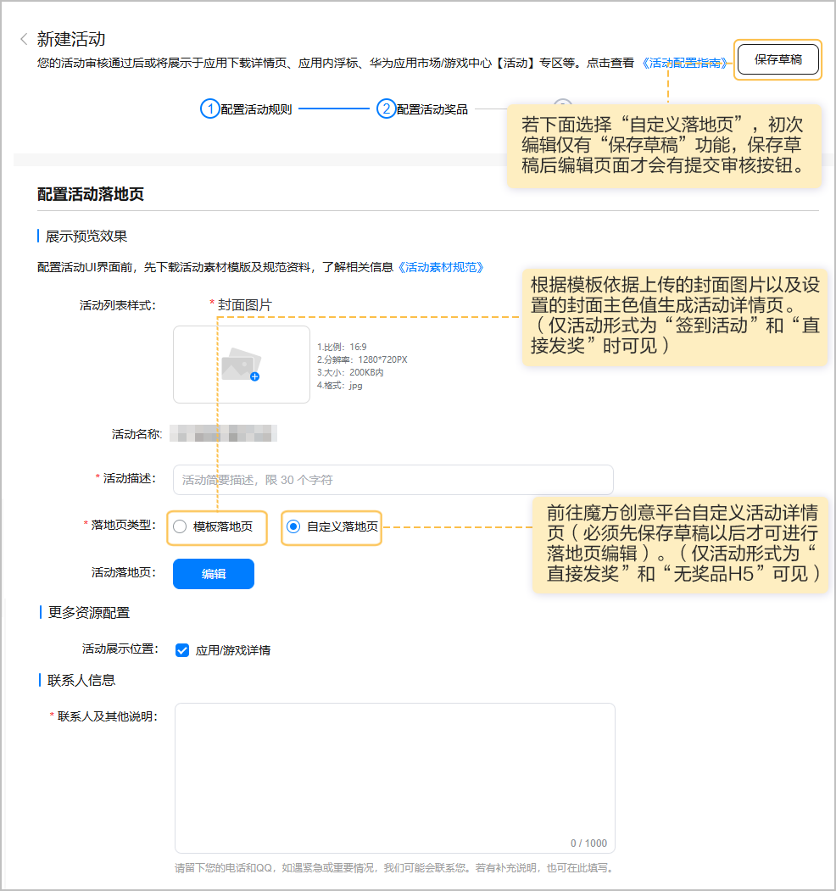
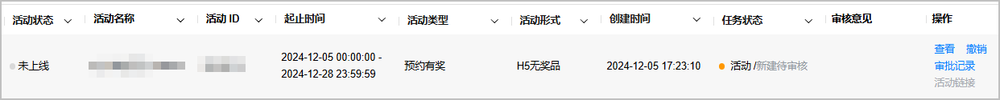

华为应用市场面向所有实名认证的联运应用及游戏开发者开放运营活动管理功能，您可自助创建运营活动，通过审核后即可在华为应用市场、游戏中心正式上线，实现拉新、促活、创收等经营目标。

## 活动目的

您可以基于不同的目的创建相应活动，活动管理当前提供以下5种活动目的场景供您选择。

| 活动目的场景 | 活动目的简介 |
| --- | --- |
| 预约有奖 | 创建活动提升预约量。 |
| 安装有奖 | 创建活动提升安装量。 |
| 登录有奖 | 创建活动增加用户登录。 |
| 提升付费 | 创建活动提升用户充值付费。 |
| 流失召回 | 创建活动召回流失用户。 |

## 活动形式

基于不同的活动目的，您可以选择不同的活动形式。目前HarmonyOS应用支持以下三种的活动形式，您可按需选择。

* **直接发奖**：用户达成特定操作，奖品直接发放到账。
* **签到活动**：活动期间，用户签到指定天数，奖品直接发放到账。
* **无奖品H5**：无需提供奖品，制作H5页面可用于宣传游戏内版本更新或游戏内活动。

## 活动准备

* 已成功[创建应用](/docs/distribute/agc/agc-help-app-0000002235710234/agc-help-create-app-0000002247955506)，且软件包类型为“APP（HarmonyOS应用）”，支持设备为“手机”。
* 提前准备活动落地页素材。

  | 准备项 | | 说明 |
  | --- | --- | --- |
  | 活动封面图片 | | 要求宽高比为16:9，分辨率为1280px\*720px，且大小不超过200KB的JPG格式图片。  说明：  设计图无需Logo和文字，尽量突出活动主题和元素，更详细要求可参照[活动素材规范](https://alliance-communityfile-drcn.dbankcdn.com/FileServer/getFile/cmtyPub/011/111/111/0000000000011111111.20260323192547.13113464442773083338524775501445%3A20260603110506%3A2800%3A37DBF5F52824F3FFE6CD3BEDA8C2579001C6E13F98F1B099798990D41991BA4E.zip?needInitFileName=true)。 |

## 配置活动奖品

若创建无奖品活动可跳过该步骤。

通过各类运营活动，为用户提供活动奖励，以直接发奖形式向用户发放奖品，需先配置可添加至运营活动的活动奖品，配置活动奖品操作步骤如下。文中具体参数说明请参见[参数说明](/docs/dev/game-dev/games-center-setup-activities-param-0000002320553297#ZH-CN_TOPIC_0000002382054357)。

1. 登录[AppGallery Connect](https://developer.huawei.com/consumer/cn/service/josp/agc/index.html)，点击“APP与元服务”，在应用列表中选择需要新增奖品的应用。
2. 新增奖品。

   
3. 填写奖品信息，完成后点击右上角“提交”提交审核。

## 创建活动

配置活动奖品并提交审核后，您可按如下步骤创建活动。文中具体参数说明请参见[参数说明](/docs/dev/game-dev/games-center-setup-activities-param-0000002320553297#ZH-CN_TOPIC_0000002382054357)。

1. 登录[AppGallery Connect](https://developer.huawei.com/consumer/cn/service/josp/agc/index.html)，点击“APP与元服务”，在应用列表中选择应用。
2. 新建活动。

   
3. 配置活动规则。

   
4. 下滑页面至“活动奖品配置”区域配置活动奖品（若“活动形式”选择“无奖品H5”无需配置，不展示该内容）。

   
5. 配置活动落地页及其它信息。

   
6. 审核与上架。

   点击页面右上角“提交审核”提交审核后，华为工作人员审核活动申请预计需要1~3个工作日，请耐心等待。审核结果可在状态栏查看。

   

   

   若想修改审核中的活动，请先撤销运营活动的申请，重新编辑活动后再提交审核。
