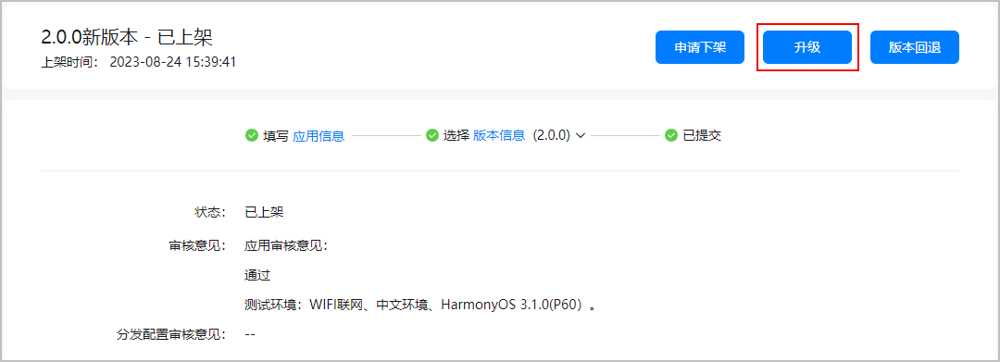
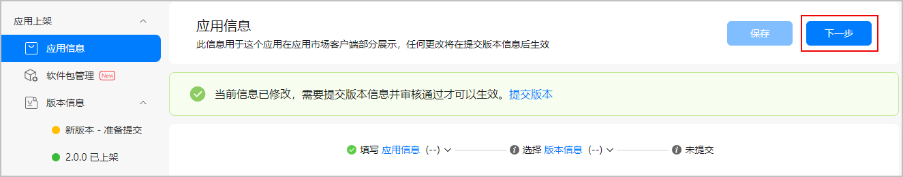
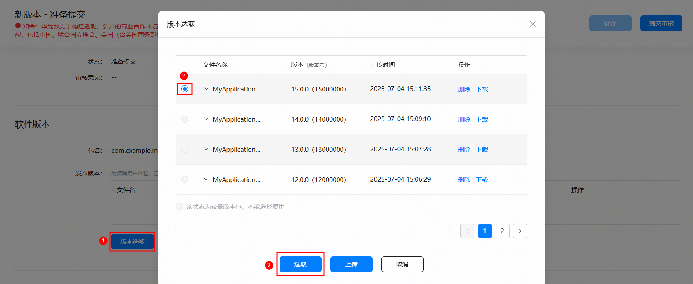

若您想提升应用的下载转化率和市场曝光度，建议您时常更新在架应用详情。您无需更换软件包，通过升级同版本的方式即可更新应用的基本信息。升级审核通过后，应用详情更新成功。

若您的应用支持中、英等多个语种，更新应用图标/应用介绍截图/应用介绍内容时，请根据您的更新计划，先选择相应的语种，再对相应语种下的应用图标/应用介绍截图/应用介绍内容进行更新，否则会导致更新内容无法在您预期的语言模块下生效。

## 前提条件

* 必须存在一个在架版本的应用。
* 更新在架应用详情需提前准备如下信息。
  + 兼容设备。
  + 可本地化基础信息：语言、应用名称、应用介绍、应用一句话简介、新版本特性、应用图标、应用截图和视频。
  + 应用分类。
  + 开发者服务信息：官网。

## 操作步骤

1. 登录[AppGallery Connect](https://developer.huawei.com/consumer/cn/service/josp/agc/index.html)，点击“APP与元服务”。
2. 在应用列表中选择待更新的应用，进入应用详情页。
3. 在“版本信息”页面的右上角点击“升级”，左侧导航栏新增“新版本 - 准备提交”页面。

   

4. 点击左侧导航栏“应用信息”，更新应用详情，完成后点击“下一步”，系统进入“新版本 - 准备提交”页面。

   

5. 在右侧“软件版本”下点击“版本选取”，直接选择当前在架软件包，点击“选取”。

   

   此处务必选择在架软件包，如果选择上传与在架不同的软件包，即使versionCode没有变化也不支持同版本升级，必须[升级应用版本](/docs/dev/game-dev/games-center-upgrade-version-0000002320626341#section166011045192419)。

   

6. （可选）设置软件包是否加密。

   您可以结合实际情况选择是否对分发的软件包进行加密。

   * 加密：用户在客户端安装的软件包为加密的，安全性较高。
   * 不加密：用户在客户端安装的软件包为不加密的，应用的启动速率较快。

   
7. 更新发布国家或地区、可本地化基础信息（应用介绍、一句话简介、新版本特性、素材）、付费情况等其它应用版本信息，具体请参见[发布应用](https://developer.huawei.com/consumer/cn/doc/app/agc-help-release-0000002235870050)。
8. 应用版本信息更新完成后，点击右上角“提交审核”，系统提示当前版本提交软件包versionCode与在架版本versionCode相同，点击“确认”。

   
9. 提交成功后，应用状态更新为“正在审核”，版本号不变。审核通过后，应用详情更新成功，用户在华为应用市场将看到最新的应用详情信息。
