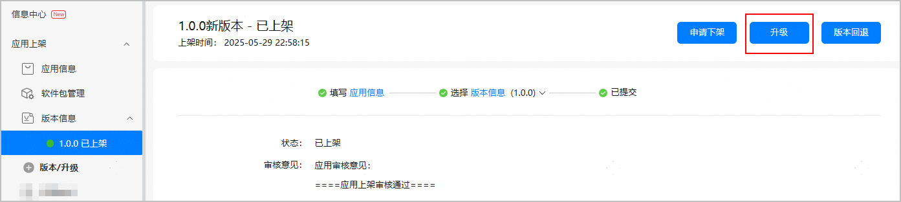
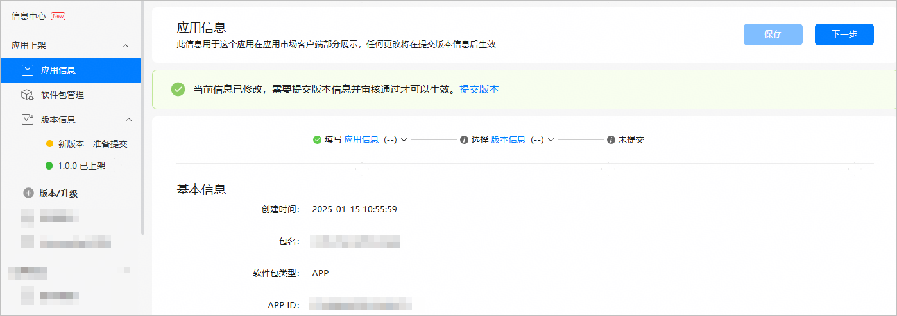
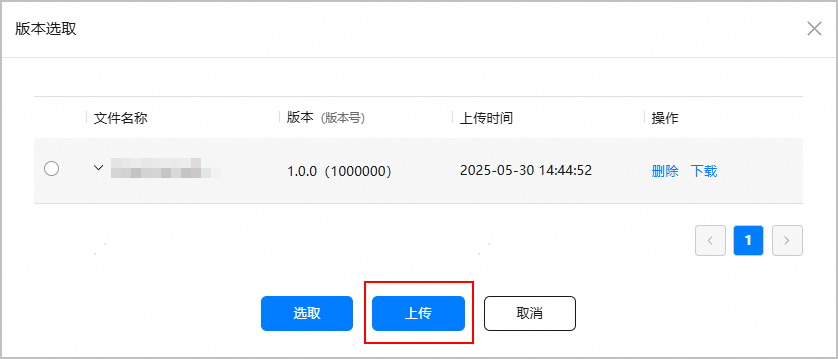
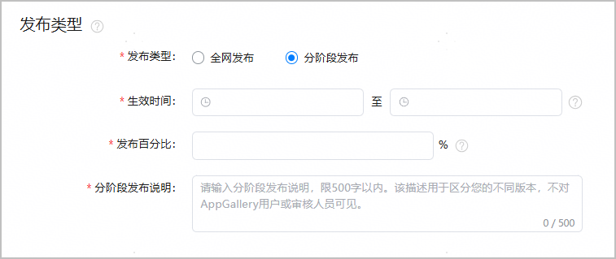
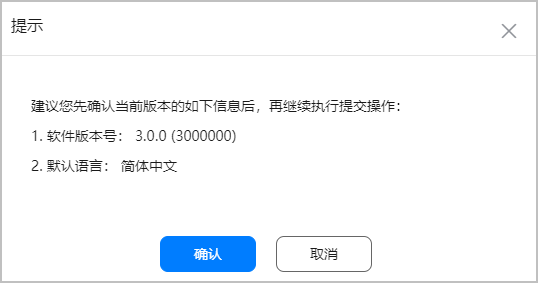
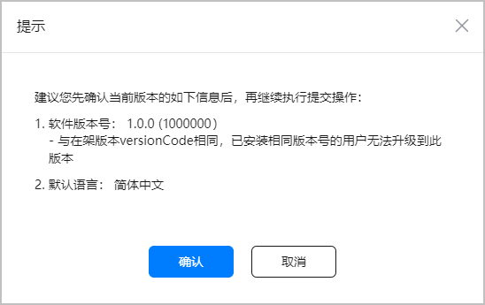

应用上架后，如果您需要修改应用的分发国家、修改软件包等，需在AppGallery Connect中提交新版本给华为进行审核。审核通过后，用户将在华为应用市场搜索到最新的应用版本。

## 前提条件

您已准备好需要更新的材料或信息，例如新版本软件包、新应用素材等。

## 创建新版本

在AGC提交版本升级申请前，请先创建新版本。

1. 登录[AppGallery Connect](https://developer.huawei.com/consumer/cn/service/josp/agc/index.html)，选择“APP与元服务”。
2. 在应用列表中点击待升级的应用“状态”链接，系统进入该版本的“版本信息”页面。
3. 点击右上角“升级”，左侧导航栏新增“新版本 - 准备提交”页面。

   

   如果存在最后一个版本未完成上架，可能“升级”按钮不存在，同时左侧“版本/升级”菜单置灰，不可点击。

   

## 更新应用信息

如需修改应用信息，点击左侧导航栏“应用信息”进行编辑，完成后点击“下一步”，进入“新版本 - 准备提交”页面。

## 上传新版本软件包

在“新版本 - 准备提交”页面的“软件版本”栏点击“版本选取”，在弹出的软件包选取窗口点击“上传”，上传本地APP软件包。

请确保您上传的软件包versionCode不低于当前在架版本的versionCode。

## 选择发布类型

如当前上架版本为全网发布，本次升级您可选择全网发布或分阶段发布。

* 如您选择全网发布，设置“发布类型”为“全网发布”。
* 如您选择分阶段发布，设置“发布类型”为“分阶段发布"，然后填写相关参数，具体参见[分阶段发布应用](https://developer.huawei.com/consumer/cn/doc/games-guides/games-center-stage-releasing-0000002286057064#ZH-CN_TOPIC_0000002348453664)。

## 更新其他版本信息

如需更新其他版本信息，请参考[发布应用](https://developer.huawei.com/consumer/cn/doc/app/agc-help-release-0000002235870050)下对应应用类型的发布指导。

在架应用不支持更改付费情况。如您想更改应用的付费情况，需下架并删除已上架应用，在重新发布应用时设置付费情况。

## 提交审核

所有信息确认无误后，点击右上角“提交审核”。

* 如系统弹出如下提示，确认软件包版本号无误后，点击“确认”。

  
* 如系统弹出如下提示，表示您上传的软件包versionCode与当前在架版本的versionCode相同。

  
  + 如您确认不更改versionCode，点击“确认”即可。但需注意，如果新版本软件包的versionCode和当前在架版本的versionCode相同，已安装相同版本号的用户将无法升级到此版本，华为应用市场客户端显示的版本更新日期保持不变，依旧为在架版本的发布日期。
  + 如果发现versionCode错误，点击“取消”，重新上传正确的软件包。
* 若弹出其他错误码，可参考[版本升级错误码说明](https://developer.huawei.com/consumer/cn/doc/app/agc-help-update-errorcode-0000002322270833)了解问题原因与解决方案。

提交成功后，应用状态更新为“正在审核”。审核通过后，应用升级成功。

## FAQ

### 软件包签名不一致如何处理？

当您在“版本选取”窗口选择上传的软件包并点击“提交审核”后，系统将立即校验开发者签名的一致性。如果当前提交审核的软件包的开发者签名与在架版本的开发者签名不一致，系统会弹出提示框，您可根据实际情况做出选择。

**软件包签名校验规则：**

* 通过分阶段发布的应用在转为全网发布前，系统校验应用签名时以全网在架应用版本签名为准。
* 若提交审核的版本基于全网在架版本升级，则和全网在架版本的签名进行比较。

**签名不一致处理方式：**

* 若您因密钥丢失等情况需更换应用签名，请点击“确认”继续提交版本审核。
* 若您因使用了错误的签名或上传了错误的软件包而导致签名不一致，可点击“取消”或关闭提示框，返回“版本选取”窗口，点击“上传”重新上传与当前在架版本签名一致的软件包。
