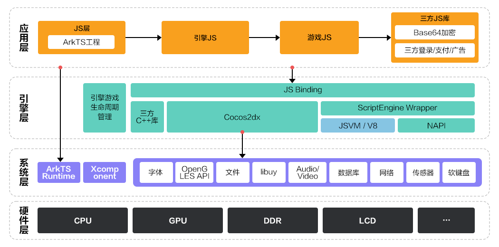

使用Cocos Creator **2.4.15**及以上版本或Cocos Creator **3.8.6**及以上版本开发的游戏均支持适配HarmonyOS 5.0及以上平台。

## 适配原理

Cocos Creator引擎运行时向下对接HarmonyOS 5.0及以上系统层能力，向上对接游戏应用层逻辑，为游戏提供图形、动画、声音、界面等功能集。

## 适配流程

Cocos Creator游戏适配HarmonyOS 5.0及以上平台的流程如下：

| 序号 | 操作 | 说明 |
| --- | --- | --- |
| 1 | [适配准备](/docs/dev/game-dev/games-creator-preparation-0000002290527373) | 为了顺利适配平台，您需提前做好一些准备工作。 |
| 2 | [游戏适配](/docs/dev/game-dev/games-creator-works-0000002290574289) | 包括游戏代码适配、系统能力适配在内的适配工作。 |
| 3 | [构建发布工程](/docs/dev/game-dev/games-creator-release-0000002290527377) | 在Cocos Creator引擎中构建出游戏的最小集代码jsb-link。 |
| 4 | [运行调试](/docs/dev/game-dev/games-creator-run-0000002290574293) | 运行并调试游戏的功能和性能，并前往AppGallery Connect提交上架申请。 |
