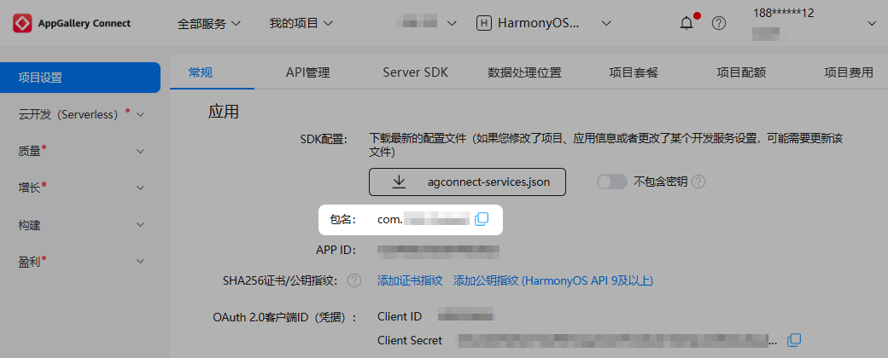

## 工具准备

### 安装DevEco Studio

前往[下载中心](https://developer.huawei.com/consumer/cn/download/deveco-studio)，登录华为账号后下载最新版本的DevEco Studio（Release）工具，并根据下载中心页面工具完整性指导进行完整性校验。

### 升级Cocos Creator

* Cocos Creator 2.X请升级到Cocos Creator 2.4.15及以上。若需定制引擎，请参见[2.X引擎定制工作流程](https://docs.cocos.com/creator/2.4/manual/zh/advanced-topics/engine-customization.html)。
* Cocos Creator 3.X请升级到Cocos Creator 3.8.6及以上。若需定制引擎，请参见[3.X引擎定制工作流程](https://docs.cocos.com/creator/3.8/manual/zh/advanced-topics/engine-customization.html)。

## 知识准备

### 学习ArkTS语言

ArkTS是游戏开发的官方高级语言，其中ArkUI（方舟UI框架）更为游戏UI开发提供了完整的基础设施，包括简洁的UI语法、丰富的UI功能。ArkTS语言更多介绍请参见[学习ArkTS语言](https://developer.huawei.com/consumer/cn/doc/harmonyos-guides/learning-arkts)。

### 了解Stage模型

了解Stage模型可以帮助开发者更好地理解应用程序的架构和设计，有助于开发者对不同阶段的应用程序包形态有更加清晰的认知，提升HarmonyOS 5.0及以上系统的开发效率和性能。Stage模型更多介绍请参见[Stage模型开发概述](/docs/dev/app-dev/application-framework/ability-kit/stage-model-development/stage-model-development-overview)。

## AGC控制台准备

### 注册开发者账号

若您还没有实名认证的华为开发者账号，请前往华为开发者联盟网站注册开发者账号并完成实名认证，详细操作请参见[注册认证](https://developer.huawei.com/consumer/cn/doc/start/registration-and-verification-0000001053628148)。

### 创建项目及在项目上添加游戏

前往AGC控制台创建游戏类应用，具体操作请参见[创建HarmonyOS应用](/docs/distribute/agc/agc-help-app-0000002235710234/agc-help-create-app-0000002247955506)。其中：

* “应用类型”：选择“HarmonyOS应用”。
* “应用分类”：选择“游戏”。

正式上架的游戏包名建议不要包含test、dev等信息。

### 获取游戏包名

登录[AppGallery Connect](https://developer.huawei.com/consumer/cn/service/josp/agc/index.html)，点击“我的项目”，在项目列表中选择项目及项目下的游戏，获取游戏包名。

