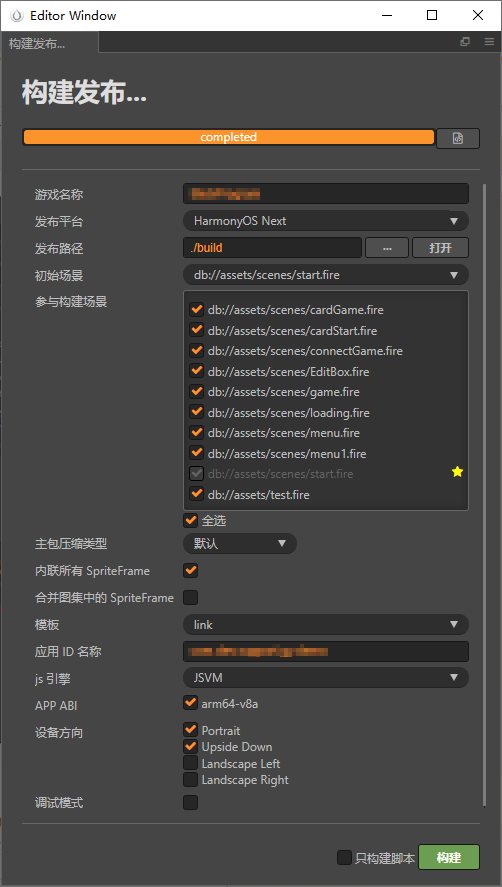
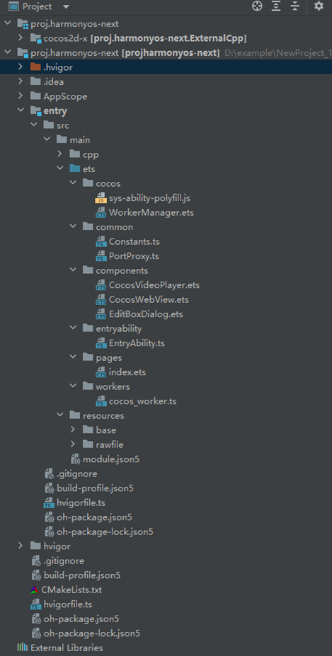
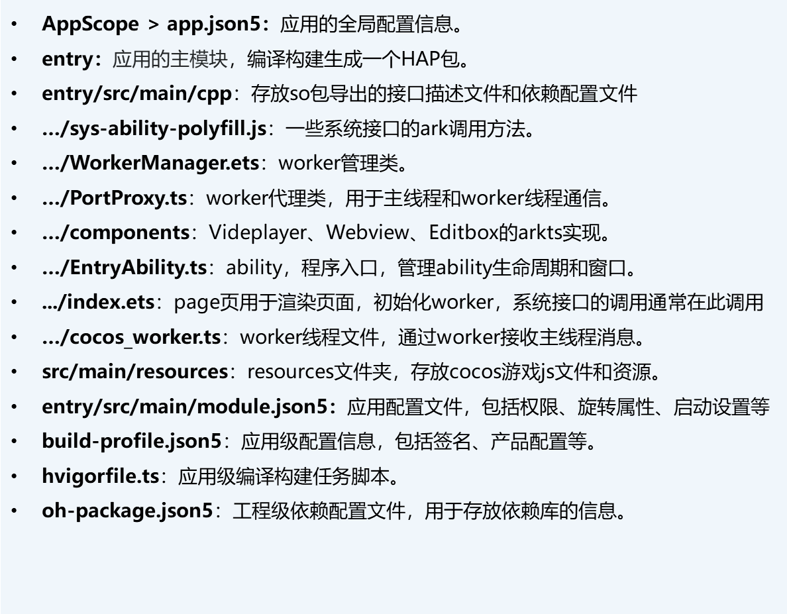

完成游戏适配后，需从Cocos Creator引擎中构建发布工程。此处以Cocos Creator 2.4.15引擎为例。

1. 在Cocos Creator 2.4.15顶部菜单选择“项目 &gt; 构建发布”，在弹出的“构建发布”窗口填写配置项后，其中：
   * “发布平台”请选择“HarmonyOS Next”。
   * “应用名称ID”请填写游戏包名。获取方式请参见[获取游戏包名](/docs/dev/game-dev/games-creator-preparation-0000002290527373#section177836993213)。
   * “js引擎”请选择“JSVM”。

   完成后点击“构建”，构建发布工程。

   

   * Cocos Creator 2.X工程相对游戏项目路径为build\jsb-link\frameworks\runtime-src\proj.harmonyos-next。
   * Cocos Creator 3.X工程相对游戏项目路径为native\engine\harmonyos-next。
2. 在DevEco Studio中打开工程，工程目录结构说明如下：

   
