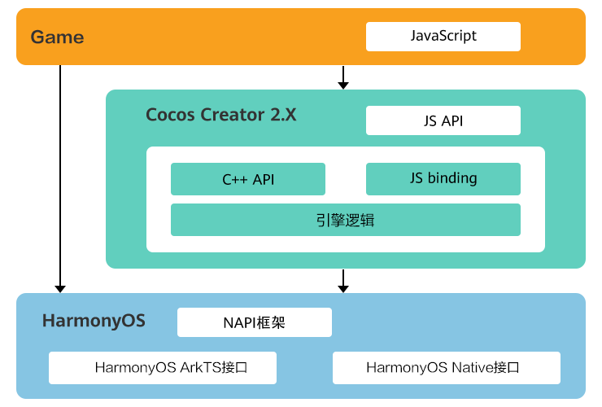

本文介绍Cocos Creator 2.X游戏如何适配系统能力。

由于HarmonyOS 5.0及以上系统使用的协议栈和其它系统不同，因此游戏原有的系统方法，例如获取剪切板、获取电量等在HarmonyOS 5.0及以上平台可能不支持，您需根据当前游戏的实际使用情况进行替换适配。


Cocos Creator 3.X适配系统能力的具体介绍请前往[基于反射机制实现 JavaScript 与 HarmonyOS Next 系统原生通信](https://docs.cocos.com/creator/3.8/manual/zh/advanced-topics/arkts-reflection.html)。

## 接口调用原理

游戏业务逻辑调用HarmonyOS 5.0及以上系统接口的原理如下图所示：



* HarmonyOS ArkTS接口：游戏替换对应能力时，您可以通过[Node-API框架](https://developer.huawei.com/consumer/cn/doc/harmonyos-guides/using-napi-interaction-with-cpp)使用C++/JS调用系统接口，ArkTS API参考请参见[ArkTS API参考](https://developer.huawei.com/consumer/cn/doc/harmonyos-references/ability-arkts) 。
  + [JavaScript直接调用ArkTS方法](#section13136172212208)。
  + [ArkTS直接调用JavaScript方法](#section1886993585811)。
* HarmonyOS Native接口：游戏替换对应能力时，您可以直接使用C++调用系统的Native接口。

## JavaScript直接调用ArkTS方法

使用Cocos Creator打包的游戏中，通过反射机制直接在JavaScript中调用 ArkTS的静态方法。

### 使用方法

```
let result = jsb.reflection.callStaticMethod(isSyn, clsPath, methodName, paramStr);
```

| callStaticMethod参数 | 说明 |
| --- | --- |
| isSyn | 是否是同步方法：   * true：为同步方法。 * false：为异步方法。 |
| clsPath | 脚本路径，例如entry/src/main/ets/test。 |
| methodName | 模块名称/静态方法名称，例如entry/test。 |
| paramStr | 方法入参，例如json字符串。 |

在callStaticMethod方法中，我们通过传入ArkTS是否同步，模块路径/依赖包名/远程库名/方法名，参数就可以直接调用ArkTS的静态方法，并且可以获得ArkTS方法的返回值。

本文示范了本地工程模块的两种场景，其他场景可参阅详细说明[napi\_load\_module\_with\_info支持的场景](https://gitee.com/link?target=https://developer.huawei.com/consumer/cn/doc/harmonyos-guides/use-napi-load-module-with-info#napi_load_module_with_info%25E6%2594%25AF%25E6%258C%2581%25E7%259A%2584%25E5%259C%25BA%25E6%2599%25AF)。

| 场景 | 详细分类 | 说明 |
| --- | --- | --- |
| 本地工程模块 | HAP加载模块内文件路径 | 要求路径以moduleName开头 |
| 本地工程模块 | HAP加载HAR模块名 | - |
| 远程包 | HAP加载远程HAR模块名 | - |
| 远程包 | HAP加载ohpm包名 | - |
| API | HAP加载@ohos.或@system. | - |
| 模块Native库 | HAP加载libNativeLibrary.so | - |

### 使用示例

* HAP加载模块内文件路径
  1. 在加载文件中的模块时，ArkTS示例代码如下：

     ```
     function test(param: string): string {
       console.log("param::", param);
       return param;
     }

     function syncTest(param: string, cb: Function): void {
       console.log("param::", param);
       setTimeout(() => {
         cb(param);
       }, 1000)
     }

     export { test, syncTest };
     ```
  2. 在模块级build-profile.json5配置文件中进行如下配置：

     ```
      "buildOption": {
       "arkOptions": {
         "runtimeOnly": {
           "sources": [
             "./src/main/ets/test.ts"
           ]
         }
       }
     }
     ```
  3. 在游戏中调用。

     ```
     let param = {
         a:1,
         b:2
     }
     let o1 = jsb.reflection.callStaticMethod(true,"entry/src/main/ets/test","entry/test",JSON.stringify(param));
     console.log("result::", o1, typeof o1, JSON.parse(o1).a);

     let o2 =jsb.reflection.callStaticMethod(false,"entry/src/main/ets/test","entry/syncTest",JSON.stringify(param));
     console.log("result::", o2, typeof o2, JSON.parse(o2).a);
     ```

* HAP加载HAR模块名
  1. HAR包Index.ets文件如下：

     ```
     function test(param: string): string {
       console.log("param::", param);
       return param;
     }

     function syncTest(param: string, cb: Function): void {
       console.log("param::", param);
       setTimeout(() => {
         cb(param);
       }, 1000)
     }

     export { test, syncTest };
     ```
  2. 在加载本地HAR包时，需先在oh-package.json5文件中配置dependencies项。

     ```
     {
         "dependencies": {
             "library": "file:../library"
         }
     }
     ```
  3. 还需在build-profile.json5中进行配置。

     ```
     "buildOption": {
       "arkOptions": {
         "runtimeOnly": {
           "packages": [
             "library"
           ]
         }
       }
     }
     ```
  4. 在游戏中调用。

     ```
     let param = {
         a:1,
         b:2
     }
     let o1 = jsb.reflection.callStaticMethod(true,"library","entry/test",JSON.stringify(param));
     console.log("result::", o1, typeof o1, JSON.parse(o1).a);

     let o2 =jsb.reflection.callStaticMethod(false,"library","entry/syncTest",JSON.stringify(param));
     console.log("result::", o2, typeof o2, JSON.parse(o2).a);
     ```

## ArkTS直接调用JavaScript方法

使用Cocos Creator打包游戏中，C++封装了evalString方法提供给开发者从ArkTS直接执行JavaScript代码。

### 注意事项

* 此方法只能在worker线程执行，若有业务需求在主线程执行后调用的话，需要在主线程将结果发送给worker线程后再调用evalString。
* 此方法需要在worker线程的JS引擎初始化完成之后才可以调用，也就是renderContext.nativeEngineInit()执行之后。
* 此方法只能在V8和jsvm两种JS引擎中有效，方舟引擎不支持，因为方舟引擎的JS交互可直接在globalThis上绑定对象后访问。
* 此方法只支持返回number、string、boolean、JSON对象。

### 使用示例

* 游戏侧

  ```
  // 游戏侧
  window.test1 = (a,b) => {
      return a + b;
  }

  window.test2 = (a,b) => {
      if(a === b)
          return true;
      else
          return false;
  }

  window.test3 = (a,b)=>{
      return (a + b) + "";
  }

  window.person = {
      name: "zhangSan",
      age: 18
  }
  ```
* ArkTS侧

  ```
  // ArkTS侧
  import cocos from 'libcocos.so';

  let test1 = cocos.evalString("test1(1,2)");
  console.log("返回结果:", test1, typeof test1);

  let test2 = cocos.evalString("test2(2,3)");
  console.log("返回结果:", test2, typeof test2);

  let test3 = cocos.evalString("test3(3,4)");
  console.log("返回结果:", test3, typeof test3);

  let test4 = cocos.evalString("person");
  console.log("返回结果:", test4.name, typeof test4);
  ```
* 打印结果

  ```
  48604-48719   A03D00/com.coc...harmony/JSAPP  pid-48604             I     返回结果: 3 number
  48604-48719   A03D00/com.coc...harmony/JSAPP  pid-48604             I     返回结果: false boolean
  48604-48719   A03D00/com.coc...harmony/JSAPP  pid-48604             I     返回结果: 7 string
  48604-48719   A03D00/com.coc...harmony/JSAPP  pid-48604             I     返回结果: zhangSan object
  ```
