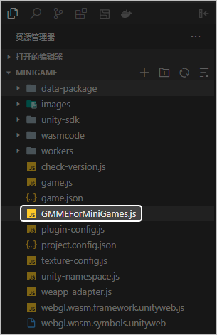
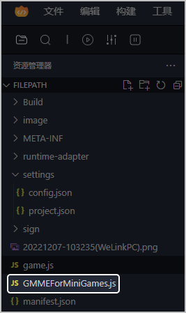

## 前提条件

* 您已[下载游戏多媒体SDK](https://developer.huawei.com/consumer/cn/doc/AppGallery-connect-Library/gamemme-sdkdownload-csharp-minigame-0000001825274857)。
* 您已下载微信开发者工具。
* 您已下载快游戏开发者工具。

## 导出为微信小游戏

1. 使用团结引擎完成游戏多媒体功能开发后，[导出WebGL并转换为小游戏项目](https://github.com/wechat-miniprogram/minigame-unity-webgl-transform/blob/main/Design/Transform.md)。

   

   首次使用团结引擎导出WebGL并转换为小游戏项目前，需安装小游戏团结引擎适配插件。
2. 使用微信开发者工具导入该项目。

   

   游戏集成游戏多媒体SDK后，如需发布到微信小游戏平台，还必须进行服务器域名配置，跟指定的域名进行网络通信，具体域名请参见[FAQ](/docs/dev/game-dev/games-gamemme-faq-0000002304632344#section1890854563118)。
3. 将游戏多媒体SDK中的GMMEForMiniGames.js文件（获取路径：Plugins &gt; js &gt; GMMEForMiniGames.js）放在微信小游戏项目的根目录下。

   
4. 在项目的game.js文件头部新增如下代码。

   ```
   import * as GMMEForMiniGames from 'GMMEForMiniGames.js'
   window.GMMEForMiniGames = GMMEForMiniGames;
   ```

## 导出为华为快游戏

1. 使用Unity完成游戏多媒体功能开发后，[导出为WebGL项目](https://github.com/Petal-Gaming-Services/UnityToQuickGame/blob/main/doc/%E7%AC%AC%E4%BA%8C%E6%AD%A5-%E5%8F%91%E5%B8%83WebGL%E9%A1%B9%E7%9B%AE.md)。
2. 使用[快游戏开发者工具](/docs/dev/game-dev/games-quickgame-developer-tool-0000002351933781)导入此项目。
3. 在工具主界面的顶部菜单栏选择“构建 &gt; Unity游戏转换快游戏”，填写信息完成转换。
4. 将游戏多媒体JS SDK中的GMMEForMiniGames.js放在快游戏项目的根目录下。

   
5. 在项目的game.js文件头部新增如下代码。

   ```
   require("GMMEForMiniGames.js");
   window.GMMEForMiniGames = GMMEForMiniGames;
   ```
