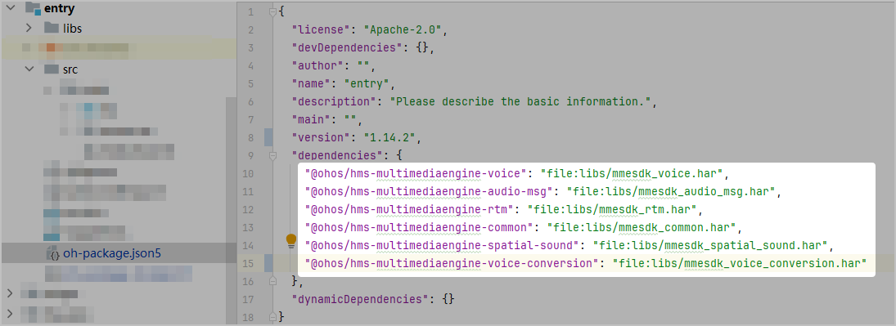
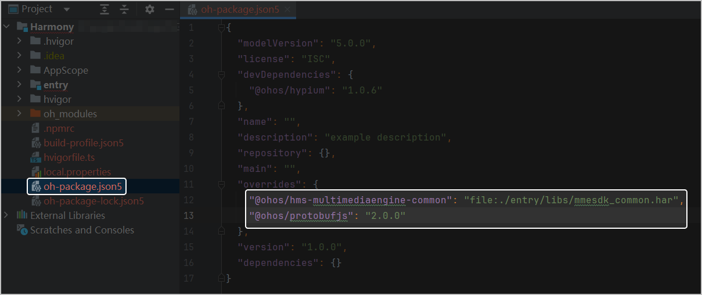
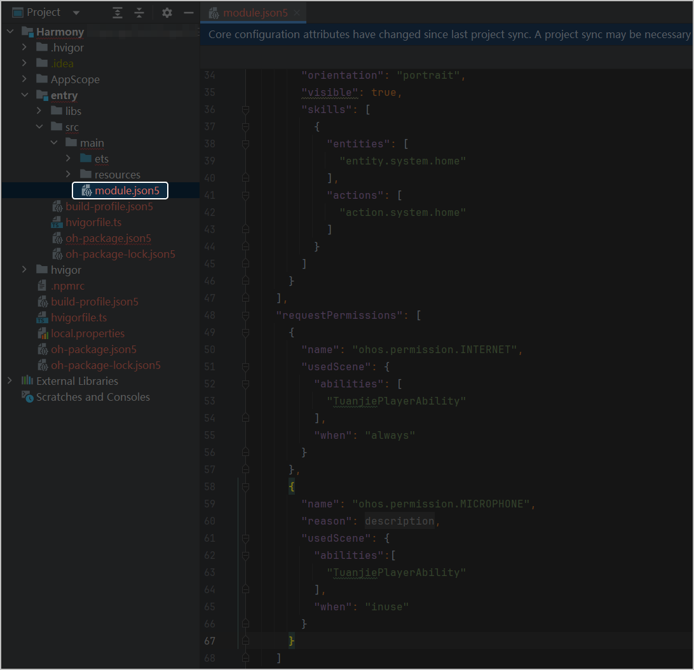
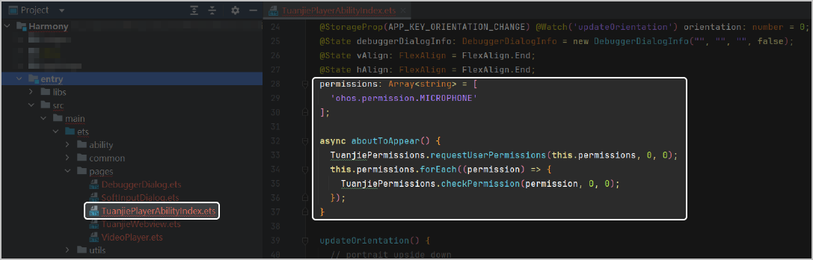
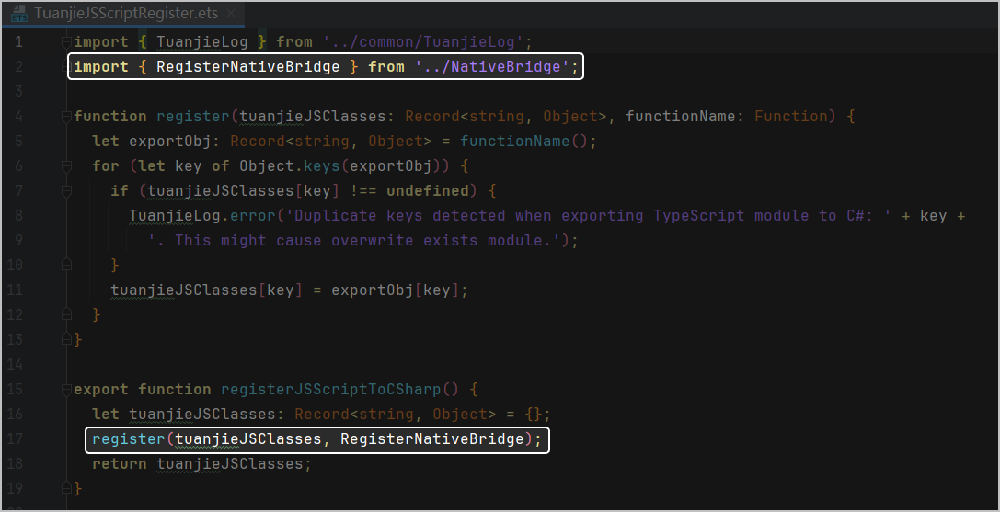
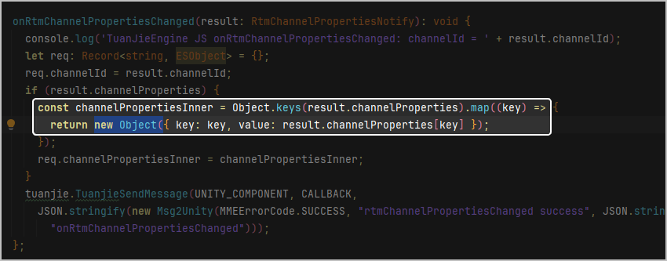
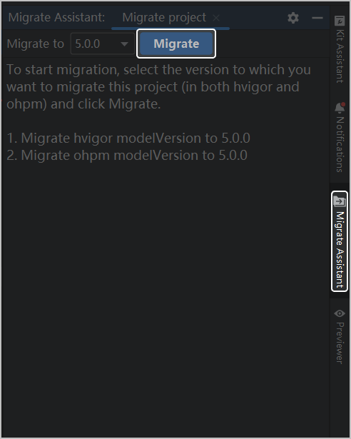

GMME SDK 支持IL2CPP编译。

1. 使用团结引擎直接导出HarmonyOS 5.0及以上工程，然后再用DevEco Studio打开和编译，此处不做详细描述。
2. 在DevEco Studio工程中的entry目录下新建一个libs文件夹，根据实现需要添加依赖包。

   | 依赖包 | 说明 |
   | --- | --- |
   | mmesdk\_common.har | 游戏多媒体服务基础SDK，必须集成。 |
   | mmesdk\_audio\_msg.har | 游戏多媒体服务语音消息模块，实现语音消息、语音变声功能时集成。 |
   | mmesdk\_voice.har | 游戏多媒体服务实时语音模块，实现实时语音、效果音播放、3D音效和语音变声功能时集成。 |
   | mmesdk\_rtm.har | 游戏多媒体服务实时信令模块，实现实时信令功能时集成。 |
   | mmesdk\_spatial\_sound.har | 游戏多媒体服务3D音效模块，实现3D音效功能时集成。  注意：  实现3D音效功能时还需集成[游戏多媒体服务实时语音模块](https://developer.huawei.com/consumer/cn/doc/games-guides/games-gamemme-integratingsdk-harmonyos-0000002304632332#ZH-CN_TOPIC_0000002382173737__zh-cn_topic_0000001717945166_p9472183931311)。 |
   | mmesdk\_voice\_conversion.har | 游戏多媒体服务语音变声模块，实现语音变声功能时集成。  注意：  实现语音变声功能时还需集成[游戏多媒体服务实时语音模块](https://developer.huawei.com/consumer/cn/doc/games-guides/games-gamemme-integratingsdk-harmonyos-0000002304632332#ZH-CN_TOPIC_0000002382173737__zh-cn_topic_0000001717945166_p9472183931311)**或**[游戏多媒体服务语音消息模块](https://developer.huawei.com/consumer/cn/doc/games-guides/games-gamemme-integratingsdk-harmonyos-0000002304632332#ZH-CN_TOPIC_0000002382173737__zh-cn_topic_0000001717945166_p1447123912134)。 |
3. 在Module的**oh-package.json5**中引用游戏多媒体SDK包。

   

   ```
   "dependencies": {
       "@ohos/hms-multimediaengine-common": "file:libs/mmesdk_common.har", // mmesdk_common.har：游戏多媒体服务基础SDK，必须集成
       "@ohos/hms-multimediaengine-voice": "file:libs/mmesdk_voice.har", // mmesdk_voice.har：游戏多媒体服务实时语音模块，实现实时语音、效果音播放、3D音效和语音变声功能时集成（可选）
       "@ohos/hms-multimediaengine-audio-msg": "file:libs/mmesdk_audio_msg.har", // mmesdk_audio_msg.har：游戏多媒体服务语音消息模块，实现语音消息、语音变声功能时集成（可选）
       "@ohos/hms-multimediaengine-rtm": "file:libs/mmesdk_rtm.har", // mmesdk_rtm.har：游戏多媒体服务实时信令模块，实现实时信令功能时集成（可选）
       "@ohos/hms-multimediaengine-spatial-sound": "file:libs/mmesdk_spatial_sound.har", // mmesdk_spatial_sound.har: 游戏多媒体服务3D音效模块，实现3D音效功能时集成（可选）
       "@ohos/hms-multimediaengine-voice-conversion": "file:libs/mmesdk_voice_conversion.har", // mmesdk_voice_conversion.har: 游戏多媒体服务语音变声模块，实现语音变声功能时集成（可选）
   }
   ```
4. 在项目工程根目录下的**oh-package.json5**文件中添加overrides配置，强制指定游戏多媒体服务基础SDK依赖。

   

   ```
   // 强制指定游戏多媒体服务基础SDK依赖
   "overrides": {
       "@ohos/hms-multimediaengine-common": "file:./entry/libs/mmesdk_common.har",
       "@ohos/protobufjs": "2.0.0"
     }
   ```
5. 添加权限

   在实现游戏多媒体SDK语音消息功能前，您还需要在module.json5文件中申请如下权限。

   

   ```
   "requestPermissions": [
         {
           "name": "ohos.permission.INTERNET",
           "usedScene": {
             "abilities": [
               "TuanjiePlayerAbility"
             ],
             "when": "always"
           }
         },
         {
           "name": "ohos.permission.MICROPHONE",
           "usedScene": {
             "abilities":[
               "TuanjiePlayerAbility"
             ],
             "when": "inuse"
           }
         }
   ]
   ```

   在应用打开时权限申请：

   

   ```
     permissions: Array<string> = [
       'ohos.permission.MICROPHONE'
     ];
     async aboutToAppear() {
       TuanjiePermissions.requestUserPermissions(this.permissions, 0, 0);
       this.permissions.forEach((permission) => {
         TuanjiePermissions.checkPermission(permission, 0, 0);
       });
     }
   ```
6. 在TuanjieJSScriptRegister.ets文件中添加本地桥接脚本

   ```
   import { RegisterNativeBridge } from '../NativeBridge';
   //代码片段
   export function registerJSScriptToCSharp() {
     //代码片段
     register(tuanjieJSClasses, RegisterNativeBridge);
     //代码片段
   }
   ```

   
7. 如果报Object literal must correspond to some explicitly declared class or interface (arkts-no-untyped-obj-literals)错误则按照下图修改内容：

   
8. 团结引擎导出来的项目结构和配置需要升级，迁移项目。

   
