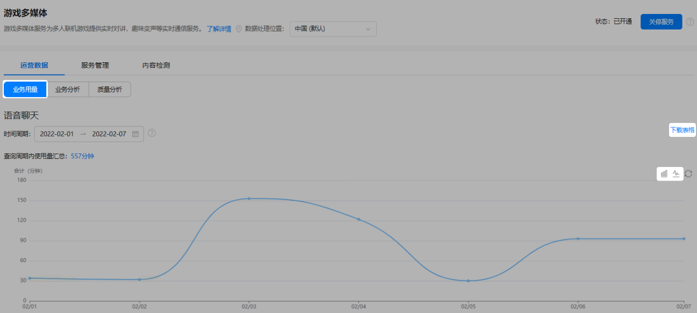
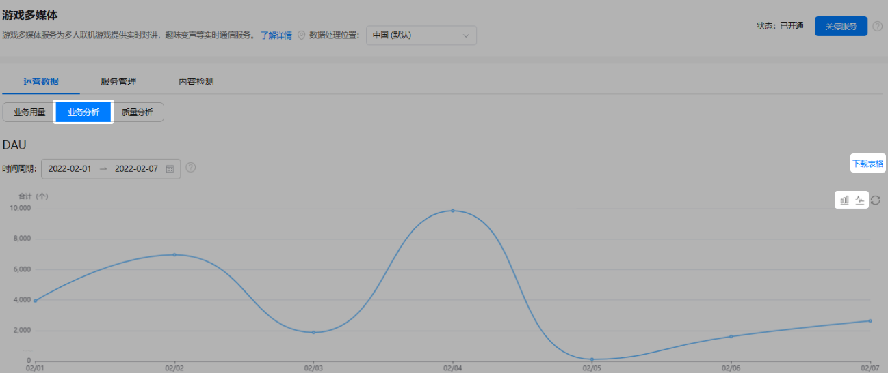
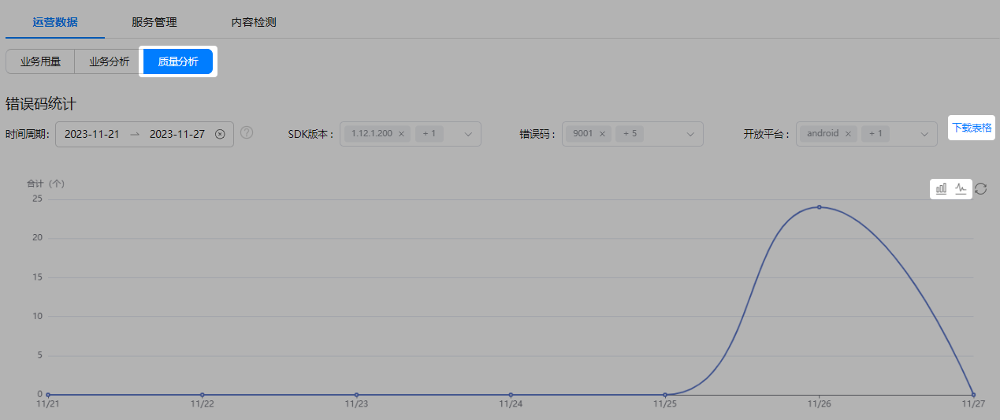

游戏多媒体相关服务使用后，AGC控制台会自动统计语音聊天时长、语音转文本使用量、错误码等数据。您可以通过查看业务用量、业务分析和质量分析相关数据，了解游戏多媒体服务的使用效果。

## 前提条件

* 您的应用已[集成游戏多媒体SDK](https://developer.huawei.com/consumer/cn/doc/games-guides/games-gamemme-integratingsdk-0000002359706914)。
* 您已[开通游戏多媒体服务](https://developer.huawei.com/consumer/cn/doc/games-guides/games-gamemme-enable-0000002338511697)。

## 业务用量

1. 登录[AppGallery Connect](https://developer.huawei.com/consumer/cn/service/josp/agc/index.html)，点击“我的项目”。
2. 在项目列表中找到您的项目，并在项目下的应用列表中选择您的游戏应用。
3. 在左侧导航栏中点击“构建 &gt; 游戏多媒体”，进入游戏多媒体服务页面。
4. 在“运营数据”页签下，选择查看“业务用量”，您可以看到语音聊天时长、语音转文本使用量统计数据和统计图。您还可以通过左上角的时间筛选框，选择查看当前日期（不含）前最长90天跨度的数据。

   
5. 如需下载统计数据，可通过点击页面右上角的“下载表格”，将数据保存到本地。
6. 如需查看不同类型的数据统计图，可通过点击页面右上角或，选择柱状图或折线图呈现相关数据。

## 业务分析

1. 登录[AppGallery Connect](https://developer.huawei.com/consumer/cn/service/josp/agc/index.html)，点击“我的项目”。
2. 在项目列表中找到您的项目，并在项目下的应用列表中选择您的游戏应用。
3. 在左侧导航栏中点击“构建 &gt; 游戏多媒体”，进入游戏多媒体服务页面。
4. 在“运营数据”页签下，选择查看“业务分析”，您可以看到DAU（日活跃用户数量）、每日峰值用户数、每日创建房间数及其统计图。您还可以通过左上角的时间筛选框，选择查看当前日期（不含）前最长90天跨度的数据。

   
5. 如需下载统计数据，可点击页面右上角的“下载表格”，将数据保存到本地。
6. 如需查看不同类型的数据统计图，可通过点击页面右上角或，选择柱状图或折线图呈现相关数据。

## 质量分析

1. 登录[AppGallery Connect](https://developer.huawei.com/consumer/cn/service/josp/agc/index.html)，点击“我的项目”。
2. 在项目列表中找到您的项目，并在项目下的应用列表中选择您的游戏应用。
3. 在左侧导航栏中点击“构建 &gt; 游戏多媒体”，进入游戏多媒体服务页面。
4. 在“运营数据”页签下，选择查看“质量分析”，您可以看到SDK错误码次数统计图。通过左上角的时间筛选框，您可以选择查看当前日期（不含）前最长30天跨度的数据。同时，您还可以根据“SDK版本”、“错误码”、“开放平台”等组合条件进行筛选查看。

   

   如需支持错误码统计，应集成1.10.1.300及以上版本游戏多媒体SDK。

   
5. 如需下载统计数据，可点击页面右上角的“下载表格”，将数据保存到本地。
6. 如需查看不同类型的数据统计图，可通过点击页面右上角或，选择柱状图或折线图呈现相关数据。
