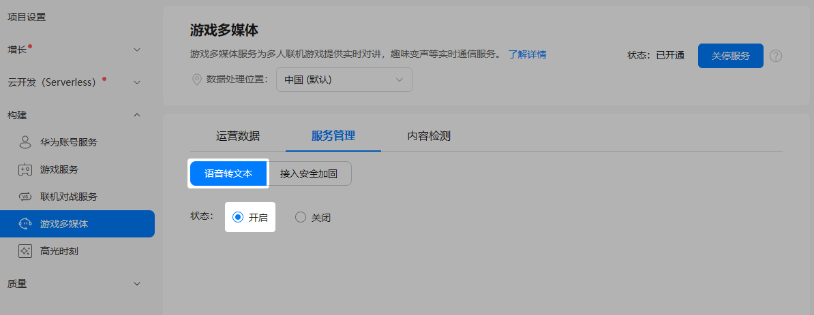
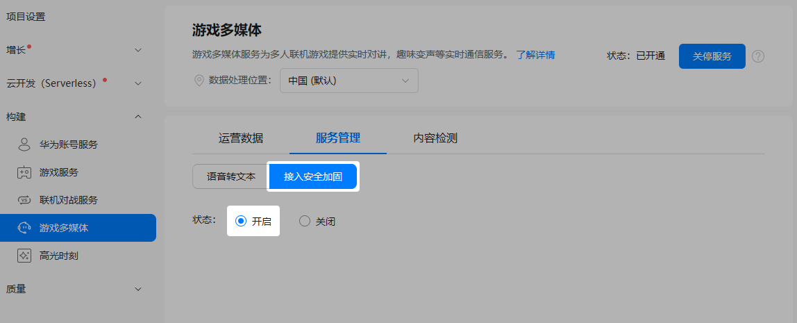
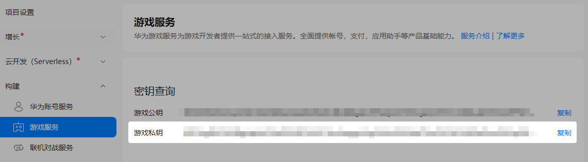
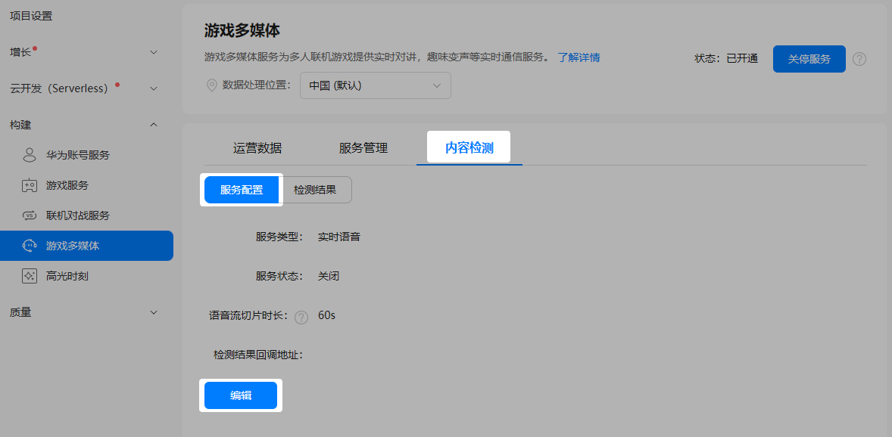
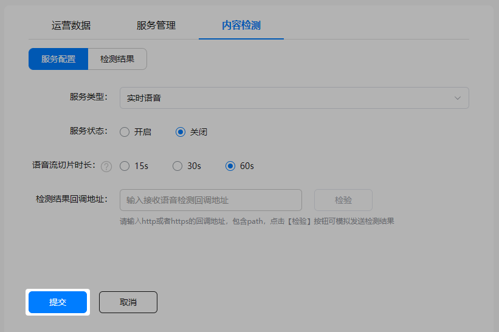

在游戏多媒体服务管理页面，游戏多媒体服务可以灵活控制[语音转文本](#section157881245131518)、[安全加固](#section92517364165)以及[内容检测](#section17288256144510)功能的开启或关闭。

## 开启语音转文本

语音转文本功能可将语音内容快速识别并转录成文本。

1. 登录[AppGallery Connect](https://developer.huawei.com/consumer/cn/service/josp/agc/index.html)，点击“开发与服务”。
2. 在项目列表中找到您的项目，并在项目下的应用列表中选择您的游戏应用。
3. 在左侧导航栏中选择“构建 &gt; 游戏多媒体”或点击左上角搜索“游戏多媒体”，进入游戏多媒体服务页面。
4. 选择“服务管理”页签，在“语音转文本”的“状态”栏选择“开启”。

   

   

   关闭语音转文本后，该功能将立即停止，可能导致您的应用异常，请谨慎操作。

## 开启安全加固

安全加固功能主要用于防止非法用户冒用合法的openId接入游戏多媒体服务，增强服务的安全性。在您的服务端，通过游戏ID、游戏密钥、玩家openId等信息计算出游戏签名，然后发送给游戏客户端。客户端在游戏多媒体SDK初始化时传入签名，并完成验签。如果您有自己的服务器，建议您开启安全加固功能，并[使用签名初始化SDK](https://developer.huawei.com/consumer/cn/doc/games-guides/games-initializing-signatures-harmonyos-0000002338768945)完成接入鉴权。

1. 选择“服务管理”页签，在“接入安全加固”的“状态”栏选择“开启”。

   

   

   关闭接入安全加固功能后，您的数据安全会存在潜在风险，请谨慎操作。
2. 记录下“游戏私钥”信息，用于后续签名计算。

   

## 开启内容检测

为了保障和谐健康的游戏环境，游戏多媒体服务提供了内容自动检测功能，对涉及广告、色情、辱骂等各类违规内容进行批量检测与精准识别。使用该功能前，您需先完成相关参数的配置以开启内容自动检测功能。

1. 选择“内容检测”页签，在子页签“服务配置”页面点击“编辑”。

   
2. 选择“服务类型”，设置“服务状态”及“语音流切片时长”，配置“检测结果回调地址”，点击“检测”模拟发送一个检测结果给已配置的回调地址用于校验。

   

   | 参数 | 说明 |
   | --- | --- |
   | 服务类型 | 内容检测的服务类型。  * 实时语音 |
   | 服务状态 | 当前服务类型下内容检测服务的状态，默认为“关闭”状态。  * 关闭 * 开启 说明：  当前，仅“实时语音”内容检测功能需要进行手动开启。 |
   | 语音流切片时长 | 切片时长越小则可以获得更快的检测反馈速度，但同时也会损失检测精度。  说明：  目前，语音流切片时长可设置为15s、30或60s（默认值），建议您根据使用需要进行设置。如果玩家某一次说话时长超过已配置的语音流切片时长，则会被截断。 |
   | 检测结果回调地址 | 主要用于接收语音检测结果，应为http/https网址格式的回调地址，且需包含path。  说明：  * http格式的回调地址采用明文传入，存在安全风险，建议您配置https格式的回调地址。 * 如地址校验未通过，显示已发出的回调信息响应异常，则您需要检查远端服务器工作是否正常。如未配置此地址，则无法接收语音检测结果。详细的请求报文格式以及示例请参见[语音审核结果回调](https://developer.huawei.com/consumer/cn/doc/games-references/gamemme-resultcallback-0000002392723713)。 |
3. 点击“提交”，完成内容自动检测配置。
