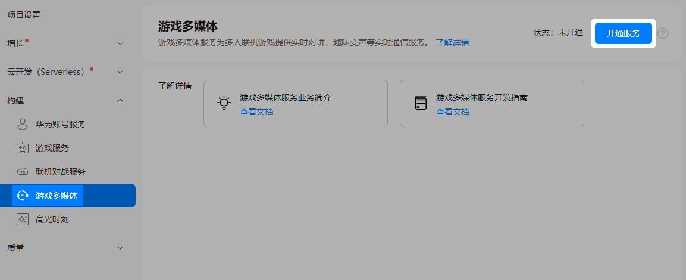

首次使用游戏多媒体服务前，需要先开通此服务。如果您已经开通，可跳过本步骤。

1. 登录[AppGallery Connect](https://developer.huawei.com/consumer/cn/service/josp/agc/index.html)，点击“开发与服务”。
2. 在项目列表中找到您的项目，并在项目下的应用列表中选择您的游戏应用。
3. 在左侧导航栏选择“构建 &gt; 游戏多媒体”或点击左上角搜索“游戏多媒体”，进入游戏多媒体服务页面。

   
4. 点击右上角“开通服务”，服务状态将更新为“已开通”。

   

   如服务开通后，点击“关停服务”，游戏多媒体服务将立即停止，正在语音中的玩家仍可在保活时间内（最长2小时）进行对话，请评估影响后谨慎操作。
