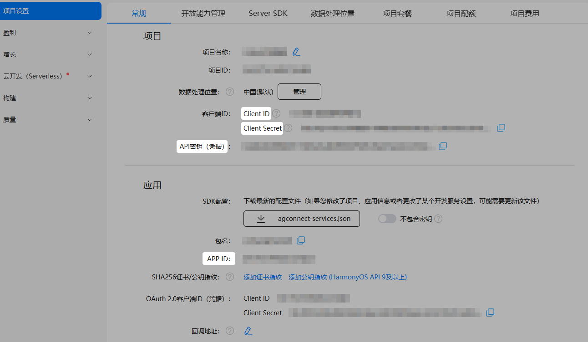

1. 在项目列表中选择您的项目，进入“项目设置”的“常规”页签。
2. 记录项目下的“Client ID”、“Client Secret”和“API密钥（凭据）”，以及应用下的“APP ID”信息。

   

   “Client ID”、“Client Secret”、“API密钥（凭据）”和“APP ID”信息主要用于SDK接入校验，具体请参见实例/对象管理。其中，“API密钥（凭据）”仅实现语音转文本功能时需要。

   

   | 参数 | 说明 |
   | --- | --- |
   | Client ID | 客户端ID，集成项目级SDK鉴权时的唯一标识。 |
   | Client Secret | 客户端密钥，集成项目级SDK鉴权时的密钥。 |
   | APP ID | 应用ID。 |
   | API密钥（凭据） | API密钥，用于访问机器学习服务，仅实现[语音转文本](/docs/dev/game-dev/games-gamemme-voicetotext-harmonyos-0000002338511705)功能时需要。 |
