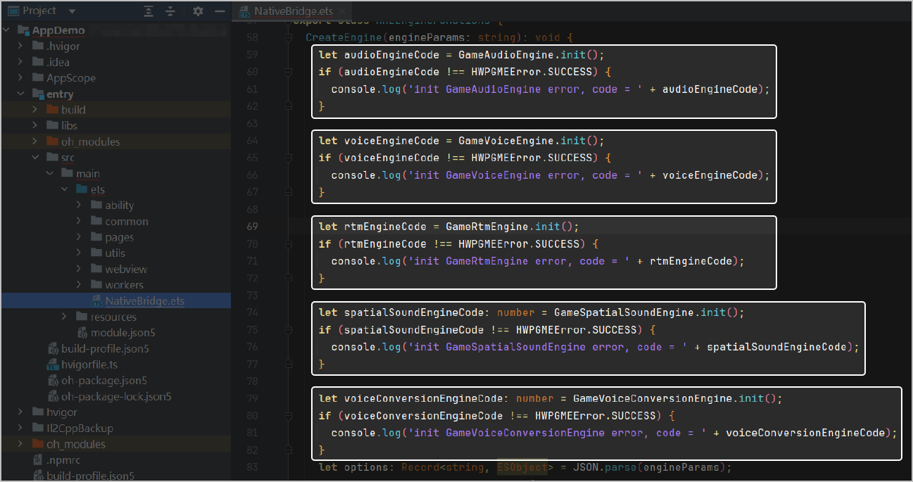

游戏多媒体C# SDK提供了实时语音、实时信令、语音消息、效果音播放和语音转文本功能，支持团结游戏引擎。

## 开发准备

团结引擎：推荐1.3.0版本（打包HarmonyOS包时使用）

## 集成步骤

### 集成C# SDK

1. 下载[游戏多媒体SDK](https://developer.huawei.com/consumer/cn/doc/AppGallery-connect-Library/gamemme-sdkdownload-csharp-0000001326343669)压缩包并进行解压，SDK包解压后有以下几个部分。

   | 目录名 | 说明 | 功能 |
   | --- | --- | --- |
   | Plugins | SDK库文件。 | 存放库文件。 |
   | GMMESDK | SDK接口代码文件。 | 提供API接口。 |
2. 将SDK中的GMMESDK整个文件夹复制到Unity工程的“**Assets &gt; Scripts**”文件夹中。

   

   在项目代码中通过引入SDK的命名空间，即可使用SDK内部接口。

### 集成OpenHarmony Plugins

如果您最终打HarmonyOS包，则需要依赖OpenHarmony Plugins。复制SDK中“Plugins &gt; OpenHarmony”文件夹下对应NativeBridge.ets文件到Unity工程的“**Assets &gt; Plugins &gt; OpenHarmony**”文件夹中。

可以根据所需功能选择性的进行初始化操作。

当您使用团结引擎完成功能开发并准备打HarmonyOS包时，您还需要进行相关配置才能打包成功，具体请参见[打包](/docs/dev/game-dev/games-export-csharp-native-0000002359547198)。
