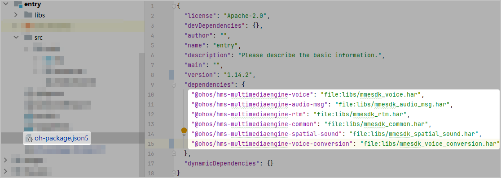
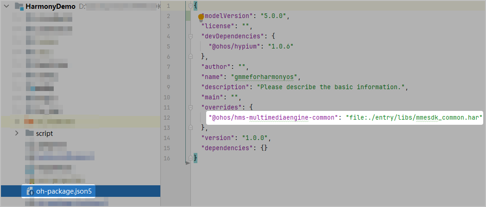
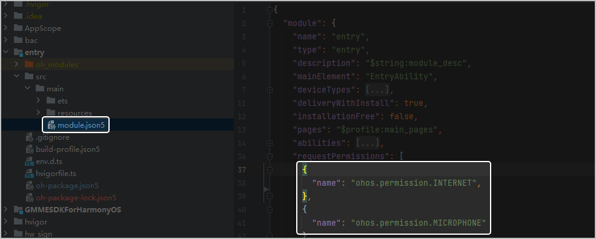

HarmonyOS 5.0及以上的游戏如需实现实时语音、实时信令、语音消息、效果音播放、语音转文本功能，可以集成游戏多媒体服务SDK。该SDK仅支持基于Stage应用模型进行应用开发，具体请参见[应用模型](/docs/dev/app-dev/application-framework/ability-kit/application-models#应用模型的构成要素)。

## 开发准备

* DevEco Studio：4.1.3.400及以上版本
* HarmonyOS SDK（API Version 12及以上）
* 测试设备：安装HarmonyOS 5.0及以上系统的手机
* OHPM客户端：1.4.0及以上版本

## 集成步骤

1. 下载[游戏多媒体SDK包](https://developer.huawei.com/consumer/cn/doc/AppGallery-connect-Library/gamemme-sdkdownload-harmonyos-0000001733710554)，并解压压缩包。
2. 在DevEco工程中的entry目录下新建一个文件夹，根据实现需要添加依赖包。

   | 依赖包 | 说明 |
   | --- | --- |
   | mmesdk\_common.har | 游戏多媒体服务基础SDK，必须集成。 |
   | mmesdk\_audio\_msg.har | 游戏多媒体服务语音消息模块，实现语音消息、语音变声功能时集成。 |
   | mmesdk\_voice.har | 游戏多媒体服务实时语音模块，实现实时语音、效果音播放、3D音效和语音变声功能时集成。 |
   | mmesdk\_rtm.har | 游戏多媒体服务实时信令模块，实现实时信令功能时集成。 |
   | mmesdk\_spatial\_sound.har | 游戏多媒体服务3D音效模块，实现3D音效功能时集成。  注意：  实现3D音效功能时还需集成[游戏多媒体服务实时语音模块](#ZH-CN_TOPIC_0000002382173737__zh-cn_topic_0000001717945166_p9472183931311)。 |
   | mmesdk\_voice\_conversion.har | 游戏多媒体服务语音变声模块，实现语音变声功能时集成。  注意：  实现语音变声功能时还需集成[游戏多媒体服务实时语音模块](#ZH-CN_TOPIC_0000002382173737__zh-cn_topic_0000001717945166_p9472183931311)**或**[游戏多媒体服务语音消息模块](#ZH-CN_TOPIC_0000002382173737__zh-cn_topic_0000001717945166_p1447123912134)。 |
3. 在Module的**oh-package.json5**中引用游戏多媒体SDK包。

   

   ```
   "dependencies": {
       "@ohos/hms-multimediaengine-common": "file:libs/mmesdk_common.har", // mmesdk_common.har：游戏多媒体服务基础SDK，必须集成
       "@ohos/hms-multimediaengine-voice": "file:libs/mmesdk_voice.har", // mmesdk_voice.har：游戏多媒体服务实时语音模块，实现实时语音、效果音播放、3D音效和语音变声功能时集成（可选）
       "@ohos/hms-multimediaengine-audio-msg": "file:libs/mmesdk_audio_msg.har", // mmesdk_audio_msg.har：游戏多媒体服务语音消息模块，实现语音消息、语音变声功能时集成（可选）
       "@ohos/hms-multimediaengine-rtm": "file:libs/mmesdk_rtm.har", // mmesdk_rtm.har：游戏多媒体服务实时信令模块，实现实时信令功能时集成（可选）
       "@ohos/hms-multimediaengine-spatial-sound": "file:../mmesdk_spatial_sound.har", // mmesdk_spatial_sound.har: 游戏多媒体服务3D音效模块，实现3D音效功能时集成（可选）
       "@ohos/hms-multimediaengine-voice-conversion": "file:../mmesdk_voice_conversion.har", // mmesdk_voice_conversion.har: 游戏多媒体服务语音变声模块，实现语音变声功能时集成（可选）
   }
   ```
4. 在项目工程根目录下的**oh-package.json5**文件中添加overrides配置，强制指定游戏多媒体服务基础SDK依赖。

   

   ```
   // 强制指定游戏多媒体服务基础SDK依赖
   "overrides": {
       "@ohos/hms-multimediaengine-common": "file:./entry/libs/mmesdk_common.har"
     },
   ```

## 添加权限

在实现游戏多媒体SDK语音消息功能前，您还需要在module.json5文件中申请如下权限。



```
"requestPermissions": [
  {
    "name": "ohos.permission.INTERNET"
  },
  {
     "name": "ohos.permission.MICROPHONE"
  }
]
```
