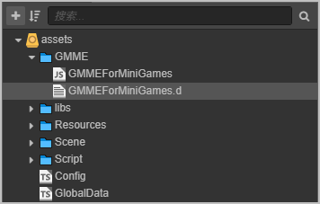
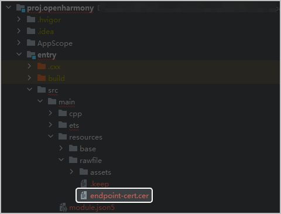

游戏多媒体JS SDK提供了实时信令、语音消息和语音转文本功能，支持Cocos Creator、Laya等主流游戏引擎。

## 开发准备

选择一款开发引擎，本文档以Cocos Creator为例：

| 功能 | 支持平台 | Cocos Creator版本 |
| --- | --- | --- |
| 实时信令 | 全平台 | Cocos Creator必须为**2.4.12版本**或者**3.8.0及以上版本** |
| 语音消息 | 华为快游戏、微信小游戏、支付宝小游戏和字节跳动小游戏 |
| 语音转文本 | 华为快游戏、微信小游戏、支付宝小游戏和字节跳动小游戏 |

## 集成步骤

以Cocos Creator工程为例：

1. 下载[SDK压缩包](https://developer.huawei.com/consumer/cn/doc/AppGallery-connect-Library/gamemme-sdkdownload-quickgame-0000001613694434)到本地，建议单独创建目录用于存放SDK脚本。
2. 打开您的Cocos工程，将SDK压缩包解压并拷贝到项目的assets目录下（如示例中的GMME目录）。

   
3. 在项目中使用import引入GameMediaEngine。

   ```
   import {GameMediaEngine} from "../../GMME/GMMEForMiniGames";
   ```
4. 若使用Cocos Creator引擎发布游戏需要适配HarmonyOS 5.0及以上版本的设备时，则在打包环节应注意：
   * 先导出HarmonyOS 5.0及以上工程，并用DevEco Studio打开。
   * 从SDK包体中取出**endpoint-cert.cert**证书，放到HarmonyOS 5.0及以上工程目录（**entry &gt; src &gt; main &gt; resources &gt; rawfile**）下。

     
