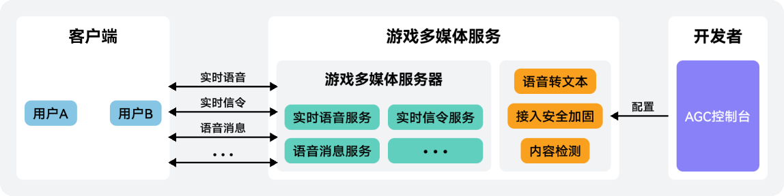

|  |  |
| --- | --- |
| 游戏多媒体服务是华为游戏中心推出的一款快速实现游戏内实时语音、实时信令（Real-time Messaging，即RTM）、语音消息等功能的服务。您只需要集成游戏多媒体服务SDK，即可为您的游戏提供实时语音对讲、全局聊天、语音/文本消息、语音转文本等能力，降低开发难度，提升玩家的游戏体验。 |  |

## 主要功能

| 主要功能 | 功能描述 | SDK类型 |
| --- | --- | --- |
| [实时语音](/docs/dev/game-dev/games-gamemme-voice-0000002338511701) | 支持实时语音通话，提供房间及语音管理等相关能力。 | HarmonyOS 5.0及以上丨C#（Native） |
| 支持范围语音，可与一定距离内的玩家进行实时语音通话。 | HarmonyOS 5.0及以上丨C#（Native） |
| 支持3D音效，可针对声音进行方位和距离衰减的效果渲染。 | HarmonyOS 5.0及以上丨C#（Native） |
| 支持语音变声，可对实时语音进行变声处理。 | HarmonyOS 5.0及以上丨C#（Native） |
| [RTM](/docs/dev/game-dev/games-gamemme-rtm-0000002338391909) | 支持文本消息和二进制消息收发传递，可用于实现实时通信、全局聊天、游戏通知、指令同步等功能。 | HarmonyOS 5.0及以上丨C#（Native）丨C#（小游戏）丨REST API |
| [语音消息](/docs/dev/game-dev/games-gamemme-audio-msg-0000002359706922) | 支持语音消息的录制与播放。 | HarmonyOS 5.0及以上丨JS（小游戏）丨C#（Native）丨C#（小游戏） |
| 支持录制与播放带有变声效果的语音消息。 | HarmonyOS 5.0及以上丨C#（Native） |
| [效果音播放](/docs/dev/game-dev/games-gamemme-local-audio-clip-0000002359547026) | 支持效果音播放，可用于实现简短音效的播放与音量系数管理等能力。 | HarmonyOS 5.0及以上丨C#（Native） |
| [语音转文本](/docs/dev/game-dev/games-gamemme-voicetotext-0000002359706930) | 支持语音转录成文本，可用于语音输入等使用场景。 | HarmonyOS 5.0及以上丨JS（小游戏） | C#（Native） | C#（小游戏） |
| [内容送检](/docs/dev/game-dev/games-gamemme-riskcontrol-inspection-analysis-0000002338391913) | 提供了内容检测能力，同时支持人工复审，以保证内容风控的准确性。 | HarmonyOS 5.0及以上丨JS（小游戏）丨C#（Native）丨C#（小游戏） |

## 工作原理

游戏客户端通过游戏多媒体服务SDK，将语音信息输入到华为游戏多媒体服务器，服务器接收并处理，然后将语音数据输出给房间内的所有客户端。同时，游戏多媒体服务SDK还提供实时信令、语音消息功能，用于不同客户端之间的文本和语音消息会话。您只需要将游戏多媒体服务SDK集成到您的游戏中，并通过简单的功能开发，即可为您的游戏快速构建实时语音、语音消息、文本消息等能力。

## 实现流程

| 序号 | 步骤 | 详情 |
| --- | --- | --- |
| 1 | 开通服务 | 首次使用游戏多媒体服务时，您需要在AGC控制台上[开通服务](/docs/dev/game-dev/games-gamemme-enable-0000002338511697)。 |
| 2 | 配置服务（可选） | 如需使用[语音转文本](/docs/dev/game-dev/games-gamemme-console-servicemanagement-0000002338391901#section157881245131518)、[安全加固](/docs/dev/game-dev/games-gamemme-console-servicemanagement-0000002338391901#section92517364165)、[内容检测](/docs/dev/game-dev/games-gamemme-console-servicemanagement-0000002338391901#section17288256144510)等功能，您需要在AGC控制台上打开相关功能的开关，部分功能还需要进行参数配置。 |
| 3 | 集成SDK | 使用游戏多媒体服务相关功能，必须集成游戏多媒体SDK，具体请参见[HarmonyOS 5.0及以上](/docs/dev/game-dev/games-gamemme-integratingsdk-harmonyos-0000002304632332)丨[JS（小游戏）](/docs/dev/game-dev/games-gamemme-integratingsdk-minigame-0000002393266905)丨[C#（Native）](/docs/dev/game-dev/games-gamemme-integratingsdk-csharp-native-0000002393227057)丨[C#（小游戏）](/docs/dev/game-dev/games-gamemme-integratingsdk-csharp-minigame-0000002359706946)。 |
| 4 | 功能开发 | 调用游戏多媒体服务SDK的API，开发实时语音、实时信令（RTM）、语音消息等相关功能。 |

## 接入流程与耗时

| 接入操作 | 详情 | 预估耗时（分钟） |
| --- | --- | --- |
| 使用入门 | 创建项目和添加应用 | 5~10 |
| 开通游戏多媒体服务 | 1 |
| 开启语音转文本（可选功能） | 1 |
| 开启安全加固（可选功能） | 1 |
| 开启内容检测（可选功能） | 2 |
| 集成SDK | 集成游戏多媒体SDK | 5~10 |
| 初始化SDK | 方式一：不使用签名初始化SDK | 15~30 |
| 方式二：使用签名初始化SDK | 45~60 |
| 功能开发 | 实时语音 | 60~80 |
| 实时信令（RTM） | 45~60 |
| 语音消息 | 45~60 |
| 效果音播放 | 15~20 |
| 语音转文本 | 15~20 |
| 内容送检 | 15~30 |

## 相关概念

| 名称 | 说明 |
| --- | --- |
| 房间 | “房间”指的是一个音频空间。游戏多媒体服务使用“房间”这个虚拟的概念，便于玩家之间的相互交流，同一房间内的玩家可以互相发送/接收对方的实时音频数据。 |
| 范围语音 | “范围语音”指在一个范围语音房间内，玩家通过设置语音接收范围和不断上报更新自身和其他玩家位置信息，与一定距离内的其他玩家进行实时语音通话。 |
| 3D音效 | 3D音效可将一定空间范围内无方位感的声音进行方位和距离衰减的效果渲染，使之听起来更有沉浸感。 |
| 频道 | “频道”指的是一个信令通道，主要用于玩家之间的实时消息通讯，订阅频道后就能收到相关频道的消息和用户事件。 |
