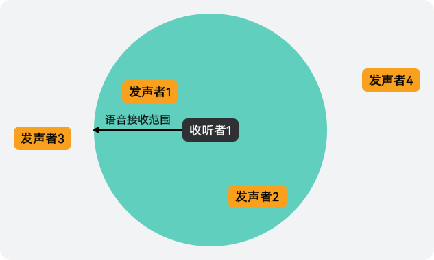

“范围语音”指在一个范围语音房间内，玩家通过设置语音接收范围和不断上报更新自身和其他玩家位置信息，与一定距离内的其他玩家进行实时语音通话。为了保证范围语音房间内语音清晰，玩家最多只能听到离自己最近的14个其他玩家的声音。




在语音接收范围内，声音可达，超出则无法接收到。

## 前提条件

* 您已[集成游戏多媒体基础SDK和实时语音模块](/docs/dev/game-dev/games-gamemme-integratingsdk-harmonyos-0000002304632332#ZH-CN_TOPIC_0000002382173737__zh-cn_topic_0000001717945166_li16904125719267)。
* 您已[创建游戏多媒体实例](/docs/dev/game-dev/games-gamemme-engine-harmonyos-0000002304472616#section1093713161034)。

## 加入范围语音房间

实现范围语音前，需先加入范围语音房间，具体请参见[加入房间](/docs/dev/game-dev/games-gamemme-voice-joinroom-roomid-harmonyos-0000002393661673#section4450837143111)。

## 设置语音接收范围

语音接收范围主要用于限制房间内收听者对音频的最大接收距离（空间距离），根据收听者与发声者的位置信息，收听者可收听到一定范围内的声音。

调用[GameMediaEngine.setAudioRecvRange](https://developer.huawei.com/consumer/cn/doc/games-references/gamemme-gamemediaengine-harmonyos-0000002392643485#section35878131182)方法设置语音接收范围。

```
gameMediaEngine.setAudioRecvRange(range); // range为语音接收范围, 大于等于0
```

## 更新/清理位置

进入房间后，在范围语音场景下，玩家通常需要先更新一下自身在世界坐标系中的坐标和朝向信息。当自身或其他玩家位置等信息不断发生变化时，可通过接口持续上报变更。同时，还可以根据场景变化，清理指定或全部玩家的位置缓存信息。

### 更新自身位置

1. 构建自身位置信息。

   ```
   let forward: number = 11.0;
   let right: number = 12.0;
   let up: number = 13.0;
   let playerPosition: PlayerPosition = {
     forward: forward,
     right: right,
     up: up
   };
   let axisForward: number[] = [0, 1.0, 0];
   let axisRight: number[] = [1.0, 0, 0];
   let axisUp: number[] = [0, 0, 1.0];
   let playerAxis: PlayerAxis = {
     forward: axisForward,
     right: axisRight,
     up: axisUp
   }

   let selfPosition: SelfPosition = {
     position: playerPosition,
     axis: playerAxis
   }
   ```
2. 调用[GameMediaEngine.updateSelfPosition](https://developer.huawei.com/consumer/cn/doc/games-references/gamemme-gamemediaengine-harmonyos-0000002392643485#section11572124810519)方法设置自身的位置（即坐标和方向）信息。

   ```
   gameMediaEngine.updateSelfPosition(selfPosition);
   ```

### 更新其他玩家位置

1. 构建其他玩家位置信息。

   ```
   let positions: RemotePlayerPosition[] = [];
   let remotePlayer1Position: PlayerPosition = {
     forward: 10.0,
     right: 11.1,
     up: 12.2
   };
   let remotePlayer1: RemotePlayerPosition = {
     openId: 'user1',
     position: remotePlayer1Position
   }
   positions.push(remotePlayer1);

   let remotePlayer2Position: PlayerPosition = {
     forward: 15.0,
     right: 16.1,
     up: 18.2
   };
   let remotePlayer2: RemotePlayerPosition = {
     openId: 'user2',
     position: remotePlayer2Position
   }
   positions.push(remotePlayer2);
   ```
2. 调用[GameMediaEngine.updateRemotePosition](https://developer.huawei.com/consumer/cn/doc/games-references/gamemme-gamemediaengine-harmonyos-0000002392643485#section3976836369)方法更新其他玩家的位置信息。

   ```
   gameMediaEngine.updateRemotePosition(positions);
   ```

### 清理玩家位置信息

* 调用[GameMediaEngine.clearRemotePlayerPosition](https://developer.huawei.com/consumer/cn/doc/games-references/gamemme-gamemediaengine-harmonyos-0000002392643485#section185619282094)方法可清理指定玩家的位置信息。例如，清理已离开房间的其他玩家位置缓存信息。

  ```
  gameMediaEngine.clearRemotePlayerPosition(openId);
  ```
* 调用[GameMediaEngine.clearAllRemotePositions](https://developer.huawei.com/consumer/cn/doc/games-references/gamemme-gamemediaengine-harmonyos-0000002392643485#section859216551087)方法可清理其他所有玩家的位置信息。例如，当重新开始一局游戏时，清理其他所有人的位置缓存信息。

  ```
  gameMediaEngine.clearAllRemotePositions();
  ```
