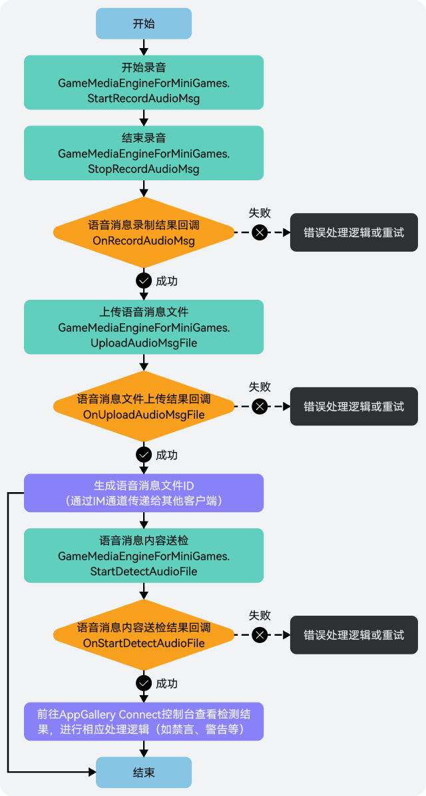
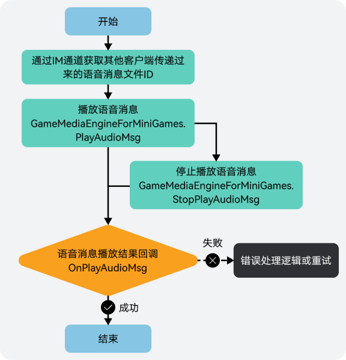

## 前提条件

* 您已[集成游戏多媒体SDK](/docs/dev/game-dev/games-gamemme-integratingsdk-csharp-minigame-0000002359706946)。
* 您已[创建游戏多媒体实例](/docs/dev/game-dev/games-gamemme-engine-csharp-minigame-0000002359706954#section10640141401010)。

## 录制语音消息



1. 调用[GameMediaEngineForMiniGames.StartRecordAudioMsg](https://developer.huawei.com/consumer/cn/doc/games-references/gamemediaengineforminigames-csharp-minigame-0000002358963772#section18293153123)方法开始录制语音信息。

   ```
   engine.StartRecordAudioMsg();
   ```
2. 在语音消息录制过程中，如需结束录制，可通过调用[GameMediaEngineForMiniGames.StopRecordAudioMsg](https://developer.huawei.com/consumer/cn/doc/games-references/gamemediaengineforminigames-csharp-minigame-0000002358963772#section35015551314)方法停止录制。

   

   录制语音消息的最大时长为50s，超过将自动结束录音。

   ```
   engine.StopRecordAudioMsg();
   ```
3. 语音消息录制停止或自动结束时，您可进行相关回调处理。由于游戏多媒体SDK已对回调函数[OnRecordAudioMsg](https://developer.huawei.com/consumer/cn/doc/games-references/igamemmeeventhandlerforminigames-csharp-minigame-0000002392643789#section117424200518)进行了封装，您只需注册OnRecordAudioMsgCompleteEvent事件监听，并实现RecordAudioMsgCompleteCallback委托函数即可。

   

   为了保证语音消息录制效果，建议您此处增加一个判断，即当语音消息时长小于1秒时，提示不发送语音消息。

   ```
   // 对语音消息录制停止或自动结束事件进行监听
   callBackHandler.OnRecordAudioMsgCompleteEvent += OnRecordAudioMsgCallback;

   // 监听处理
   private void OnRecordAudioMsgCallback(string filePath, int code, string msg, int duration, int size)
   {
       // 根据返回结果做相应业务逻辑处理
   }
   ```
4. 当语音消息录制成功后，可通过调用[GameMediaEngineForMiniGames.UploadAudioMsgFile](https://developer.huawei.com/consumer/cn/doc/games-references/gamemediaengineforminigames-csharp-minigame-0000002358963772#section1666356111311)方法将语音消息文件上传到游戏多媒体服务器。

   

   上传的语音消息文件大小最大支持50MB，在游戏多媒体服务器上将会保留7天。

   ```
   engine.UploadAudioMsgFile(filePath, msTimeOut);// filePath:语音文件的待上传路径; msTimeOut:超时时间, 单位：ms, 取值范围[3000, 7000]
   ```
5. 语音消息文件上传时，您可进行相关回调处理。由于游戏多媒体SDK已对回调函数[OnUploadAudioMsgFile](https://developer.huawei.com/consumer/cn/doc/games-references/igamemmeeventhandlerforminigames-csharp-minigame-0000002392643789#section17164622185117)进行了封装，您只需注册OnUploadAudioMsgFileCompleteEvent事件监听，并实现UploadAudioMsgFileCompleteCallback委托函数即可。

   ```
   // 对上传语音消息文件事件进行监听
   callBackHandler.OnUploadAudioMsgFileCompleteEvent += OnUploadAudioMsgFileCallback;

   // 监听处理
   private void OnUploadAudioMsgFileCallback(string filePath, string fileId, int code, string msg)
   {
       // 根据返回结果做相应业务逻辑处理
   }
   ```
6. （可选）当语音消息文件上传成功后，如需对文件进行风控检测，可通过调用[GameMediaEngineForMiniGames.StartDetectAudioFile](https://developer.huawei.com/consumer/cn/doc/games-references/gamemediaengineforminigames-csharp-minigame-0000002358963772#section914238412)方法进行送检。

   ```
   engine.StartDetectAudioFile(string fileId); // fileId: 文件ID
   ```
7. 语音消息文件风控送检时，您可以进行相关回调处理。由于游戏多媒体SDK已对回调函数[OnStartDetectAudioFile](https://developer.huawei.com/consumer/cn/doc/games-references/igamemmeeventhandlerforminigames-csharp-minigame-0000002392643789#section10120185817411)进行了封装，您只需注册OnStartDetectAudioFileCompleteEvent事件监听，并实现OnStartDetectAudioFileCompleteCallback委托函数即可。

   ```
   // 对上传语音消息文件进行风控监听
   callBackHandler.OnStartDetectAudioFileCompleteEvent += OnStartDetectAudioFileCompleteCallback;
   // 监听处理
   private void OnStartDetectAudioFileCompleteCallback(string fileId, int code, string msg)
   {
       // 根据返回结果做相应业务逻辑处理
   ```

## 发送语音消息

语音消息文件上传完成后，会生成一个语音消息文件ID，可通过IM通道发送文件ID给其他玩家来发送语音消息。游戏多媒体SDK的实时信令功能提供了消息发送通道，语音消息也可以通过该通道完成文件ID传递，具体实现请参见[实时信令](/docs/dev/game-dev/games-gamemme-rtm-overview-0000002338719289)。

## 播放语音消息



1. 可通过调用[GameMediaEngineForMiniGames.PlayAudioMsg](https://developer.huawei.com/consumer/cn/doc/games-references/gamemediaengineforminigames-csharp-minigame-0000002358963772#section9331558101320)方法播放该文件中的语音消息内容。

   ```
   engine.PlayAudioMsg(filePath);// filePath:播放语音的文件路径
   ```
2. 如需停止播放语音消息，可通过调用[GameMediaEngineForMiniGames.StopPlayAudioMsg](https://developer.huawei.com/consumer/cn/doc/games-references/gamemediaengineforminigames-csharp-minigame-0000002358963772#section11212659141311)方法结束播放。

   ```
   engine.StopPlayAudioMsg();
   ```
3. 播放/停止播放语音消息时，您可进行相关回调处理。由于游戏多媒体SDK已对回调函数[OnPlayAudioMsg](https://developer.huawei.com/consumer/cn/doc/games-references/igamemmeeventhandlerforminigames-csharp-minigame-0000002392643789#section12566624125110)进行了封装，您只需注册OnPlayAudioMsgCompleteEvent事件监听，并实现PlayAudioMsgCompleteCallback委托函数即可。

   ```
   // 对播放/停止播放语音消息事件进行监听
   callBackHandler.OnPlayAudioMsgCompleteEvent += OnPlayAudioMsgCompleteCallback

   // 监听处理
   private void OnPlayAudioMsgCompleteCallback(string filePath, int code, string msg)
   {
       // 根据返回结果做相应业务逻辑处理
   }
   ```
