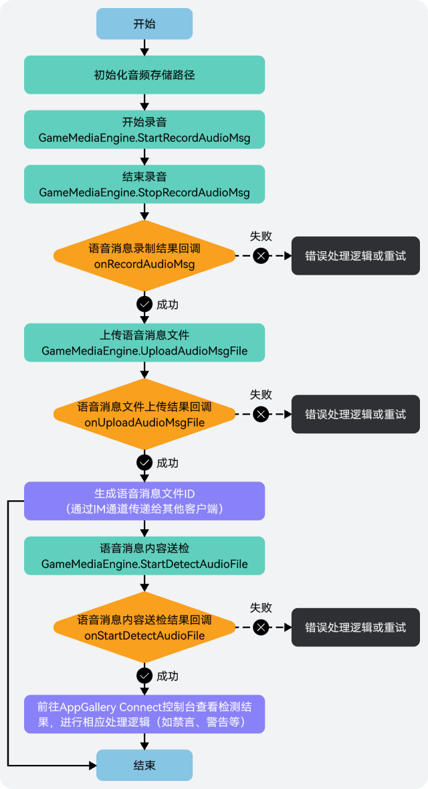
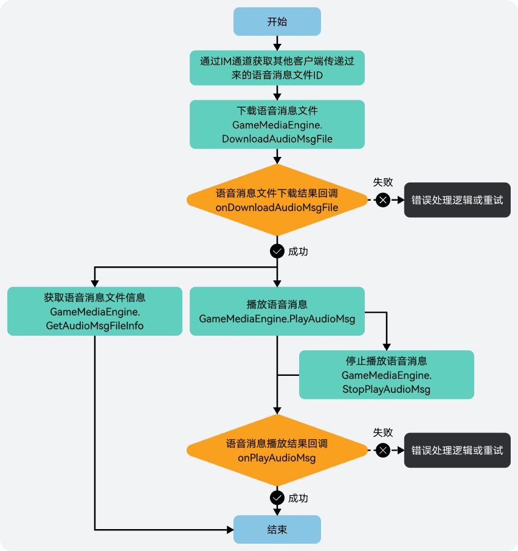

语音消息文件会占用一部分本地存储空间，建议您销毁实例时，删除本地存储的语音文件以释放存储空间。

## 前提条件

* 您已[集成游戏多媒体基础SDK和语音消息模块](/docs/dev/game-dev/games-gamemme-integratingsdk-csharp-native-0000002393227057)。
* 您已[创建游戏多媒体实例](/docs/dev/game-dev/games-gamemme-engine-csharp-native-0000002393227065#section10640141401010)。

## 录制语音消息



1. 当玩家录制语音消息时，需先初始化音频存储路径。

   

   文件路径自行指定，音频文件仅支持.m4a格式。

   ```
   filePath = Application.temporaryCachePath + "path"+ name.m4a;
   ```
2. 音频存储路径初始化完成后，开始录制语音消息。
   * 不带变声效果： 可调用[GameMediaEngine.StartRecordAudioMsg(filePath)](https://developer.huawei.com/consumer/cn/doc/games-references/gamemme-gamemediaengine-csharp-native-0000002392723521#section18293153123)方法开始录制语音信息。

     ```
     gameMediaEngine.StartRecordAudioMsg(filePath); // filePath:录制的音频文件本地保存地址
     ```
   * 带变声效果：可调用[GameMediaEngine.StartRecordAudioMsg(filePath, voiceType)](https://developer.huawei.com/consumer/cn/doc/games-references/gamemme-gamemediaengine-csharp-native-0000002392723521#section2249359185110)方法开始录制语音消息。

     

     如实时语音开启了变声特性，则语音消息不支持变声。

     ```
     gameMediaEngine.StartRecordAudioMsg(filePath, voiceType); // filePath:录制的音频文件本地保存地址; voiceType:变声类型,原声类型表示关闭变声,其他枚举值请参见API参考文档
     ```
3. 在语音消息录制过程中，如需结束录制，可通过调用[GameMediaEngine.StopRecordAudioMsg](https://developer.huawei.com/consumer/cn/doc/games-references/gamemme-gamemediaengine-csharp-native-0000002392723521#section35015551314)方法停止录制。

   

   录制语音消息的最大时长为50s，超过将自动结束录音。

   ```
   gameMediaEngine.StopRecordAudioMsg();
   ```
4. 语音消息录制停止或自动结束时，您可进行相关回调处理。由于游戏多媒体SDK已对回调函数[onRecordAudioMsg](https://developer.huawei.com/consumer/cn/doc/games-references/gamemme-igamemmeeventhandler-csharp-native-0000002358963656#section117424200518)进行了封装，您只需注册OnRecordAudioMsgCompleteEvent事件监听，并实现RecordAudioMsgCompleteCallback委托函数即可。

   

   为了保证语音消息录制效果，建议您此处增加一个判断，即当语音消息时长小于1秒时，提示不发送语音消息。

   ```
   // 对语音消息录制停止或自动结束事件进行监听
   callBackHandler.OnRecordAudioMsgCompleteEvent += OnRecordAudioMsgCallback;

   // 监听处理
   private void OnRecordAudioMsgCallback(string fileName, int code, string msg)
   {
       // 根据返回结果做相应业务逻辑处理
   }
   ```
5. 当语音消息录制成功后，可通过调用[GameMediaEngine.UploadAudioMsgFile](https://developer.huawei.com/consumer/cn/doc/games-references/gamemme-gamemediaengine-csharp-native-0000002392723521#section1666356111311)方法将语音消息文件上传到游戏多媒体服务器。

   

   上传的语音消息文件大小最大支持50MB，在游戏多媒体服务器上将会保留7天。

   ```
   gameMediaEngine.UploadAudioMsgFile(filePath, msTimeOut);// filePath:语音文件的待上传路径; msTimeOut:超时时间, 单位：ms, 取值范围[3000, 7000]
   ```
6. 语音消息文件上传时，您可进行相关回调处理。由于游戏多媒体SDK已对回调函数[onUploadAudioMsgFile](https://developer.huawei.com/consumer/cn/doc/games-references/gamemme-igamemmeeventhandler-csharp-native-0000002358963656#section17164622185117)进行了封装，您只需注册OnUploadAudioMsgFileCompleteEvent事件监听，并实现UploadAudioMsgFileCompleteCallback委托函数即可。

   ```
   // 对上传语音消息文件事件进行监听
   callBackHandler.OnUploadAudioMsgFileCompleteEvent += OnUploadAudioMsgFileCallback;

   // 监听处理
   private void OnUploadAudioMsgFileCallback(string filePath, string fileId, int code, string msg)
   {
       // 根据返回结果做相应业务逻辑处理
   }
   ```
7. （可选）当语音消息文件上传成功后，如需对文件进行风控检测，可通过调用[GameMediaEngine.StartDetectAudioFile](https://developer.huawei.com/consumer/cn/doc/games-references/gamemme-gamemediaengine-csharp-native-0000002392723521#section15934221444)方法进行送检。

   ```
   gameMediaEngine.StartDetectAudioFile(string fileId); // fileId: 文件ID
   ```
8. 语音消息文件风控送检时，您可以进行相关回调处理。由于游戏多媒体SDK已对回调函数[onStartDetectAudioFile](https://developer.huawei.com/consumer/cn/doc/games-references/gamemme-igamemmeeventhandler-csharp-native-0000002358963656#section8901620145810)进行了封装，您只需注册OnStartDetectAudioFileCompleteEvent事件监听，并实现OnStartDetectAudioFileCompleteCallback委托函数即可。

   ```
   // 对上传语音消息文件进行风控监听
   callBackHandler.OnStartDetectAudioFileCompleteEvent += OnStartDetectAudioFileCompleteCallback;

   // 监听处理
   private void OnStartDetectAudioFileCompleteCallback(string fileId, int code, string msg)
   {
       // 根据返回结果做相应业务逻辑处理
   }
   ```

## 发送语音消息

语音消息文件上传完成后，会生成一个语音消息文件ID，可通过IM通道发送文件ID给其他玩家来发送语音消息。游戏多媒体SDK的实时信令功能提供了消息发送通道，语音消息也可以通过该通道完成文件ID传递，具体实现请参见[实时信令](/docs/dev/game-dev/games-gamemme-rtm-overview-0000002338719289)。

## 播放语音消息



1. 当玩家通过IM通道获取到其他玩家传递过来的语音消息文件ID后，可通过调用[GameMediaEngine.DownloadAudioMsgFile](https://developer.huawei.com/consumer/cn/doc/games-references/gamemme-gamemediaengine-csharp-native-0000002392723521#section11348125741317)方法下载该文件。

   ```
   gameMediaEngine.DownloadAudioMsgFile(fileId, filePath, msTimeOut);// fileId:文件ID; filePath:文件的存储地址; msTimeOut:超时时间, 单位：ms, 取值范围[3000, 7000]
   ```
2. 下载语音消息文件时，您可进行相关回调处理。由于游戏多媒体SDK已对回调函数[onDownloadAudioMsgFile](https://developer.huawei.com/consumer/cn/doc/games-references/gamemme-igamemmeeventhandler-csharp-native-0000002358963656#section666142318513)进行了封装，您只需注册OnDownloadAudioMsgFileCompleteEvent事件监听，并实现DownloadAudioMsgFileCompleteCallback委托函数即可。

   ```
   // 对下载语音消息文件事件进行监听
   callBackHandler.OnDownloadAudioMsgFileCompleteEvent += OnDownloadAudioMsgFileCallback;

   // 监听处理
   private void OnDownloadAudioMsgFileCallback(string filePath, string fileId, int code, string msg)
   {
       // 根据返回结果做相应业务逻辑处理
   }
   ```
3. 当语音消息文件下载成功后，可通过调用[GameMediaEngine.PlayAudioMsg](https://developer.huawei.com/consumer/cn/doc/games-references/gamemme-gamemediaengine-csharp-native-0000002392723521#section9331558101320)方法播放该文件中的语音消息内容。

   ```
   gameMediaEngine.PlayAudioMsg(filePath);// filePath:播放语音的文件路径
   ```
4. 如需停止播放语音消息，可通过调用[GameMediaEngine.StopPlayAudioMsg](https://developer.huawei.com/consumer/cn/doc/games-references/gamemme-gamemediaengine-csharp-native-0000002392723521#section11212659141311)方法结束播放。

   ```
   gameMediaEngine.StopPlayAudioMsg();
   ```
5. 播放/停止播放语音消息时，您可进行相关回调处理。由于游戏多媒体SDK已对回调函数[onPlayAudioMsg](https://developer.huawei.com/consumer/cn/doc/games-references/gamemme-igamemmeeventhandler-csharp-native-0000002358963656#section12566624125110)进行了封装，您只需注册OnPlayAudioMsgCompleteEvent事件监听，并实现PlayAudioMsgCompleteCallback委托函数即可。

   ```
   // 对播放/停止播放语音消息事件进行监听
   callBackHandler.OnPlayAudioMsgCompleteEvent += OnPlayAudioMsgCompleteCallback

   // 监听处理
   private void OnPlayAudioMsgCompleteCallback(string filePath, int code, string msg)
   {
       // 根据返回结果做相应业务逻辑处理
   }
   ```
6. 当语音消息文件下载成功后，如需了解文件的时长和大小，可以通过调用[GameMediaEngine.GetAudioMsgFileInfo](https://developer.huawei.com/consumer/cn/doc/games-references/gamemme-gamemediaengine-csharp-native-0000002392723521#section19773145711145)方法获取文件信息。

   ```
   // filePath:获取音频文件信息的文件路径
   engine.GetAudioMsgFileInfo(filePath, new OpenHarmonyJSCallback(args => {
       OpenHarmonyJSObject data = args[0];
       string audioMsgFileInfo = data.Get<string>("data");
       // 处理业务逻辑
   }));
   ```
