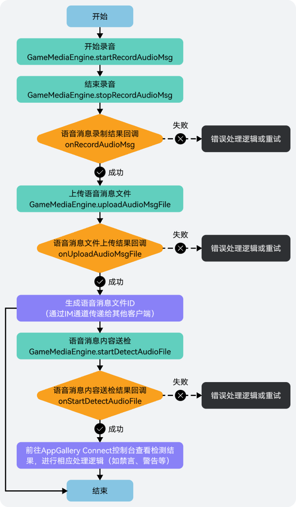
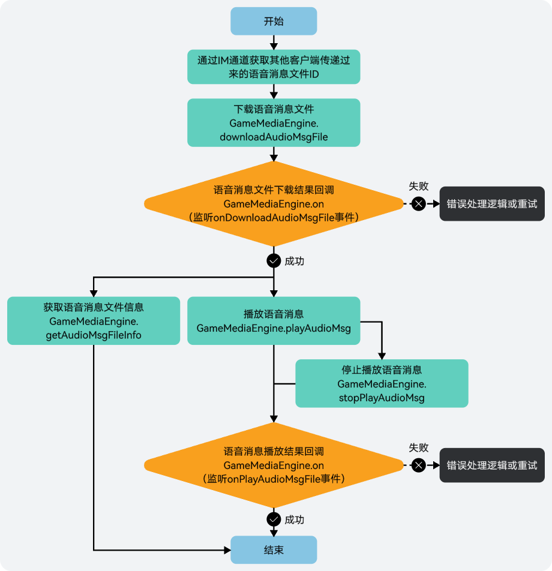

语音消息文件会占用一部分本地存储空间，建议您销毁实例时，删除本地存储的语音文件以释放存储空间。

## 前提条件

* 您已[集成游戏多媒体基础SDK和语音消息模块](https://developer.huawei.com/consumer/cn/doc/games-guides/games-gamemme-integratingsdk-harmonyos-0000002304632332#ZH-CN_TOPIC_0000002382173737__zh-cn_topic_0000001717945166_li16904125719267)。
* 您已[创建游戏多媒体实例](https://developer.huawei.com/consumer/cn/doc/games-guides/games-gamemme-engine-harmonyos-0000002304472616#section1093713161034)。

## 录制语音消息



1. 当玩家录制语音消息时，需先初始化音频存储路径。

   

   * 文件路径自行指定，音频文件仅支持.m4a格式。
   * context为UIAbilityContext，获取方式请参见[应用上下文Context](https://developer.huawei.com/consumer/cn/doc/harmonyos-guides/application-context-stage)。

   ```
   let filePath = context.cacheDir + "/xxx.m4a";
   ```
2. 音频存储路径初始化完成后，可调用[GameMediaEngine.startRecordAudioMsg](https://developer.huawei.com/consumer/cn/doc/games-references/gamemme-gamemediaengine-harmonyos-0000002392643485#section415117411091)方法开始录制语音消息。

   不带变声效果：调用GameMediaEngine.startRecordAudioMsg方法，将变声类型voiceType设置为空，并开始录制语音消息。

   ```
   gameMediaEngine.startRecordAudioMsg(filePath); // filePath:录制的音频文件本地保存地址
   ```

   带变声效果：调用GameMediaEngine.startRecordAudioMsg方法，设置变声类型voiceType，并开始录制语音消息。

   ```
   gameMediaEngine.startRecordAudioMsg(filePath, voiceType); // filePath:录制的音频文件本地保存地址;voiceType:变声类型,原声类型表示关闭变声,其他枚举值请参考VoiceType
   ```
3. 在语音消息录制过程中，如需结束录制，可通过调用[GameMediaEngine.stopRecordAudioMsg](https://developer.huawei.com/consumer/cn/doc/games-references/gamemme-gamemediaengine-harmonyos-0000002392643485#section17819104310917)方法停止录制。

   

   录制语音消息的最大时长为50s，超过将自动结束录音。

   ```
   gameMediaEngine.stopRecordAudioMsg();
   ```
4. 语音消息录制停止或自动结束时，可在EventHandler接口的[onRecordAudioMsg](https://developer.huawei.com/consumer/cn/doc/games-references/gamemme-eventhandler-harmonyos-0000002392723353#section1556521463920)方法中实现相关回调处理。

   

   为了保证语音消息录制效果，建议您此处增加一个判断，即当语音消息时长小于1秒时，提示不发送语音消息。

   ```
   onRecordAudioMsg(filePath: string, code: number, msg: string) {
     console.log('onRecordAudioMsg : code=' + code + ', msg=' + msg + ', filePath' + filePath);
   }
   ```
5. 当语音消息录制成功后，可通过调用[GameMediaEngine.uploadAudioMsgFile](https://developer.huawei.com/consumer/cn/doc/games-references/gamemme-gamemediaengine-harmonyos-0000002392643485#section66813455911)方法将语音消息文件上传到游戏多媒体服务器。

   

   上传的语音消息文件大小最大支持50MB，在游戏多媒体服务器上将会保留7天。

   ```
   gameMediaEngine.uploadAudioMsgFile(filePath, msTimeOut);// filePath:音频文件的待上传路径; msTimeOut:超时时间, 单位：ms, 取值范围[3000, 7000]
   ```
6. 语音消息文件上传时，可在EventHandler接口的[onUploadAudioMsgFile](https://developer.huawei.com/consumer/cn/doc/games-references/gamemme-eventhandler-harmonyos-0000002392723353#section244313389817)方法中实现相关回调处理。

   ```
   onUploadAudioMsgFile(filePath: string, fileId: string, code: number, msg: string) {
     console.log('onUploadAudioMsgFile : code=' + code + ', msg=' + msg);
   }
   ```
7. （可选）当语音消息文件上传成功后，如需对文件进行风控检测，可调用[GameMediaEngine.startDetectAudioFile](https://developer.huawei.com/consumer/cn/doc/games-references/gamemme-gamemediaengine-harmonyos-0000002392643485#section96939502356)方法进行送检。

   ```
   gameMediaEngine.startDetectAudioFile(fileId); // fileId: 文件ID
   ```
8. 语音消息文件风控送检时，可在EventHandler接口的[onStartDetectAudioFile](https://developer.huawei.com/consumer/cn/doc/games-references/gamemme-eventhandler-harmonyos-0000002392723353#section1286293365418)方法中实现相关回调处理。

   ```
   onStartDetectAudioFile(fileId: string, code: number, msg: string) {
     console.log('onStartDetectAudioFile : code=' + code + ', msg=' + msg);
   }
   ```

## 发送语音消息

语音消息文件上传完成后，会生成一个语音消息文件ID，可通过IM通道发送文件ID给其他玩家来发送语音消息。游戏多媒体SDK的实时信令功能提供了消息发送通道，语音消息也可以通过该通道完成文件ID传递，具体实现请参见[实时信令](https://developer.huawei.com/consumer/cn/doc/games-guides/games-gamemme-rtm-harmonyos-0000002393227033)。

## 播放语音消息



1. 当玩家通过IM通道获取到其他玩家传递过来的语音消息文件ID后，可通过调用[GameMediaEngine.downloadAudioMsgFile](https://developer.huawei.com/consumer/cn/doc/games-references/gamemme-gamemediaengine-harmonyos-0000002392643485#section11348125741317)方法下载该文件。

   ```
   gameMediaEngine.downloadAudioMsgFile(fileId, filePath, msTimeOut);// fileId:文件ID; filePath:文件下载的存储地址，目录需要提前创建出来; msTimeOut:超时时间, 单位：ms, 取值范围[3000, 7000]
   ```
2. 下载语音消息文件时，可在EventHandler接口的[onDownloadAudioMsgFile](https://developer.huawei.com/consumer/cn/doc/games-references/gamemme-eventhandler-harmonyos-0000002392723353#section62836356396)方法中实现相关回调处理。

   ```
   onDownloadAudioMsgFile(filePath: string, fileId: string, code: number, msg: string) {
     console.log('onDownloadAudioMsgFile : code=' + code + ', msg=' + msg);
   }
   ```
3. 当语音消息文件下载成功后，可通过调用[GameMediaEngine.playAudioMsg](https://developer.huawei.com/consumer/cn/doc/games-references/gamemme-gamemediaengine-harmonyos-0000002392643485#section1972154910919)方法播放该文件中的语音消息内容。

   ```
   gameMediaEngine.playAudioMsg(filePath);// filePath:播放语音的文件路径
   ```
4. 如需停止播放语音消息，可通过调用[GameMediaEngine.stopPlayAudioMsg](https://developer.huawei.com/consumer/cn/doc/games-references/gamemme-gamemediaengine-harmonyos-0000002392643485#section1223514518912)方法结束播放。

   ```
   gameMediaEngine.stopPlayAudioMsg();
   ```
5. 播放/停止播放语音消息时，可在EventHandler接口的[onPlayAudioMsg](https://developer.huawei.com/consumer/cn/doc/games-references/gamemme-eventhandler-harmonyos-0000002392723353#section9172134211399)方法中实现相关回调处理。

   ```
   onPlayAudioMsg(filePath: string, code: number, msg: string) {
     console.log('onPlayAudioMsg : code=' + code + ', msg=' + msg);
   }
   ```
6. 当语音消息文件下载成功后，如需了解文件的时长和大小，您还可以通过调用[getAudioMsgFileInfo](https://developer.huawei.com/consumer/cn/doc/games-references/gamemme-gamemediaengine-harmonyos-0000002392643485#section1465081415)方法获取文件信息。

   ```
   gameMediaEngine.getAudioMsgFileInfo(filePath).then((fileInfo:AudioMsgFileInfo) => {  // filePath:获取音频文件信息的文件路径
   // 可根据需求将数据进行处理
   }).catch((err: HWPGMEException) => {
   // 获取语音消息信息异常
   });
   ```
