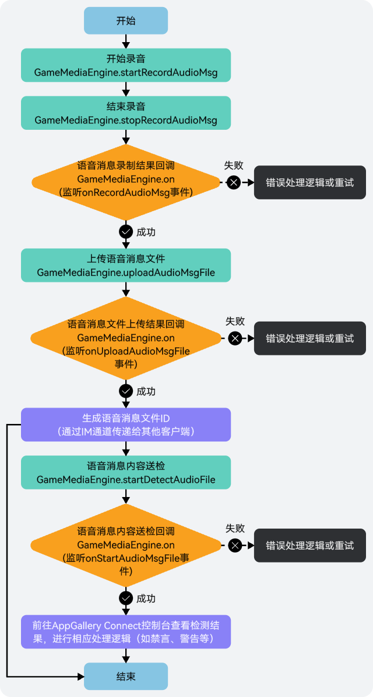
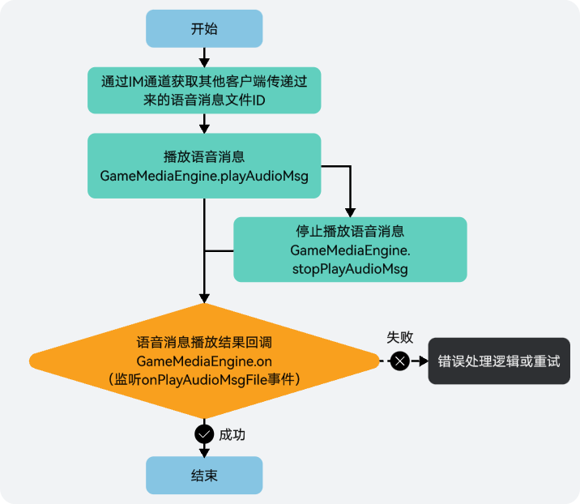

如需发布到华为快游戏、微信小游戏、支付宝小游戏和字节跳动小游戏平台，需要注意的是，不支持使用浏览器、模拟器等进行预览调试。

## 前提条件

* 您已[集成游戏多媒体SDK](https://developer.huawei.com/consumer/cn/doc/games-guides/games-gamemme-integratingsdk-minigame-0000002393266905)。
* 您已[创建游戏多媒体实例](https://developer.huawei.com/consumer/cn/doc/games-guides/games-gamemme-engine-minigame-0000002393266909)。

## 录制语音消息



1. 玩家可通过调用[GameMediaEngine.startRecordAudioMsg](https://developer.huawei.com/consumer/cn/doc/games-references/gamemme-gamemediaengine-minigame-0000002392643589#section415117411091)方法，开始录制语音消息。

   ```
   ...
   gameMediaEngine.startRecordAudioMsg();
   ```
2. 在语音消息录制过程中，如需结束录制，可通过调用[GameMediaEngine.stopRecordAudioMsg](https://developer.huawei.com/consumer/cn/doc/games-references/gamemme-gamemediaengine-minigame-0000002392643589#section17819104310917)方法停止录制。

   

   录制语音消息的最大时长为50s，超过将自动结束录音。

   ```
   ...
   gameMediaEngine.stopRecordAudioMsg();
   ```
3. 语音消息录制停止或自动结束时，可在[GameMediaEngine.on](https://developer.huawei.com/consumer/cn/doc/games-references/gamemme-gamemediaengine-minigame-0000002392643589#section1487511413163)接口中监听“[onRecordAudioMsg](https://developer.huawei.com/consumer/cn/doc/games-references/gamemme-eventname-minigame-0000002392723465#section1153116161013)”事件，并实现该事件的回调处理。

   

   为了保证语音消息录制效果，建议您此处增加一个判断，即当语音消息时长小于1秒时，提示不发送语音消息。

   ```
   GameMediaEngine.on("onRecordAudioMsg", (filePath: string, code: number, msg: string, duration: number, size: number) =>   this.onRecordAudioMsg(filePath, code, msg, duration, size));
   onRecordAudioMsg(filePath: string, code: number, msg: string, duration: number, size: number) {
      // 可根据需求将数据进行处理
   }
   ```
4. 当语音消息录制成功后，可通过调用[GameMediaEngine.uploadAudioMsgFile](https://developer.huawei.com/consumer/cn/doc/games-references/gamemme-gamemediaengine-minigame-0000002392643589#section66813455911)方法将语音消息文件上传到游戏多媒体服务器。

   

   上传的语音消息文件大小最大支持50MB，在游戏多媒体服务器上将会保留7天。

   ```
   ...
   gameMediaEngine.uploadAudioMsgFile(filePath, msTimeOut);// filePath:语音消息文件的待上传路径; msTimeOut:超时时间, 单位：ms, 取值范围[3000, 7000]
   ```
5. 语音消息文件上传时，可在[GameMediaEngine.on](https://developer.huawei.com/consumer/cn/doc/games-references/gamemme-gamemediaengine-minigame-0000002392643589#section1487511413163)接口中监听“[onUploadAudioMsgFile](https://developer.huawei.com/consumer/cn/doc/games-references/gamemme-eventname-minigame-0000002392723465#section7757652199)”事件，并实现该事件的回调处理。

   ```
   GameMediaEngine.on("onUploadAudioMsgFile", (filePath: string, fileId: string, code: number, msg: string) => this.onUploadAudioMsgFile(filePath, fileId, code, msg));
   onUploadAudioMsgFile(filePath: string, fileId: string, code: number, msg: string) {
       if (code === 0) {
           // 上传成功
       }
   }
   ```
6. （可选）当语音消息文件上传成功后，如需对文件进行风控检测，可调用[GameMediaEngine.startDetectAudioFile](https://developer.huawei.com/consumer/cn/doc/games-references/gamemme-gamemediaengine-minigame-0000002392643589#section10269141985816)方法进行送检。

   ```
   gameMediaEngine.startDetectAudioFile(fileId); // fileId: 文件ID
   ```
7. 语音消息文件风控送检时，可在[GameMediaEngine.on](https://developer.huawei.com/consumer/cn/doc/games-references/gamemme-gamemediaengine-minigame-0000002392643589#section1487511413163)接口中监听“[onStartDetectAudioFile](https://developer.huawei.com/consumer/cn/doc/games-references/gamemme-eventname-minigame-0000002392723465#section5506102220487)”事件，并实现该事件的回调处理。

   ```
   GameMediaEngine.on("onStartDetectAudioFile", (fileId: string, code: number, msg: string) =>   {
      console.log('onStartDetectAudioFile : code=' + code + ', msg=' + msg);
   })
   ```

## 发送语音消息

语音消息文件上传完成后，会生成一个语音消息文件ID，可通过IM通道发送文件ID给其他玩家来发送语音消息。游戏多媒体SDK的实时信令功能提供了消息发送通道，语音消息也可以通过该通道完成文件ID传递，具体实现请参见[实时信令](https://developer.huawei.com/consumer/cn/doc/games-guides/games-gamemme-rtm-overview-0000002338719289)。

## 播放语音消息



1. 通过调用[GameMediaEngine.playAudioMsg](https://developer.huawei.com/consumer/cn/doc/games-references/gamemme-gamemediaengine-minigame-0000002392643589#section1972154910919)方法，可播放语音消息内容。
   * 当玩家通过IM通道获取到其他玩家传递过来的语音消息文件ID后，可远程播放语音消息。

     ```
     ...
     gameMediaEngine.playAudioMsg(fileId);// fileId:语音消息文件上传后生成的文件ID
     ```
   * 当玩家录制完语音消息后，可使用语音消息文件的本地路径，直接本地播放语音消息。

     ```
     ...
     gameMediaEngine.playAudioMsg(filePath);// filePath:语音消息文件的本地路径
     ```
2. 如需停止播放语音消息，可通过调用[GameMediaEngine.stopPlayAudioMsg](https://developer.huawei.com/consumer/cn/doc/games-references/gamemme-gamemediaengine-minigame-0000002392643589#section1223514518912)方法结束播放。

   ```
   ...
   gameMediaEngine.stopPlayAudioMsg();
   ```
3. 播放/停止播放语音消息时，可在[GameMediaEngine.on](https://developer.huawei.com/consumer/cn/doc/games-references/gamemme-gamemediaengine-minigame-0000002392643589#section1487511413163)接口中监听“onPlayAudioMsg”事件，并实现该事件的回调处理。

   ```
   GameMediaEngine.on("onPlayAudioMsg", (filePath: string, code: number, msg: string) =>
       this.onPlayAudioMsg(filePath, code, msg));
   onPlayAudioMsg(filePath: string, code: number, msg: string) {
       // 可根据需求将数据进行处理
   }
   ```
