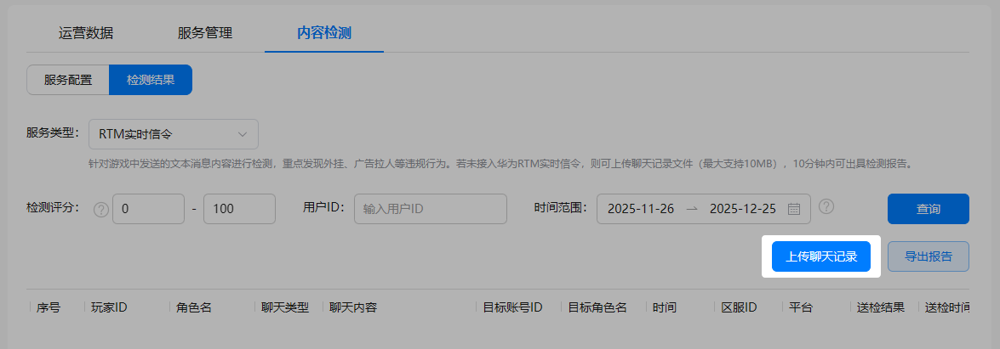
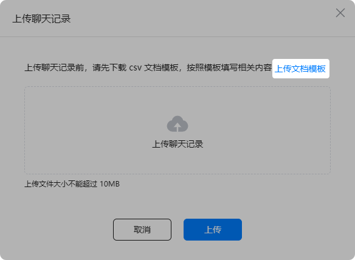

除自动送检方式外，游戏多媒体服务还提供了在AGC控制台进行人工送检的方式，支持手动批量上传文本消息聊天内容进行内容检测。

## 前提条件

您已[开启内容检测](/docs/dev/game-dev/games-gamemme-console-servicemanagement-0000002338391901#section17288256144510)功能。

## 操作步骤

1. 选择“RTM实时信令”服务类型，点击“上传聊天记录”。

   
2. 点击“上传文档模板”下载模板，并按照模板填写相关内容后保存。

   

   * 当前，批量上传聊天记录仅支持.csv文件格式，请将已填写好的文档模板保存为.csv文件格式。
   * 由于csv模板在编辑时，纯数字信息超过11（不含）位时，会自动转换成科学计数格式（例如输入123456789102，则会自动转换成1.23457E+11），造成数据失真，建议您在每次编辑前全选csv模板内容，并将单元格格式设置为文本格式。

   
3. 点击“上传聊天记录”，选择已填写好的文档模板，并点击“上传”。

   

   批量上传文件最大支持10MB，上传完成后10分钟内即可出具检测报告。
